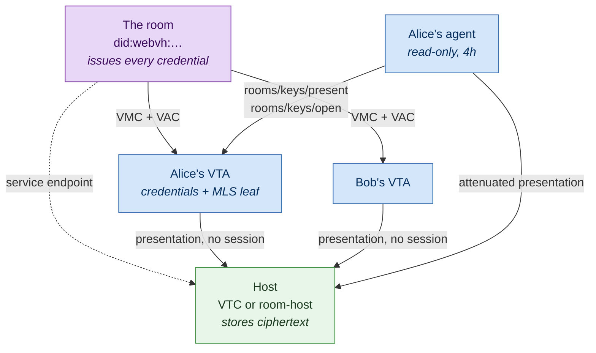
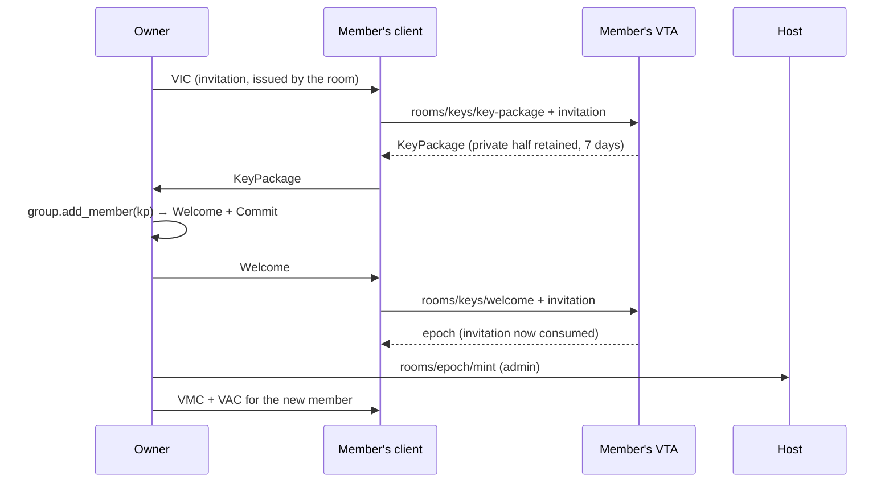

# Data rooms — creating one, and keeping it

A **data room** is a shared space — a set of records — readable and writable by
exactly the parties its credentials admit, for the humans in it and for their AI
agents. It is not a row in some service's table: a room has its own DID, issues
its own credentials, and can move from one host to another without a single
credential being reissued.

This guide is the operator's path through that: what you assemble, which of the
four topologies you are building, and every verb you will use afterwards.

> **Design and rationale** live in
> [`../05-design-notes/data-rooms.md`](../05-design-notes/data-rooms.md) — the
> four topologies, the visibility ladder, why MLS, why the host never decides.
> The security reviews are
> [v2](../05-design-notes/data-rooms-security-review-v2.md) (current) and
> [v1](../05-design-notes/data-rooms-security-review-v1.md). This guide does not
> repeat the arguments; it tells you which commands and calls make them true.
>
> **A running walkthrough** ships as an example:
> `cargo run -p room-host --example data_room`. It starts a real host on a real
> port, signs real credentials, and drives four acts against it. Read it beside
> this guide — every mechanic below appears there, executable.

---

## 1. What a room is made of

Five pieces. Getting them straight up front saves most of the confusion later,
because three of them are commonly assumed to be one thing.

| Piece | What it is | Who holds it |
|---|---|---|
| **The room** | A DID (`did:webvh`, ideally witnessed). Its identifier **is** the `roomId`. It issues every credential in the room. | Controlled by the **owner** |
| **The host** | Stores records and answers `rooms/*` Trust Tasks. Holds no member list and could not consult one. | A VTC, or the `room-host` binary |
| **The member's VTA** | Holds the member's room credentials, their MLS group state, and acts as an oracle for their agents. | Each member, separately |
| **The credentials** | VIC to enter once, VMC to prove membership, VAC for what you may do. All issued **by the room**. | Each member's VTA |
| **The MLS group** | The group-key layer on the sealed tiers. One leaf per member — the member's VTA, not their devices. | Each member's VTA |



**The one rule everything else follows from:** a room operation is authorized by
the credential chain the room issued, verified against the room's own DID. Never
by the host's ACL, never by a session, never by a roster. That is what lets a
room change hosts by re-pointing a service endpoint — and it is why every call
below carries a presentation rather than a bearer token.

---

## 2. What works today

Rooms are implemented across `vti-rooms`, `vti-rooms-dtg`, `room-host`,
`vtc-service` and `vta-service`. Not everything in the design note is built, and
knowing which half you are standing on saves an afternoon.

| | State |
|---|---|
| `open` and `attributed` rooms | **Serve.** Create, records, curate, epoch mint, transfer, claim |
| `private` rooms | **Store but refuse to serve.** The same-subject binding needs a ZK profile the DTG working group has not settled; `vti-rooms-dtg` refuses rather than guessing, so a VTC and a room host cannot disagree about it |
| MLS group layer, record sealing | **Work** (`vti-rooms` `mls` feature) — create, add/remove, commit, exporter-derived storage keys |
| VTA custody: `rooms/keys/{key-package,welcome,commit,open}` | **Work.** A member's VTA holds the group and opens records for their agents |
| The presentation oracle: `rooms/keys/present` | **Works.** Attenuates the member's own VAC for an agent |
| Succession: nomination, transfer, claim | **Work**, including the "renewing defeats a pending claim" property |
| **A CLI** | **`pnm rooms {create,list,get,put,curate,renew}`** — the member's surface, driven through the oracle so the CLI holds no room credentials and no group key. The **owner's** surface (issuing VIC/VMC/VAC) is not there: it needs the room's own signing key |
| **Credential issuance** | **Library only.** Nothing serves "issue this member a VMC and a VAC"; the room's owner mints them with `dtg-credentials` and delivers them out of band |
| **Governance (`rooms.rego`)** | **On a VTC.** A community decides who may create a room on it, in Rego, with the shipped default hosting `open`/`attributed` for its own members. A standalone `room-host` has no policy engine — T1's governance is its owner (§8.4) |
| **Read mirrors** (T3) | **`room-host --mirror-config`** — a host serves a read-only copy fed by `sinceVersion` pulls and refuses every write, naming the primary. A mirror pulls **as a member**, presenting a room-issued `read` chain |
| **Reading across a membership change** | **Works, for members who keep up.** Records are sealed per epoch, and a member's VTA retains the *epoch key chain* — each commit it applies wraps the outgoing epoch's key under the incoming one, so everything already in the room stays readable. **A newly joined member is the gap**: their Welcome carries the current epoch and nothing below it, so they read from their joining epoch forward until the chain reaches them, which needs a task that does not exist yet (design note §12.2) |
| **Cryptographic deletion** | **Primitive only.** `prune_epoch_links_before` severs the chain below an epoch, which makes everything older unopenable by anyone — genuinely, not as a promise to erase bytes. No verb reaches it; it needs a spec first |
| **Witnessed renewal anchoring** | **Blocked on a decision**, not on effort: §9 says a renewal anchors the epoch authenticator and version watermark in the room's witnessed log, but not *where in the log entry*. See [`epoch anchoring`](../05-design-notes/data-rooms-epoch-anchoring.md) |

---

## 3. Choose a topology

The room protocol is identical in all four. What differs is **where the room
lives and who governs creation** — never what a room is.

| | Room lives on | Members come from | Governed by | You deploy |
|---|---|---|---|---|
| **T1 Personal** | your own `room-host` | anyone you invite | you | the `room-host` binary (§8.1) |
| **T2 Community** | a VTC | that community, typically | the community | nothing — a VTC already serves `rooms/*` (§8.2) |
| **T3 Cross-community** | one home host | any communities' members | the home host | nothing beyond T2 (§8.3) |
| **T4 Peer** | a peer's `room-host` | VRC-connected peers | the owner | the `room-host` binary (§8.4) |

Two of these are nearly free. **T3 is T2 plus nothing** — a VMC binds a member
to *the room*, so members from three communities in one room is the ordinary
case rather than a bridge. **T4 is T1 with the VRC as the door.**

Pick by asking two questions, in this order:

1. **Who must not be able to read it?** If the answer includes the host, you are
   on `attributed` (§4), and the room's DID should be owner-controlled.
2. **Who is accountable for it existing?** That party is the owner. If it is a
   community, use T2. If it is a person, use T1 — a personal host is governed by
   its owner, and that sentence is the whole policy model.

---

## 4. Choose a visibility tier

Fixed at creation, for the life of the room. You cannot un-see cleartext, so a
downgrade is meaningless and an upgrade would protect only what came after while
presenting as though it protected everything.

| | `open` | `attributed` | `private` |
|---|---|---|---|
| Record bodies, titles | cleartext | encrypted | encrypted |
| Which member is acting | visible to the host | visible to the host | unlinkable proof |
| Server-side search | ✅ | ❌ | ❌ |
| Per-member access log at the host | ✅ | ✅ | ❌ |
| Recoverable from the host's backup alone | ✅ | ❌ | ❌ |
| **Serves today** | ✅ | ✅ | ❌ (§2) |

The ladder measures **the host, whoever that is**. On a room you host yourself,
you-as-host see everything and already know the membership — you issued it — so
the ladder largely collapses. Owner-hosting is not automatically the more
private choice; a neutral host that *cannot* read is a real alternative.

On the sealed tiers, **record keys must be opaque**. A key reading
`decision/acquire-northwind` defeats the encryption sitting beside it — use
`SealedRoom::opaque_key()` and put structured naming inside the sealed body.

---

## 5. Create a room

Four steps. Steps 1 and 3 are the owner's own work; only step 2 touches a host.

### 5.1 Mint the room's identity

The room's DID is its identifier and its credential issuer, so it must be
minted before anything else exists.

**Production shape — `did:webvh` via the `room` DID template:**

```bash
pnm bootstrap provision-request \
  --template room \
  --var WEBVH_SERVER=https://dids.example.org \
  --var MEDIATOR_DID=did:web:mediator.example.org \
  --var 'LABEL=Northwind deal room' \
  --out room-request.json

pnm bootstrap provision-integration \
  --request room-request.json \
  --context personal \
  --out room-bundle.asc

pnm bootstrap open --bundle room-bundle.asc --expect-digest <sha256-from-producer>
```

`did:webvh` rather than `did:peer` on purpose: a `did:peer` encodes its keys in
the identifier, so its controller can never change — and transferring a room is
a controller change. Set `WITNESSES` for any room whose host you do not fully
trust; witnessing is what makes a host serving a stale log *evident* rather than
merely possible.

> **Gap to know about:** no installer consumes a `room` bundle yet. `pnm
> bootstrap open` prints the payload summary; extracting the room's signing key
> to issue credentials with means opening the sealed payload yourself via
> `vta_sdk::sealed_transfer`. Until that lands, most non-production rooms use a
> locally-minted `did:key` (below), which also means the host needs no network
> DID resolution at all.

**Evaluation shape — a local `did:key`:** mint an Ed25519 key, form
`did:key:z6Mk…`, and use that as both the room's identifier and its issuing key.
`vti_rooms_dtg::test_support::RoomFixture` does exactly this, and it is what the
`data_room` example runs on.

### 5.2 Register the room with its host

```rust
use vtc_client::{VtcClient, rooms::Visibility};

// A room host mounts at the origin; a VTC's base_url includes its mount (…/v1).
let client = VtcClient::anonymous("https://rooms.example.org", host_did);

client.create_room(
    room_did,              // roomId — the room's own DID
    owner_did,             // the accountable party (invariant I1)
    Visibility::Attributed,
    Some(365),             // retentionDays after the room goes dormant
    signer_did,            // signs the Trust Task document
    signer_key_multibase,
).await?;
```

Over the wire that is one `rooms/create/0.1` document
(`vta_sdk::trust_task_sign::build_signed` builds and signs it) posted to
`/trust-tasks`. **The caller brings the `roomId`** — a room identified by
something its host chose could not move to another host without changing
identity.

Two things bite anyone hand-building these documents rather than using the
client. On a VTC the document's **`recipient` must be the VTC's own DID** — that
binding is the framework's replay defence, and a document addressed elsewhere is
rejected before it reaches a room handler. And a VTC's Trust Task endpoint rides
its governed chain, with a **64 KiB body cap**, which is the practical ceiling on
a single record there; the `room-host` binary imposes neither.

The host sets what it is entitled to set and nothing else: `epoch = 1`,
`epochExpiresAt = now + 365 days`, `retentionDays` (default **90**), and the
version counter. **Sign this one as the owner**: creation is the single verb no
chain can authorize, so the request's own proof is the check, and a signer who
is not the `ownerDid` they name is refused (§8.4).

### 5.3 Issue the owner's own credentials

The room is now registered and **nobody can do anything in it**, including you.
Authority comes from credentials the room issued, so mint two with the room's
key:

- a **VMC** — the room's statement that this DID is a member;
- a **VAC** granting `read`, `write`, `curate`, `admin`.

```rust
use dtg_credentials::DTGCredential;

let mut vac = DTGCredential::new_vac(
    room_did.to_string(),      // issuer: the room
    owner_did.to_string(),     // subject: the member
    room_did.to_string(),      // scope: the room governs itself
    vec!["read".into(), "write".into(), "curate".into(), "admin".into()],
    now - Duration::minutes(1),
    Some(now + Duration::days(30)),
)?;
vac.sign(&room_secret, None).await?;
```

Then store both in the member's VTA credential vault:

```bash
pnm cred-vault receive --credential-file ./vmc.json
pnm cred-vault receive --credential-file ./vac.json
```

This matters for more than tidiness: the presentation oracle (§7) finds a
member's room credentials **by issuer** — `issuer == roomId`, type
`MembershipCredential` / `AuthorityCredential` — and refuses if it holds none,
or if it holds two of the same kind for one room.

The four actions are a ladder with one deliberate break: **`curate` is not
implied by `write`.** Deciding what a room's shared knowledge is worth is a
different grant from being able to add to it. `admin` mints epochs and transfers
ownership.

### 5.4 On a sealed tier, form the MLS group

```rust
use vti_rooms::mls::RoomGroup;
use vti_rooms::sealed::SealedRoom;

let group = RoomGroup::create(owner_did)?;      // one leaf: the owner's VTA
let room  = SealedRoom::new(room_did, group);
```

**The room's epoch is the MLS epoch plus one** — MLS counts from 0, a room from
1 — so a group you have just created is already at the epoch the host recorded
when it registered the room, and nothing needs minting yet. Read it from
`SealedRoom::room_epoch()` rather than computing it; an off-by-one here seals
records under an epoch the host rejects, and the failure reads as a key problem
rather than an arithmetic one.

After that, every membership change moves the group and the number has to follow
(§6, §10.1). The host never learns the key — minting an epoch is an `admin`
chain saying a number, not a key exchange.

---

## 6. Add a member

Joining is a **two-party act**. Without an invitation step the owner could seal a
room key into your VTA and you would simply be *in*, holding keys to material
you never agreed to hold. The VIC is that second party's half, and it is
enforced, not ceremonial.



Step by step:

1. **The owner issues a VIC** naming the joiner, from the room's key, and
   delivers it — DIDComm on a sealed room, because a server-side invitation
   store would hand the host the membership at invite time.
2. **The joiner's VTA mints a KeyPackage** (`rooms/keys/key-package/0.1`,
   invitation required). Minting retains a private key against a Welcome that
   may never come, which is why it is not offered unconditionally; unused
   packages expire after 7 days.
3. **The owner adds the leaf** — `RoomGroup::add_member(key_package)` produces a
   Welcome and a Commit — and sends the Welcome to the joiner.
4. **The joiner's VTA processes it** (`rooms/keys/welcome/0.1`, same invitation).
   The invitation is consumed **after** the join succeeds, so a Welcome that
   failed to process does not strand the member with a spent invitation and no
   membership. Single use means single use, and the consumed record outlives
   leaving the room.
5. **The owner mints the new epoch** on the host and **issues the member's VMC +
   VAC**, which the member stores in their own VTA (§5.3).

Five checks stand behind the invitation, and none is optional: it parses as a
DTG credential and is an invitation; its proof verifies; the issuer is *this*
room; the subject is *us*; it is in its window and unconsumed.

### Commits are not optional, and their absence is silent

Every membership change after the first produces a Commit, and **every existing
member's VTA must apply it** (`rooms/keys/commit/0.1`). A member who misses one
is stuck at their last epoch and can open nothing sealed after it. The symptom
is "this record does not open", which reads like corruption — so
`rooms/keys/open` reports *which epoch the VTA holds* when a record is sealed
under a later one. If you see that, deliver the missing commit.

Commits are authorized **inside the group** by MLS, not by any ACL of the
receiving VTA. A VTA has no opinion about who a room's owner is, and should not
acquire one.

**Applying a commit is also what keeps the room's past readable.** Each one
carries an *epoch link* — the outgoing epoch's storage key, wrapped under the
incoming one — which the VTA retains alongside the group. That chain is what
lets a member open a record written three memberships ago. A member who skips
commits therefore loses twice: they cannot read forward (they are behind) and
they will not be able to read back across the gap either, because the link that
bridges it only ever arrives once.

Two error messages distinguish the cases, and they mean different things:

| Message | What happened | What to do |
|---|---|---|
| *"a commit has not been delivered"* | the record is **newer** than this VTA's epoch | deliver the missing commit |
| *"cannot reach … the epoch key chain reaches back only to N"* | the record is **older** than any key this VTA can derive | the links for that stretch never arrived, or the history was deliberately severed. Nothing recovers it locally |

---

## 7. Give an agent access

The case rooms were designed for: a member holds `read`/`write`, and their agent
runs on a chain one link longer whose leaf confers only `read`, expires in
hours, and is bound to the agent. The agent never holds the member's
credentials, and never holds a key at all.

The member's VTA does both halves:

| Task | What it does | Gate |
|---|---|---|
| `rooms/keys/present/0.1` | Attenuates the principal's VAC into a one-action, audience-bound leaf and returns a presentation | `roomPresent` capability + context access |
| `rooms/keys/open/0.1` | Takes ciphertext, returns plaintext | `roomOpen` capability |

```jsonc
// rooms/keys/present/0.1 payload
{
  "roomId":  "did:webvh:…",
  "action":  "read",              // exactly one; required
  "audience": "did:web:rooms.example.org",   // bind it to the host you will call
  "nonce":   "…"                   // optional
}
```

Four things a caller **cannot** obtain by asking, each closing a way this could
have become the credential hand-off it exists to replace:

- **More than the principal holds** — `attenuate` refuses to widen, in the
  credential library, not at a policy check somebody could forget to write.
- **A presentation covering everything** — `action` is required and exactly one
  action is conferred.
- **A presentation made out to somebody else** — the leaf grants to the DID the
  *transport* authenticated, never one named in the payload. Minted for A, it is
  worthless to B.
- **A long-lived leaf** — the lifetime is a constant (4 hours), not a request
  parameter.

> **How to grant it.** The role is the ceiling: `application` (what an agent
> integration is normally granted), `initiator` and `admin` carry both room
> capabilities, while `reader` and `monitor` carry neither — minting a
> credential on a principal's behalf is not a read.
>
> Within that ceiling, an entry's own list narrows — at creation
> (`pnm acl create … --capabilities room-present`, which is the form to prefer,
> since it leaves no window where the entry is wider) or after
> (`pnm acl update <did> --capabilities room-present`, undone with
> `--capabilities-all`). Narrowing binds the agent's next call, not its next
> token, and a name the role does not carry is refused rather than dropped — so
> the role always describes the entry.

Withdrawing an agent's access is withdrawing it *at the VTA* — remove the ACL
entry and no further presentations are minted. That is the whole value of an
oracle over handing credentials across: there is a place to say no.

---

## 8. Run the host

### 8.1 T1 — your own room host

```bash
cargo build --release -p room-host

room-host \
  --data-dir /var/lib/room-host \
  --listen 127.0.0.1:8300 \
  --resolve-dids           # required for did:webvh rooms; see below
```

- **`--resolve-dids` is off by default and is a real decision.** A room's
  credentials are normally issued by a `did:webvh` room, so a host without it
  serves almost nothing — but turning it on means an *unauthenticated* request
  can make this host fetch. `did:key`-only is the conservative construction and
  is what the example and the tests run on.
- **The binary is deliberately thin.** No TLS, no rate limiter, no admin
  surface, no roster, and no body cap of its own beyond axum's 2 MB default. Put
  it behind a reverse proxy that provides the first two. The absence of the
  roster is the portability guarantee: there is nothing in the binary that could
  consult one.
- **It is not part of the VTA, on purpose.** The process guarding a master seed
  should not also terminate presentations from arbitrary DIDs. If you want the
  host to have its own identity for addressing, provision it with the
  `room-host` DID template (`WEBVH_SERVER`, `URL`, `MEDIATOR_DID`) — though
  nothing in the binary consumes that bundle yet, since it verifies presentations
  and signs nothing.
- **Storage** is a plain fjall store under `--data-dir`, unencrypted at rest. On
  `attributed`/`private` the records are already sealed; on `open` they are
  cleartext, so the data directory deserves the same care as any content store.
  Back it up yourself — there is no export task.
- **Audit** goes to `tracing`. Which actor may be recorded is decided in
  `vti_rooms::audit`, shared with the VTC, so a `private` room logs that *a
  member* acted and never who. Do not add the DID back in your own log pipeline;
  that single line reassembles the membership one entry at a time.

### 8.2 T2 — a community (VTC)

Nothing to deploy. A `vtc-service` serves the whole `rooms/*` family in-process
at `POST /v1/trust-tasks`, on the unauthenticated chain — which is correct here,
because on every verb but `create` (§8.4) the caller is authenticated by the
document's own proof and authorized by the room's chain, never by the
community's ACL or a session.

- **Keyspaces**: `rooms` (one row per room) and `room_records`. Both are in
  `BACKED_UP`, so `POST /v1/backup/export` captures them.
- **Audit**: room operations land in the VTC's hash-chained audit keyspace, with
  the same tier rule as above.
- **Governance**: the `rooms` policy purpose (`vtc.rooms` package) decides who
  may create a room here. The shipped default hosts `open` and `attributed`
  rooms for the community's own members and refuses `private` until an operator
  activates a policy permitting it — §7.4's posture, on the grounds that a
  community which has not decided should not discover it is hosting rooms whose
  membership it cannot see. Replace it like any other policy:
  `POST /v1/policies` then activate. A VTC with **no** active `rooms` policy
  refuses creation rather than answering 500 — a missing decision is a closed
  door, not a server fault.
- **What a policy can see**: the creator (their DID, whether they hold a member
  row, and their role) and the room's identifier, visibility and owner. It
  deliberately does *not* carry the design's `didControlledBy` /
  `contentStoredAt` hosting axes — the published `rooms/create/0.1` schema has
  no member for either, so no host can know them.

Members of a T2 room do not need to be members of the community. Community
membership governs *who may create a room here*; room membership is, and stays,
the room's own statement — nothing in the family consults the roster once a room
exists.

### 8.3 T3 — cross-community

T3 is T2 with members from anywhere: a VMC binds a member to **the room**, so a
room whose members come from three communities needs no bridging and no special
configuration. Register the room on whichever host is the home, and every
member's VTA presents to that one.

**Read mirrors** are the optional half, and they exist. Another `room-host` can
hold a read-only copy of a room primaried elsewhere:

```jsonc
// mirrors.json — hardened to owner-only on load, because it holds a key
{ "rooms": [{
    "roomId": "did:webvh:room.example",
    "primaryUrl": "https://primary.example.org",
    "primaryDid": "did:web:primary.example.org",
    "membership": "<the VMC the room issued this mirror>",
    "authority": ["<a chain conferring read>"],
    "signerDid": "did:key:zMirror",
    "signerKeyMultibase": "z…"
}] }
```

```bash
room-host --mirror-config mirrors.json --mirror-interval-secs 300
```

**A mirror pulls as a member.** It presents a room-issued chain conferring
`read`, exactly as any other reader does — there is no mirror-shaped exemption
at the primary and no new verb, so the room admits a mirror the way it admits a
person and can stop admitting it the same way. Two consequences, neither hidden:
on `attributed`/`private` the mirror only ever holds ciphertext, so mirroring
gives its operator nothing the primary's operator lacks; on `open` it reads
cleartext, because everything on that tier is cleartext to whoever holds it.

What a mirror **cannot** do is tamper — records are signed and AEAD-bound to
`roomId | key | version | epoch`, so an altered or renumbered copy does not
verify and does not open. Its only failure modes are **stale** and **silent**,
and both are visible to a client watching the version watermark. Writes are
refused naming the primary; even `admin` is refused, because a mirror that
accepted an epoch mint would fork the lifecycle clock its primary owns.

Multi-primary replication remains a non-goal, not a gap: replicated
multi-writer room state needs state-resolution machinery whose failure modes
took Matrix years to shake out.

### 8.4 T4 — peers, and what still governs creation

T4 runs the same binary as T1; what differs is the door — a VRC-linked peer
rather than an invitation you originated — and that nobody governs creation but
the owner.

**What creation checks, stated once for all four.** `rooms/create/0.1` is the
one verb no chain can authorize: at the moment it runs the room has issued
nothing. So the check is the request's own proof — **the signer must be the
party they name as owner** — and the room is written from that, not from the
payload. Without it `ownerDid` is a field anyone can fill with anyone.

What that does *not* establish is control of the identifier. Someone can still
register a `roomId` they do not control while naming themselves owner, and so
deny that id to its real owner on that host. The row confers nothing — every
later verb needs credentials the real room issued — so it is a nuisance rather
than a takeover, and bounding it is quota and access control.

**On a VTC, creation is also governed** by the `rooms` policy (§8.2), which is
how a community says whose rooms it will host. **A standalone `room-host` has no
policy engine and no roster**, by design — T1's governance is its owner, and
that sentence is the whole model — so creation there is open to anyone who can
sign as themselves: put it behind a proxy you control.

---

## 9. Use the room

### From the CLI

```bash
# Every command needs both parties: your VTA (for the presentation) and the
# room's host (which stores the bytes). --host-did binds the presentation to
# that host; omit it and anyone who observes it can replay it for four hours.
pnm rooms list  --room <room-did> --host https://rooms.example.org --host-did <host-did>
pnm rooms get   decision/pricing-2026 --room <room-did> --host https://rooms.example.org
pnm rooms put   decision/pricing-2026 "Agreed not to reprice." --room <room-did> \
                --host https://rooms.example.org --title "Pricing holds" --expected-version 0
pnm rooms curate decision/pricing-2026 --status deprecated --room <room-did> --host …
pnm rooms renew 3 --room <room-did> --host …          # mint the next epoch (needs `admin`)
```

The CLI **never holds a room credential or a group key**. Each command asks your
VTA to mint a presentation for exactly the action it performs (`read`, `write`,
`curate`, `admin`), sends that to the host, and — on a sealed record — hands the
ciphertext back to the VTA to open. A member who holds less than the action
needs is refused by their own VTA rather than by the host, which is the earlier
and clearer of the two.

Two things it deliberately cannot do. **Write to a sealed room**: sealing needs
the room's group key, which lives in the VTA, and no task seals on a caller's
behalf. **Issue credentials**: minting a VIC, VMC or VAC needs the *room's*
signing key, which is the owner's — a different party with different custody.

### From Rust

All record verbs carry a presentation and no token. `RoomSession` holds the
credentials — build one per room per identity; a member's and their agent's are
different sessions against the same room, differing only in the chain.

```rust
use vtc_client::rooms::{RoomSession, CleartextContent, SealedContent};

let alice = RoomSession::new(room_did, membership_vmc, chain_leaf_first)?;
```

The chain travels **leaf first**, whole, on every call. A host never fetches a
link it was not given: resolving one over the network would make verification
depend on availability, turn an identifier into a request the host can be
induced to make against an address the *caller* chooses, and signal credential
use to whoever hosts it. Depth is capped at `MAX_CHAIN_DEPTH` (8).

| Verb | Task URI | Needs |
|---|---|---|
| Write | `rooms/records/put/0.1` | `write` |
| Read | `rooms/records/get/0.1` | `read` |
| List | `rooms/records/list/0.1` | `read` |
| Curate | `rooms/records/curate/0.1` | `curate` |
| Mint an epoch | `rooms/epoch/mint/0.1` | `admin` |
| Transfer ownership | `rooms/owner/transfer/0.1` | `admin` |
| Claim ownership | `rooms/owner/claim/0.1` | a nomination (§10) |

**Writing on an `open` room** carries `cleartext` (`title`, `description`,
`body`, `tags`); on a sealed room it carries `sealed` (`ciphertext`, `nonce`,
`epoch`). Exactly one — the host refuses the wrong shape for the tier.

**`expectedVersion` is the concurrency control.** `Some(0)` is create-only;
`Some(n)` requires the stored record to be at version `n`, and a mismatch comes
back carrying the current version so you do not have to re-read to learn what
you lost to. Versions are assigned by the host, monotonic per **room**, which is
what `sinceVersion` watermarks compare.

**Sealing binds a record to its location.** The AEAD associated data commits to
`roomId | key | version | epoch`, so a host that relocates a record — to another
key, version, epoch, or room — produces an authentication failure rather than a
readable record. It holds every byte and cannot move one.

That binding has a consequence worth planning for: **the version is committed
before the host assigns it.** `seal_record` takes the version you *intend*, so
the shapes that work are create-only writes (`expectedVersion: 0`) or a read of
the current version before a rewrite.

**Listing returns metadata, never bodies.** On sealed tiers clients fetch and
decrypt to rank, which is affordable because rooms are small — and is one
concrete reason `open` continues to exist.

**Curation** (`status` → `active` / `deprecated` / `retracted`, plus `pinned`) is
separate from writing because a record's *standing* is not its content: on a
sealed tier "same body, marked deprecated" would otherwise make a member re-seal
and re-upload bytes the host already holds. A curation assigns a new version —
a change others must converge on is a change like any other. `retracted` is a
tombstone: the body goes, the key/version/epoch stay, so incremental sync
converges instead of resurrecting deletions.

**Bodies are human-readable markdown**, written for the human and recalled by
the agent — and treated as **untrusted input in both directions**. A room is a
writable channel into every member's agent context, and a phishing channel into
every member's eyes. Render inert; fence recalled content as data, never
instructions.

---

## 10. Keep it alive, and hand it on

### 10.1 The lifecycle clock

```text
  Live  ──epoch expires──▶  Lapsed  ──30 days──▶  Dormant  ──retention──▶  Reclaimable
   ▲                          │                      │                        │
   └──────────────────────────┴──────────────────────┴─── a single renewal ───┘
```

- **Live** — normal. A new room is live for one epoch lifetime: **365 days**.
- **Lapsed** — read-only. Nothing destroyed, nothing hidden.
- **Dormant** — 30 days past lapse. The owner should have been told, and this is
  the state a successor can claim in (§10.2).
- **Reclaimable** — the `retentionDays` you stated at creation has run out,
  counted from the lapse and never sooner than the dormancy window, so a short
  retention cannot reclaim a room before its owner has had the notice. Even
  here the code only reports; deleting is a separate deliberate act.

The state is **computed, never stored** — a stored state is a decision somebody
made and can get wrong. Renewal is minting an epoch, and it undoes every earlier
state up to the last. **Reads do not extend anything**, deliberately: a host
counting reads would make a sealed room's lifecycle depend on the one signal the
host can see, which is exactly the correlation the tiers exist to deny.

```rust
client.mint_epoch(&alice, next_epoch, Some("added a member"), signer, key).await?;
```

The design also wants each renewal **anchored in the room's witnessed DID log**
(the MLS epoch authenticator plus the version watermark), which is what makes a
host claiming a live room lapsed, a forked group, and a rolled-back mirror all
detectable. That is the owner's job, not the host's, and it is not implemented —
`RoomGroup::epoch_authenticator()` gives you the value if you want to anchor it
yourself.

### 10.2 Ownership: transfer and claim

Two verbs, the same storage effect, entirely different routes.

**Transfer** is the owner acting while present, gated on `admin` — the same
grant that mints epochs, because handing over the room is the more consequential
of the two.

```rust
client.transfer_owner(&alice, new_owner_did, Some("stepping back"), signer, key).await?;
```

The host does **not** check that the incoming owner is a member of the group. It
cannot — it holds no roster and no group state. Refusing what it cannot verify
would fail every correct transfer, and treating its own ignorance as evidence
would convert "I don't know" into "no". That obligation is the outgoing owner's,
who can see the group.

**Claim** is what happens when the owner is not there, and it needs three things
at once:

1. a **nomination** the room issued, naming this claimant, in its window;
2. the room **dormant** — not merely lapsed;
3. the claimant's **own membership**, presented as every other room task does.

A nomination is a VAC granting `succeed` — a word no room task accepts, so it
confers nothing at all while the owner is present, and is redeemable through
exactly one path. Issue it like any other room credential, from the room's key:

```rust
let mut nomination = DTGCredential::new_vac(
    room_did.to_string(),        // issuer: the room
    successor_did.to_string(),   // subject: who may claim
    room_did.to_string(),
    vec![vti_rooms::authz::ACTION_SUCCEED.into()],
    now - Duration::minutes(1),
    Some(now + Duration::days(365)),   // give it a real window
)?;
nomination.sign(&room_secret, None).await?;
```

Give it to the nominee and to nobody else; a claim presents it alongside their
own membership.

**Renewing is the whole defence, and it is the same act as ordinary use.** An
owner who was merely away defeats every pending claim by minting an epoch —
which is what they would have done anyway. Nothing has to be revoked and no
dispute has to be raised. That is why the gate is dormancy rather than lapse: a
window that opened the moment an epoch expired would make every holiday one.

**A claim does not renew the room.** It hands over a dormant room and leaves it
dormant; the new owner's first act should be the epoch mint that proves they can
perform it. If they cannot, the next nominee can claim in turn — the succession
chain working rather than failing.

### 10.3 Losing a member, and losing everyone

A member who loses their VTA lost their MLS leaf. The design's answer is
**k-of-n re-admission** — some members attest the returning party and the owner
commits an add for their new leaf; not secret sharing, because what needs
distributing is the *authority to re-admit*, not shards of a key. No quorum
machinery is implemented, so today this is the owner adding a fresh leaf on
whatever assurance they are willing to act on, which is the same human judgement
the quorum would formalise.

If every member's VTA is gone, **the room is gone.** The host holds ciphertext
and cannot help. Say this at creation, not in a footnote.

Which is why `room_groups` and `room_invitations` are in the VTA's `BACKED_UP`
set — that is a decision, not a default. A member who restores a VTA without
their room groups has lost every sealed room they belong to, with no way to
recover but a fresh invitation from every owner.

---

## 11. When something is refused

| Refusal | What it usually means |
|---|---|
| `a private room must not be served without a ZK profile` | The tier is not servable yet (§2). Use `attributed` |
| the chain "does not confer this on room …" | Wrong action for the chain (agent with `read` writing), or a chain rooted somewhere other than this room |
| a valid-looking presentation refused on a *different* signer | Presentations are bound to the presenter. A captured one is worthless — this is working as intended |
| `this VTA holds no AuthorityCredential issued by room …` | The member's VMC/VAC are not in the credential vault (§5.3) |
| `this VTA holds N AuthorityCredentials issued by room …` | Two credentials of one kind for one room; the oracle will not guess which to attenuate |
| record "does not open", VTA reports an older epoch | A missed commit (§6). Deliver it |
| `no invitation presented for room …` | `key-package`/`welcome` without the VIC, or the VIC names someone else |
| `invitation … has already been used` | Single use. Issue a fresh one |
| a room "is live" / "not claimable" | The owner renewed. The claim is correctly dead |
| `unsupportedType` | The host does not implement that task — check you are talking to a room host and not something else on the same port |
| `this registration was signed by …, which is not the owner it names` | `rooms/create` signed by anyone but the `ownerDid` in the payload. Sign as the owner (§5.2) |
| Every call fails on `missing field 'id'` | You are posting a bare JSON body. Room calls are Trust Task **documents** — build them with `vta_sdk::trust_task_sign::build_signed` |

---

## 12. Reference

**Host tasks** (`https://trusttasks.org/spec/rooms/…`), served by `room-host`
and `vtc-service`:

| URI | Action required |
|---|---|
| `rooms/create/0.1` | no chain — the signer must be the `ownerDid` (§8.4) |
| `rooms/records/put/0.1` | `write` |
| `rooms/records/get/0.1` | `read` |
| `rooms/records/list/0.1` | `read` |
| `rooms/records/curate/0.1` | `curate` |
| `rooms/epoch/mint/0.1` | `admin` |
| `rooms/owner/transfer/0.1` | `admin` |
| `rooms/owner/claim/0.1` | nomination + membership + dormancy |

**Member-VTA tasks** (`https://trusttasks.org/spec/rooms/keys/…`), served by
`vta-service`:

| URI | Authorized by |
|---|---|
| `rooms/keys/key-package/0.1` | an invitation |
| `rooms/keys/welcome/0.1` | that invitation, consumed |
| `rooms/keys/commit/0.1` | the MLS group itself |
| `rooms/keys/open/0.1` | `roomOpen` capability |
| `rooms/keys/present/0.1` | `roomPresent` capability + context access |

**Constants**

| | Value | Where |
|---|---|---|
| Epoch lifetime | 365 days | `vti_rooms::lifecycle::DEFAULT_EPOCH_LIFETIME_DAYS` |
| Lapsed → dormant | 30 days | `DORMANT_AFTER_LAPSE_DAYS` |
| Default retention | 90 days | host-side default for `retentionDays` |
| Max chain depth | 8 | `vti_rooms::authz::MAX_CHAIN_DEPTH` |
| Minted presentation lifetime | 4 hours | `room_oracle::PRESENTATION_LIFETIME` |
| Unused KeyPackage lifetime | 7 days | `room_group::KEY_PACKAGE_LIFETIME_SECS` |

**Crates**

| | |
|---|---|
| `vti-rooms` | Storage, wire types, authorization, lifecycle, audit-actor rule; `mls` + sealing behind the `mls` feature |
| `vti-rooms-dtg` | The credential half — chain verification, invitation and nomination checking, `RoomFixture` test support |
| `room-host` | The standalone host binary (T1/T4) and the `data_room` example |
| `vtc-service` | The same family in-process (T2/T3) |
| `vta-service` | Member-side custody and the oracle (`operations::{room_oracle,room_groups,room_invitation}`) |
| `vtc-client` | `RoomSession` and the client methods, with `mls` for the group layer |
