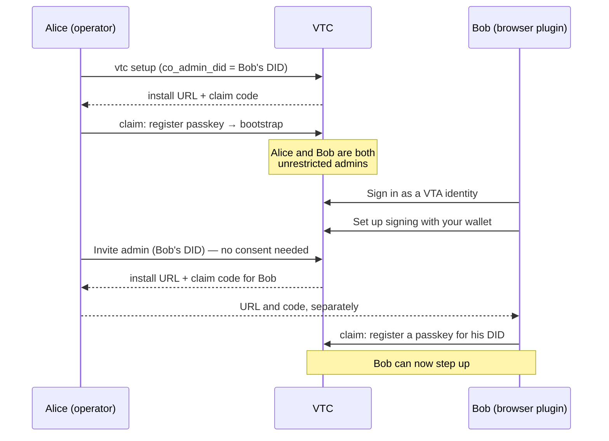

# Administrator access to a VTC

How administration works in a Verifiable Trust Community: who counts as an
administrator, how one person or several run a community, and what stops one
administrator — or one stolen credential — from taking it over.

The walkthrough at the end onboards a first administrator and then a second
one who works from the VTA browser plugin.

Related: [`bootstrap-runbook.md`](bootstrap-runbook.md) (bring-up order),
[`non-interactive-setup.md`](non-interactive-setup.md) (`vtc setup --from`),
[`website-and-admin.md`](website-and-admin.md) (the console).

---

## 1. The model

### 1.1 An administrator is an ACL row

A DID is an administrator because the VTC's access-control list (ACL) says so:
an entry with role `admin`. Every administrative act is authorized by reading
that row **at the moment the act runs**. A credential, a session or a console
key never carries authority of its own.

Only administrators can sign in to the console. A sign-in from any other role
is refused at the challenge.

### 1.2 Unrestricted and scoped administrators

An admin row carries `allowed_contexts`:

| Entry | Means |
|---|---|
| `admin`, no contexts | **Unrestricted** (a super-admin) |
| `admin`, contexts `a`, `b/c` | **Scoped** |

The console's "Allowed contexts" field says "blank = all": leaving it blank on an
admin entry makes that admin unrestricted.

**What a context is here.** In the VTC a context is only a label on an ACL
entry. Labels are path-like and nest, so `b` covers `b/c`. The community keeps
no list of contexts, nothing creates one, and no community resource belongs to
one. Members, join requests, vetting, credentials, rooms and the website are
community-wide, and any administrator, scoped or not, works on all of them. (In
the VTA a context is a key hierarchy; the VTC shares the ACL model, not that
meaning.) Contexts decide three things:

1. whether an admin is scoped or unrestricted, and so the list below;
2. which ACL entries a scoped admin can see (an overlapping context) and change
   or revoke (wholly inside its contexts, never an unrestricted admin);
3. whose step-up passkeys a scoped admin can list.

In the console, **Access control** shows each entry's contexts in the
**Contexts** column and has a **Filter by context** box. Offline, run
`vtc acl list`. The column shows "all" for any entry with no contexts, but that
reading is true only for an admin; a member with no contexts has none.

Only an unrestricted administrator can:

- mint admin invites, and invite members to enrol step-up passkeys;
- read and verify the audit trail;
- change, reload or restart the configuration, and import one;
- export or restore a backup, or purge members;
- approve actions waiting on a second administrator (§3.2);
- revoke other people's console signing keys.

Everything else, including vetting, members, joins and credentials, a scoped
administrator does exactly as an unrestricted one does.

### 1.3 How an administrator proves who they are

| Sign-in | What it is | Can do step-up (§3.1)? |
|---|---|---|
| **Passkey** ("Sign in with passkey") | a WebAuthn passkey registered to the admin DID at this VTC | yes |
| **VTA wallet** ("Sign in as a VTA identity", via the browser plugin) | the VTA signs as one of your personas (a `did:webvh` or `did:key`) | only if that DID also has a passkey here (§4, step 5); signs approvals (§3.2) |
| **`cnm` / API** | a DI-signed `auth/authenticate` from a `did:key` | not interactively; signs approvals (§3.2) |

Once signed in, the console signs your actions as signed Trust Task documents,
using a **console signing key**. That key is generated in the browser, cannot be
exported, and is enrolled as a delegation from your admin DID ("Set up signing"
after sign-in):

- it lasts at most 30 days;
- you can hold at most five at once;
- it can be used only in the console;
- it is revoked by you, or by any unrestricted administrator.

A console key proves only that you have the browser. The protections in §3
never accept it as a second factor or as an approval.

## 2. One administrator or several

### 2.1 A single administrator

A community with one unrestricted administrator works for day-to-day
administration: vetting, members, invitations, policy, credentials, the website.
The single administrator **cannot** make anyone else an unrestricted
administrator online, because that needs a second administrator's consent
(§3.2) and there is nobody to give it:

> Make did:example:geoff an unrestricted administrator of this community needs
> consent from 1 other unrestricted admin(s), and this community has 0
> (VTI-APV-014).

A single administrator has three ways forward:

1. **Grant scoped admin instead.** Give the entry one or more contexts. A scoped
   administrator needs only your step-up, not another administrator's consent.
2. **Add the second administrator offline**, once. Stop the daemon, then run
   `vtc acl add --did <did> --role admin --label "<name>"` or
   `vtc admin invite --did <did>`, and start it again. Each offline write is
   recorded as an `AclBreakGlassWritten` audit row at the next start, and
   raised in Actions for the administrators to acknowledge (§3.5).
3. **Name the second administrator at install** (`co_admin_did`, §4 step 1),
   which avoids the problem altogether.

A single administrator is also a single point of failure: lose that passkey and
the only way back is the offline route. **Run with at least two unrestricted
administrators.**

### 2.2 Several administrators

Once there are two unrestricted administrators, everything works online. A new
unrestricted administrator is created by one administrator and approved by
another (§3.2), and break-glass is not needed again unless you are back to one.

With three or more you can raise the consent threshold so a promotion takes
several approvals (`acl.unrestricted_admin_consent_threshold`, default and
minimum 1, maximum 16, changeable at runtime). Raising it takes effect at once;
lowering it is itself an action that needs the current threshold's approvals
(VTI-APV-020). The VTC refuses a threshold the community could never meet. It also refuses to remove or demote an
administrator when that would leave the threshold unmeetable.

## 3. Protection against a bad administrator

The design assumes any one administrator's credentials can be stolen, or that
one administrator can go rogue. These are the controls that bound the damage.

### 3.1 Step-up bound to one operation

Acts that confer authority need a live step-up from the administrator
performing them, made for **that one operation**:

- granting or promoting anyone to admin (scoped or unrestricted);
- minting an admin invite that creates a new administrator;
- inviting a member to enrol a step-up passkey or a step-up approver, or
  revoking one on their behalf;
- git-namespace break-glass.

The VTC sends a challenge bound to a digest of the exact operation. The answer
must come from the actor's **own additional factor**, one of:

- **a passkey** — the gesture must verify the user and come from a passkey
  registered to the actor; or
- **a step-up approver** — a `did:key` bound to the actor as their step-up
  factor, such as the approver identity the VTA browser plugin holds behind a
  WebAuthn-unlocked key. It signs a statement over the challenge and the
  operation digest; the answer around it is signed by the actor's **own DID**
  (the wallet signs it as the persona), never by a console key; an answer
  signed by a console key is refused with
  `auth/step-up/approve-response:subjectMismatch`. This is how a wallet
  administrator, who has no passkey at this VTC, steps up (VTI-APV-015).

The refusal says which the VTC will take (`accepts`). Once an administrator
holds a dedicated step-up factor — an approver or a step-up passkey — their
ordinary session passkeys stop counting for step-up.

A step-up is valid for one use within 300 seconds, and raises no session.
Approving one act never approves a different one, and a script holding your
console key can't use your factor for an act you didn't see: the console key
can redeem a recorded step-up, but it can never make one.

### 3.1a Enrolling a step-up approver

A second factor can't be bound on the strength of the first, so every
enrolment rests on something independent of the subject's signing key, proves
the approver key is held (the approver signs over a fresh challenge), carries
the subject's own signature, and is audited naming how it was bound
(`enrolledVia`, VTI-APV-016):

| Route | Who | `enrolledVia` |
|---|---|---|
| Claim the install under your own DID (`vtc/install/claim/*/0.3`) | the founder, with the install URL and claim code | `install` |
| An invite from another community administrator, behind their own step-up (Members → the member → **Invite to enrol an approver**), redeemed at `/admin/enrol-approver` | a member who holds no factor | `invite` |
| Add or rotate one yourself behind a factor you already hold (**My passkeys → Approver devices**) | the subject | `selfService` |
| `vtc admin enrol-approver --did <subject>`, daemon stopped — mints the same invite | the operator, with host access | `offline` |

Nobody invites themselves. An approver DID is bound to one subject, once: a
revoked one can never be bound again. A subject holds at most five. Revoking
the last one is allowed — it costs the ability to step up with it, not the
subject's authority — and is recovered through another invite.

Every administrator made by a completed action (§3.2: an `acl/grant`,
`acl/update` or `acl/change-role` to unrestricted admin) is issued an approver
enrolment invite automatically. The requester sees it once, on the completed
action (the URL and a claim code), and delivers the claim code to the new
administrator by a separate channel.

### 3.2 Second-party consent: the action list

These operations need the consent of **other** unrestricted administrators:

| Operation | Requirement |
|---|---|
| making someone an unrestricted administrator, or widening an entry to unrestricted: `acl/grant`, `acl/update`, `acl/change-role`, `vtc/admin/invites/create` | VTI-APV-014 |
| removing, demoting or narrowing **another** unrestricted administrator: `acl/revoke`, a downward `acl/change-role`, a narrowing `acl/update` or `acl/grant`, `vtc/members/admin-remove` | VTI-APV-019 |
| lowering `acl.unrestricted_admin_consent_threshold`, by `config/patch` or `vtc/config/import` (raising it stays immediate) | VTI-APV-020 |
| `policy/upsert` and `policy/activate` for the purposes that decide authority | VTI-VTC-022 |

The approvers are every other live unrestricted administrator. A is never an
approver of their own request, and for a reduction the subject is not one
either. The number needed is the consent threshold (§2.2). A reduction with
nobody left to approve it waits out a cooling-off instead (§3.4).

1. Administrator A sends the operation. Every check runs, and A's step-up is
   asked for **first**, so a thief holding only A's signing key cannot make the
   other administrators' devices ring.
2. The VTC **parks** the operation as an *action*, storing A's signed document
   as sent. A gets HTTP 202 and a `trust-task-next-step` reply naming the
   action; the console shows "*Sent for approval — 1 of 2 must approve within
   72 hours*", linking to it. A sends nothing again.
3. Each approver finds the action in the console's **Actions** page (or `cnm
   actions list`) and approves or declines it, signing with their own DID
   (§4 step 6). One decline closes it for everyone.
4. The approval that reaches the threshold **runs the stored operation**. The
   VTC re-checks everything first, against the community as it is then
   (VTI-APV-017):
   - A still has the authority, and separation of duties, the role-change policy
     and attrition still allow it;
   - the approvers are still unrestricted administrators, and the threshold is
     still met;
   - the subject's entry hasn't changed since the approvers saw it.

   It runs at most once. If a check fails, the action closes `failed` and
   nothing is written. The action is recorded as `executing` before the
   operation runs, and the operation records its effect when it writes, so an
   action interrupted by a crash is settled from that record when the VTC next
   looks at it: `completed` if the write landed, `failed` if it never did
   rather than marked failed on a timer.

An action is approved against the exact payload it parks, and each approver
answers their own challenge. It ends in one of these ways:

| Closes as | When |
|---|---|
| `completed` | the threshold was reached and the operation ran |
| `failed` | a re-check at completion refused it |
| `declined` | any approver declined |
| `cancelled` | A withdrew it (`vtc/admin/actions/cancel`), or it was invalidated: A stopped being a live unrestricted administrator, the subject's entry changed, or too few approvers remain to reach the threshold |
| `expired` | nobody completed it within its lifetime |

An approver who loses standing simply stops counting. Closed actions stay in
**History** for 30 days.

Lifetimes and limits are community configuration, changeable at runtime with
`config/patch`. An open action keeps the expiry it was raised with.

| Setting | Default | Bounds |
|---|---|---|
| `acl.action_lifetime` (seconds) | 259200 (72 h) | 900 – 1209600 (14 days) |
| `acl.action_max_open_per_requester` | 5 | 1 – 20 |
| `acl.action_max_open` (whole community) | 50 | 10 – 500 |
| `acl.action_decline_cooldown` (seconds; same requester, kind and subject after a decline) | 3600 | 0 – 86400 |
| `acl.removal_cooling_off` (seconds; §3.4) | 86400 (24 h) | 0 – 604800 (7 days) |
| `acl.consent_request_push` (push requests to approvers' devices) | `false` | boolean |

More than three actions from one requester in 10 minutes writes a `Critical`
`AdminActionBurst` audit row and flags that requester's cards for the
approvers. An approver can make at most 10 decisions a minute.

The action list is the source of truth. The VTC can also push a VTC-signed
`task-consent/request` to each approver's device, best-effort, but only when
`acl.consent_request_push` is `true`; it is off by default.

A decision may carry extra evidence beside its signature
(`task-consent/decision/0.2`): `webauthn`, a passkey assertion, which the
console adds, or `approverSigned`, a statement from a step-up approver bound to
the signer (§3.1a), made for that decision's challenge and payload digest. The
console approves with a passkey only; `cnm` and other clients can send
`approverSigned`.

### 3.3 Separation of duties

- No one can grant themselves admin, promote themselves, change their own entry
  or role, or revoke their own entry.
- No one can write an entry that outlives their own.
- Every promotion goes through the role-change policy and its host checks; no
  path skips them.

### 3.4 Admins cannot remove each other down to nothing

Removals and demotions of administrators are serialized under a lock. The VTC
refuses to remove the last administrator or the last unrestricted
administrator, or to leave fewer unrestricted administrators than the consent
threshold needs. Once that threshold is above 1, it has to be lowered before
the last spare approver can be removed. Narrowing an unrestricted administrator
to scoped counts as a removal for this check.

Every removal, demotion or narrowing of an administrator takes the requester's
step-up. For a scoped administrator that is all it takes. When the subject is
another unrestricted administrator it is also an action for the other
unrestricted administrators to approve (§3.2, VTI-APV-019).

**Two unrestricted administrators: the cooling-off.** With only the requester
and the subject, nobody is left to approve. The VTC cannot tell a removal of a
compromised co-admin from a compromised admin removing the other, and must not
make the first impossible. So, after the requester's step-up, the operation is
parked as an action with no approvers and a **cooling-off**
(`acl.removal_cooling_off`, default 24 hours, 0 to 7 days, read live; `0`
lands it at once, as before):

- The requester sees it under **Requested by me** and can **Cancel** it until
  it lands.
- The subject sees it in their list and a `Critical` console banner — "*X has
  asked to reduce your authority; it takes effect at T unless they cancel*" —
  but cannot block it. If the subject is the attacker, a veto would protect
  them.
- When the window ends the VTC lands it by itself (the sweeper runs every
  minute), audits it at `Critical` as `AuthorityReducedUnopposed`, and closes
  the action `completed`, saying it landed unopposed.
- If a third unrestricted administrator appears meanwhile, the action is
  cancelled: there is now someone to approve, so send it again.
- **First to act wins.** If the subject asks to reduce the requester while the
  first request is open, the first request lands at once, the subject's request
  is refused with a message saying so, and the subject's own open actions are
  cancelled as they lose authority.

The subject learns of a pending cooling-off only from the console and the
action list; nothing is pushed to them until it lands. Run with three or more
unrestricted administrators to close the window altogether.

When an administrator loses privilege, their sessions are revoked and they are
told with a VTC-signed notice:

- **A reduction** — `acl/revoke` (whole entry or part of its scope), a
  downward `acl/change-role`, or an `acl/update` or `acl/grant` that narrows
  the entry — sends `vtc/members/authority-reduced-notice/0.1` (VTI-APV-019),
  a durable push over TSP, DIDComm or REST, in that order of preference. It
  says what happened (`revoked`, `demoted` or `narrowed`), the previous and
  resulting role, who decided and when, the reason if one was given, and how it
  was agreed: `consented` if another administrator approved, `unopposed` if
  nobody did (a cooling-off, or a scoped admin reduced on the requester's
  step-up alone).
- **A removal from the community** (`vtc/members/admin-remove`) sends the
  removal notice instead. Nobody gets both.

### 3.5 Everything is audited, including the break-glass

The audit trail has a row for every grant, update, revocation, promotion,
admin invite and passkey registration, and for every step of an action
(`TaskConsentRecorded`, stage `parked`, `approved`, `declined`, `cancelled`,
`invalidated`, `expired`, `completed` or `failed`).

Offline writers (`vtc acl add` and `remove`, `vtc admin invite`, `vtc admin
enrol-approver`, `vtc create-did-key --admin`, `vtc admin emergency-bootstrap`)
cannot write the audit trail while the daemon is stopped, so they leave a
marker. At its next start the daemon audits each one (`AclBreakGlassWritten`,
or `EmergencyBootstrapInvoked`) and also raises it in the action list as an
**acknowledge** item (VTI-VTC-023):

- Its summary names the command, the DID or DIDs, the operator's host and the
  time. It has no Approve or Decline, no expiry and no threshold.
- It is for the administrators who held an admin role (scoped or unrestricted)
  when the write was made, less anyone who has since lost every admin role. If
  none of them remain — and always after an emergency bootstrap, which removed
  them — it is for every administrator there is now.
- Until you acknowledge it, the console shows a `Critical` banner that cannot
  be dismissed, linking to **Actions**. **Acknowledge** signs
  `vtc/admin/actions/acknowledge/0.1`; acknowledging is audited. When everyone
  it is for has acknowledged, it closes `completed` (`acknowledged`) and stays
  in **History** for 30 days. Acknowledging twice answers
  `alreadyAcknowledged`; anyone it is not for gets `notAcknowledgeable`.
- A marker is cleared only after its item is raised, so a crash in between
  raises it once at the following start rather than losing it.

Offline access is the operator's last resort and bypasses every check above. It
needs the host itself. Approvals protect a community against its
administrators, not against the operator: the operator can't be constrained,
only made visible, which is what the acknowledge item does. Protect the host
the way you protect the community.

### 3.6 Other limits

| Control | Limit |
|---|---|
| Admin and install invites | single use, at most 24 hours, plus a claim code delivered separately (Argon2id-hashed); at install claim 0.3, five wrong claim codes void the token, and each is answered `invalidToken`, so the count is no oracle |
| Step-up passkey invites | issued by a different unrestricted administrator behind their own step-up, redeemed by the member's own signature; five wrong claim codes void the invite |
| Step-up approver invites | the same, at most 24 hours (15 minutes by default); the redemption is signed by the invited subject's own DID and carries the approver's proof of possession |
| Member notices | members get a signed notice when a step-up passkey is enrolled or revoked for them, naming who did it; an administrator whose authority is reduced gets an authority-reduced notice (§3.4) |
| Git-namespace break-glass | always a step-up, audited at `Critical`, announced to every other namespace administrator |

## 4. Walkthrough: first administrator, then a second one using the browser plugin

The cast:

- **Alice**, the operator. She runs `vtc setup` and becomes the first
  administrator, signing in with a passkey.
- **Bob**, who uses the VTA browser plugin and signs in with his VTA wallet
  persona, `did:webvh:…:bob`.



### Step 1 — Bob gives Alice his DID (before setup, if you can)

Bob installs the VTA browser plugin, onboards it to his VTA, and chooses the
persona he will administer as. He sends its DID to Alice. If that persona's DID
document is published, Alice resolves it to check she has the right one.

Naming Bob at install is what lets the community start with two unrestricted
administrators. If the community is already running with Alice alone, skip to
step 3b.

If Bob administers from `cnm` rather than a wallet, `cnm community add
"<community>"` mints the DID he sends instead — one of his own for this
community only, so it links him to no other community he runs. Once Alice has
granted it (here, as `co_admin_did`; later, as in step 3), `cnm community
continue <slug> --vtc-did <VTC DID>` confirms it. See
[`bootstrap-runbook.md`](bootstrap-runbook.md#cnm-needs-its-own-super-admin-row).

### Step 2 — Alice installs the community and claims her passkey

1. Run `vtc setup` (interactive) or `vtc setup --from <toml>`. Set Bob as the
   co-administrator:

   ```toml
   co_admin_did = "did:webvh:…:bob"
   ```

   Setup provisions the VTC's identity from Alice's VTA, mints her
   administrator `did:key`, and prints a one-time install URL
   (`<base>/admin/install?token=…`) and a separate **claim code**. Both are
   valid for 15 minutes.
2. Alice opens the URL ("Claim Admin Passkey"), enters the claim code and
   registers a passkey. The VTC writes **two** unrestricted admin rows: Alice's,
   and Bob's labelled "co-admin (install bootstrap)". It audits
   `CommunityInstalled`.
3. Alice signs in with **Sign in with passkey**, then completes **Set up
   signing** with her passkey.

The claim code is the security of this step, not the URL. Keep them apart, and
note that the claim proves possession of the URL and code, not control of the
DID it names.

### Step 3 — Bob becomes an administrator

**3a. Bob was named at install:** there is nothing to do. His row exists.

**3b. The community is already running with Alice alone.** Alice's online
grant of unrestricted admin is refused (§2.1), so she either:

- grants Bob **scoped** admin online: Access control → **Add entry** → DID,
  Role `admin`, the contexts → **Create entry**, then her passkey gesture; or
- adds him **unrestricted**, offline, once:

  ```sh
  # daemon stopped
  vtc acl add --did did:webvh:…:bob --role admin --label "Bob"
  # start the daemon; it audits AclBreakGlassWritten
  ```

### Step 4 — Bob signs in with his wallet and sets up signing

1. Bob opens the console and chooses **Sign in as a VTA identity**, picking his
   persona. The VTA signs the sign-in for him.
2. The console stops at **Set up signing** and offers **Set up signing with
   your wallet**. The VTA signs an authorization for a new console key in this
   browser.

Bob can now do every administrative act that does **not** need a step-up.

### Step 5 — Alice invites Bob to register a passkey

Until Bob has a passkey at this VTC, every act in §3.1 is refused for him with
"needs a passkey gesture from did:webvh:…:bob, who has no passkey registered".
He cannot add the first passkey himself: **My passkeys** adds a passkey only
behind an existing one, and nobody can invite themselves. Alice does it:

1. Access control → **Admin invites** → **Invite admin** → Bob's DID →
   **Mint invite**. Bob already holds an admin row, so the invite grants
   nothing, and needs neither Alice's step-up nor anyone's consent.
2. She sends Bob the install URL and the claim code by **different channels**.
3. Bob opens the URL, enters the code, and registers a passkey. It is recorded
   against his DID (`AdminPasskeyRegistered`).

From then on Bob's step-up works whichever way he signs in, because the gesture
is checked against the passkeys registered to his DID.

### Step 5b — Or: Bob enrols an approver device, with no passkey at all

If Bob would rather step up with the browser plugin than with a VTC passkey:

1. Alice opens Members → Bob → **Invite to enrol an approver**, confirms with
   her own step-up, and sends Bob the URL and the claim code by **different
   channels**.
2. Bob opens the URL (`/admin/enrol-approver#token=…`), types the code, and
   approves twice in the plugin: his wallet signs the redemption **as his own
   DID**, and the plugin's approver identity — unlocked by a WebAuthn gesture —
   signs the enrolment statement.
3. From then on, when a step-up is asked of Bob the console hands the request
   and the operation to the plugin, which shows the operation and signs; his
   wallet signs the answer as his DID.

With no other administrator to ask, the operator runs `vtc admin
enrol-approver --did did:webvh:…:bob` on the host with the daemon stopped; it
mints the same invite and is audited as a break-glass at the next start.

A founder who uses only a wallet can claim the install this way from the start:
`vtc/install/claim/{start,finish}/0.3` claims the community under the DID the
install token names (signed by that DID, checked against its live document) and
binds the plugin's approver as the founder's step-up factor at bootstrap. The
console's install page offers it alongside the passkey claim (0.2): the wallet
signs as the founder's DID and the approver device is the step-up factor
(`bootstrap-runbook.md`, Path C).

### Step 6 — Make sure each approver can sign

An approval (§3.2) is a `task-consent/decision` signed by the approver's **own
DID**, never by a console key. There are two ways to sign one:

- **The console, with the browser wallet.** **Approve** and **Decline** on the
  Actions page sign the decision through the wallet, as the admin DID itself.
  The VTA holds that key, whether it is the admin `did:key` the VTA minted or
  the wallet persona. If the session also has a passkey, the console adds a
  passkey assertion as an extra factor; it never replaces the signature. The
  console cannot yet add an approver device's statement instead: the plugin
  signs approver statements for enrolment only.
- **`cnm`**, for an administrator without a wallet. It signs with the
  `did:key` of its profile. The console shows the command to run instead of
  the buttons. A client may attach `approverSigned` evidence (§3.2).

Bob signs from the console. Alice signs from the console if she uses the
wallet, or from `cnm` if she doesn't; for that, the `cnm` Client DID needs its
own unrestricted admin row, as `bootstrap-runbook.md` describes ("`cnm` needs
its own super-admin row").

### Step 7 — A third administrator, entirely online

Say Bob makes Carol an unrestricted administrator:

1. Bob creates or promotes Carol in the console and confirms with his passkey.
   The console shows *Sent for approval — 1 of 1 must approve within 72
   hours*, with a link to the action. Bob is done; he sends nothing again.
2. Alice sees **Actions (1)** in the console's navigation, a banner after she
   signs in, and `(1)` in the tab title. Under **Waiting for me** the card says
   what the action does, who asked, and when it expires. She checks it and
   chooses **Approve**. From `cnm` instead:

   ```sh
   cnm actions list --view waiting                  # what is waiting for you
   cnm actions show <actionId>                      # what it does, and who asked
   cnm consent approve --action <actionId>          # or: --match-code <code>
   cnm consent deny    --action <actionId> --reason "not expected"
   ```

   `cnm` fetches the action, renders its summary from the payload itself, and
   shows a six-character match code derived from the payload digest.
3. Alice's approval reaches the threshold, so the VTC re-checks everything and
   runs Bob's stored operation. Carol has a row, and the action shows as
   *completed* in both their **History**. Bob's completed action shows, once,
   an approver enrolment invite for Carol (§3.1a); he sends her the URL and,
   by another channel, the claim code. Carol then follows step 4, and enrols
   her approver from the invite (step 5b) or a passkey (step 5).

Promotions that Alice starts need an approver other than Alice: here, Bob.

## 5. Known gaps

- **Approver step-up needs a plugin that supports it.** The VTC accepts a
  step-up approver's statement (§3.1, step 5b); the browser plugin's
  `approveStepUp` is a separate release. Until it ships, step 5's passkey is
  the route. Mobile approvers are phase 2 of
  [`../05-design-notes/vtc-approver-step-up.md`](../05-design-notes/vtc-approver-step-up.md).
- **The console approves with a passkey only.** The VTC accepts
  `approverSigned` decision evidence (§3.2), but the plugin signs approver
  statements for enrolment only, so the console has no way to make one for a
  decision. `cnm` and other clients can.
- **A cooling-off is not pushed to its subject.** The subject of a two-admin
  reduction (§3.4) learns of it from the console banner and the action list;
  the notice comes only when it lands. A "pending" notice needs a
  specification first.
- **The requester can't be required at completion.** An action completes on
  the N-th approval; a policy that makes the requester finish it with a fresh
  step-up (`requireRequesterAtCompletion`) is designed, not built
  ([`../05-design-notes/vtc-action-list.md`](../05-design-notes/vtc-action-list.md) §4.3).
- **A co-administrator named at install** has no install token of their own,
  and is not made by an action, so gets no automatic invite; they enrol an
  approver through an invite (step 5b) after the bootstrap.

## 6. Quick reference

| I want to… | Do this |
|---|---|
| add a scoped admin | Access control → Add entry → contexts set → your passkey |
| add an unrestricted admin, with 2+ unrestricted admins | the same with contexts blank → it waits in Actions → another admin approves and it runs |
| add an unrestricted admin, as the only admin | offline `vtc acl add … --role admin`, daemon stopped |
| give an existing admin a console passkey | Access control → Admin invites → Invite admin |
| give a member a step-up passkey | Members → member → Step-up passkeys → Invite… |
| give a wallet admin an approver device | Members → member → Invite to enrol an approver; or offline `vtc admin enrol-approver --did …` |
| add, rotate or revoke your own approver | My passkeys → Approver devices |
| approve a promotion | console → Actions → Waiting for me → Approve (wallet), or `cnm consent approve --action <actionId>` |
| see what is waiting | console → Actions, or `cnm actions list` |
| withdraw my request, including a cooling-off | console → Actions → Requested by me → Cancel |
| acknowledge an offline write | console → the banner, or Actions → Acknowledge |
| give approvers longer | `acl.action_lifetime` (seconds, default 72 h, at most 14 days) |
| change the two-admin cooling-off | `acl.removal_cooling_off` (seconds, default 86400, at most 604800; `0` lands at once) |
| push requests to approvers' devices | `acl.consent_request_push = true` (default `false`) |
| require two approvers | set `acl.unrestricted_admin_consent_threshold = 2` (needs 3+ unrestricted admins) |
| see who did what | Audit trail (unrestricted admins only); filter for `AclBreakGlassWritten` or `EmergencyBootstrapInvoked` to see offline writes |
