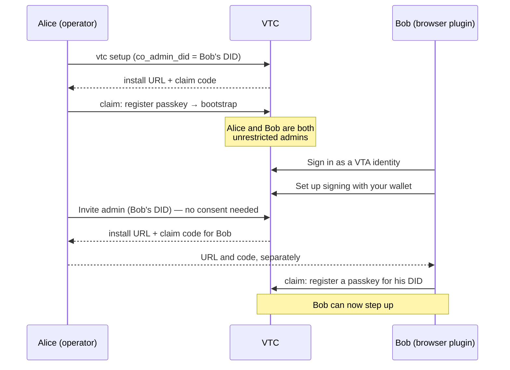

# Administrator access to a VTC

How administration works in a Verifiable Trust Community: who counts as an
administrator, how one person or several run a community, and what stops one
administrator — or one stolen credential — from taking it over.

The walkthrough at the end onboards a first administrator and then a second
one who works from the VTA browser plugin.

Related: [`bootstrap-runbook.md`](bootstrap-runbook.md) (bring-up order),
[`non-interactive-setup.md`](non-interactive-setup.md) (`vtc setup --from`),
[`website-and-admin.md`](website-and-admin.md) (the console).

---

## 1. The model

### 1.1 An administrator is an ACL row

A DID is an administrator because the VTC's access-control list (ACL) says so:
an entry with role `admin`. Every administrative act is authorized by reading
that row **at the moment the act runs**. A credential, a session or a console
key never carries authority of its own.

Only administrators can sign in to the console. A sign-in from any other role
is refused at the challenge.

### 1.2 Unrestricted and scoped administrators

An admin row carries `allowed_contexts`:

| Entry | Means |
|---|---|
| `admin`, no contexts | **Unrestricted** (a super-admin) |
| `admin`, contexts `a`, `b/c` | **Scoped** |

The console's "Allowed contexts" field says "blank = all": leaving it blank on an
admin entry makes that admin unrestricted.

**What a context is here.** In the VTC a context is only a label on an ACL
entry. Labels are path-like and nest, so `b` covers `b/c`. The community keeps
no list of contexts, nothing creates one, and no community resource belongs to
one. Members, join requests, vetting, credentials, rooms and the website are
community-wide, and any administrator, scoped or not, works on all of them. (In
the VTA a context is a key hierarchy; the VTC shares the ACL model, not that
meaning.) Contexts decide three things:

1. whether an admin is scoped or unrestricted, and so the list below;
2. which ACL entries a scoped admin can see (an overlapping context) and change
   or revoke (wholly inside its contexts, never an unrestricted admin);
3. whose step-up passkeys a scoped admin can list.

In the console, **Access control** shows each entry's contexts in the
**Contexts** column and has a **Filter by context** box. Offline, run
`vtc acl list`. The column shows "all" for any entry with no contexts, but that
reading is true only for an admin; a member with no contexts has none.

Only an unrestricted administrator can:

- mint admin invites, and invite members to enrol step-up passkeys;
- read and verify the audit trail;
- change, reload or restart the configuration, and import one;
- export or restore a backup, or purge members;
- approve another administrator's promotion to unrestricted (§3.2);
- revoke other people's console signing keys.

Everything else, including vetting, members, joins and credentials, a scoped
administrator does exactly as an unrestricted one does.

### 1.3 How an administrator proves who they are

| Sign-in | What it is | Can do step-up (§3.1)? |
|---|---|---|
| **Passkey** ("Sign in with passkey") | a WebAuthn passkey registered to the admin DID at this VTC | yes |
| **VTA wallet** ("Sign in as a VTA identity", via the browser plugin) | the VTA signs as one of your personas (a `did:webvh` or `did:key`) | only if that DID also has a passkey here (§4, step 5) |
| **`cnm` / API** | a DI-signed `auth/authenticate` from a `did:key` | not interactively; signs approvals (§3.2) |

Once signed in, the console signs your actions as signed Trust Task documents,
using a **console signing key**. That key is generated in the browser, cannot be
exported, and is enrolled as a delegation from your admin DID ("Set up signing"
after sign-in):

- it lasts at most 30 days;
- you can hold at most five at once;
- it can be used only in the console;
- it is revoked by you, or by any unrestricted administrator.

A console key proves only that you have the browser. The protections in §3
never accept it as a second factor or as an approval.

## 2. One administrator or several

### 2.1 A single administrator

A community with one unrestricted administrator works for day-to-day
administration: vetting, members, invitations, policy, credentials, the website.
The single administrator **cannot** make anyone else an unrestricted
administrator online, because that needs a second administrator's consent
(§3.2) and there is nobody to give it:

> Make did:example:geoff an unrestricted administrator of this community needs
> consent from 1 other unrestricted admin(s), and this community has 0
> (VTI-APV-014).

A single administrator has three ways forward:

1. **Grant scoped admin instead.** Give the entry one or more contexts. A scoped
   administrator needs only your step-up, not another administrator's consent.
2. **Add the second administrator offline**, once. Stop the daemon, then run
   `vtc acl add --did <did> --role admin --label "<name>"` or
   `vtc admin invite --did <did>`, and start it again. Each offline write is
   recorded as an `AclBreakGlassWritten` audit row at the next start (§3.5).
3. **Name the second administrator at install** (`co_admin_did`, §4 step 1),
   which avoids the problem altogether.

A single administrator is also a single point of failure: lose that passkey and
the only way back is the offline route. **Run with at least two unrestricted
administrators.**

### 2.2 Several administrators

Once there are two unrestricted administrators, everything works online. A new
unrestricted administrator is created by one administrator and approved by
another (§3.2), and break-glass is not needed again unless you are back to one.

With three or more you can raise the consent threshold so a promotion takes
several approvals (`acl.unrestricted_admin_consent_threshold`, default and
minimum 1, maximum 16, changeable at runtime). The VTC refuses a threshold the
community could never meet. It also refuses to remove or demote an
administrator when that would leave the threshold unmeetable.

## 3. Protection against a bad administrator

The design assumes any one administrator's credentials can be stolen, or that
one administrator can go rogue. These are the controls that bound the damage.

### 3.1 Step-up bound to one operation

Acts that confer authority need a live passkey gesture from the administrator
performing them, made for **that one operation**:

- granting or promoting anyone to admin (scoped or unrestricted);
- minting an admin invite that creates a new administrator;
- inviting a member to enrol a step-up passkey, or revoking one on their behalf;
- git-namespace break-glass.

The VTC sends a challenge bound to a digest of the exact operation. The gesture
must verify the user and must come from the actor's own passkey. It is valid for
one use within 300 seconds, and raises no session. Approving one act never
approves a different one, and a script holding your console key can't use your
gesture for an act you didn't see: the console key can redeem a gesture, but it
can never make one.

### 3.2 Second-party consent for unrestricted authority (VTI-APV-014)

Making someone an unrestricted administrator, or widening an entry to
unrestricted, needs consent from **another** unrestricted administrator. This
applies to grants, promotions and admin invites alike.

1. Administrator A sends the operation. Their step-up is asked for **first**,
   so a thief holding only A's signing key cannot make the other
   administrators' devices ring.
2. The VTC refuses with `consent_required` and sends a VTC-signed
   `task-consent/request` to every other unrestricted administrator. A is never
   an approver of their own request.
3. Administrator B checks it and approves (`cnm consent show` / `approve`, §4
   step 7).
4. A sends the **same** operation again. The VTC re-checks everything before it
   writes:
   - B is still an unrestricted administrator;
   - the threshold is still met;
   - the subject's entry hasn't changed since B saw it.

   The approval is bound to that exact payload and is spent once. Pending
   requests expire after 15 minutes, and a granted approval after 10.

### 3.3 Separation of duties

- No one can grant themselves admin, promote themselves, change their own entry
  or role, or revoke their own entry.
- No one can write an entry that outlives their own.
- Every promotion goes through the role-change policy and its host checks; no
  path skips them.

### 3.4 Admins cannot remove each other down to nothing

Removals and demotions of administrators are serialized under a lock. The VTC
refuses to remove the last administrator or the last unrestricted
administrator, or to leave fewer unrestricted administrators than the consent
threshold needs. Once that threshold is above 1, it has to be lowered before
the last spare approver can be removed. Narrowing an unrestricted administrator
to scoped counts as a removal for this check.

When an administrator loses privilege, their sessions are revoked and they
receive a signed removal notice.

### 3.5 Everything is audited, including the break-glass

The audit trail has a row for every grant, update, revocation, promotion,
admin invite and passkey registration, and for every consent requested,
approved, declined, granted and spent. Offline writers (`vtc acl add` and
`remove`, `vtc admin invite`, `vtc create-did-key --admin`) cannot write the
audit trail while the daemon is stopped, so they leave a marker. The daemon
turns it into an `AclBreakGlassWritten` row at its next start, naming the
command, the DID and the host it ran on.

Offline access is the operator's last resort and bypasses every check above. It
needs the host itself. Protect the host the way you protect the community.

### 3.6 Other limits

| Control | Limit |
|---|---|
| Admin and install invites | single use, at most 24 hours, plus a claim code delivered separately (Argon2id-hashed) |
| Step-up passkey invites | issued by a different unrestricted administrator behind their own step-up, redeemed by the member's own signature; five wrong claim codes void the invite |
| Member notices | members get a signed notice when a step-up passkey is enrolled or revoked for them, naming who did it |
| Git-namespace break-glass | always a step-up, audited at `Critical`, announced to every other namespace administrator |

## 4. Walkthrough: first administrator, then a second one using the browser plugin

The cast:

- **Alice**, the operator. She runs `vtc setup` and becomes the first
  administrator, signing in with a passkey.
- **Bob**, who uses the VTA browser plugin and signs in with his VTA wallet
  persona, `did:webvh:…:bob`.



### Step 1 — Bob gives Alice his DID (before setup, if you can)

Bob installs the VTA browser plugin, onboards it to his VTA, and chooses the
persona he will administer as. He sends its DID to Alice. If that persona's DID
document is published, Alice resolves it to check she has the right one.

Naming Bob at install is what lets the community start with two unrestricted
administrators. If the community is already running with Alice alone, skip to
step 3b.

### Step 2 — Alice installs the community and claims her passkey

1. Run `vtc setup` (interactive) or `vtc setup --from <toml>`. Set Bob as the
   co-administrator:

   ```toml
   co_admin_did = "did:webvh:…:bob"
   ```

   Setup provisions the VTC's identity from Alice's VTA, mints her
   administrator `did:key`, and prints a one-time install URL
   (`<base>/admin/install?token=…`) and a separate **claim code**. Both are
   valid for 15 minutes.
2. Alice opens the URL ("Claim Admin Passkey"), enters the claim code and
   registers a passkey. The VTC writes **two** unrestricted admin rows: Alice's,
   and Bob's labelled "co-admin (install bootstrap)". It audits
   `CommunityInstalled`.
3. Alice signs in with **Sign in with passkey**, then completes **Set up
   signing** with her passkey.

The claim code is the security of this step, not the URL. Keep them apart, and
note that the claim proves possession of the URL and code, not control of the
DID it names.

### Step 3 — Bob becomes an administrator

**3a. Bob was named at install:** there is nothing to do. His row exists.

**3b. The community is already running with Alice alone.** Alice's online
grant of unrestricted admin is refused (§2.1), so she either:

- grants Bob **scoped** admin online: Access control → **Add entry** → DID,
  Role `admin`, the contexts → **Create entry**, then her passkey gesture; or
- adds him **unrestricted**, offline, once:

  ```sh
  # daemon stopped
  vtc acl add --did did:webvh:…:bob --role admin --label "Bob"
  # start the daemon; it audits AclBreakGlassWritten
  ```

### Step 4 — Bob signs in with his wallet and sets up signing

1. Bob opens the console and chooses **Sign in as a VTA identity**, picking his
   persona. The VTA signs the sign-in for him.
2. The console stops at **Set up signing** and offers **Set up signing with
   your wallet**. The VTA signs an authorization for a new console key in this
   browser.

Bob can now do every administrative act that does **not** need a step-up.

### Step 5 — Alice invites Bob to register a passkey

Until Bob has a passkey at this VTC, every act in §3.1 is refused for him with
"needs a passkey gesture from did:webvh:…:bob, who has no passkey registered".
He cannot add the first passkey himself: **My passkeys** adds a passkey only
behind an existing one, and nobody can invite themselves. Alice does it:

1. Access control → **Admin invites** → **Invite admin** → Bob's DID →
   **Mint invite**. Bob already holds an admin row, so the invite grants
   nothing, and needs neither Alice's step-up nor anyone's consent.
2. She sends Bob the install URL and the claim code by **different channels**.
3. Bob opens the URL, enters the code, and registers a passkey. It is recorded
   against his DID (`AdminPasskeyRegistered`).

From then on Bob's step-up works whichever way he signs in, because the gesture
is checked against the passkeys registered to his DID.

### Step 6 — Give the community an approver that can sign

Consent approvals (§3.2) are documents an administrator's DID signs with its
own key, never a console key. Today:

- `cnm consent approve` signs with the `did:key` of its profile;
- the console has no approval screen;
- Bob's `did:webvh` is held by his VTA, and **cannot sign an approval yet**.

So at least one unrestricted administrator must be able to approve from `cnm`.
The simplest arrangement is Alice's `cnm`: give the `cnm` Client DID its own
unrestricted admin row, as `bootstrap-runbook.md` describes ("`cnm` needs its
own super-admin row").

### Step 7 — A third administrator, entirely online

Say Bob makes Carol an unrestricted administrator:

1. Bob creates or promotes Carol in the console and confirms with his passkey.
   The VTC refuses with *another unrestricted administrator has to approve this
   first* and sends the request to the other unrestricted administrators.
2. Bob passes the refusal on to Alice (its `details.consentRequests` holds the
   VTC-signed request). Alice checks it and approves:

   ```sh
   cnm consent show    refusal.json   # verify it and show what it asks
   cnm consent approve refusal.json   # type Bob's match code
   ```

3. Bob sends the same operation again. It goes through, and Carol has a row.
   Carol then follows steps 4 and 5 for herself.

Promotions that Alice starts need an approver other than Alice. Until Bob can
sign approvals (§5), the `cnm` row from step 6 is that approver.

## 5. Known gaps

- **Wallet administrators can't step up without a VTC passkey.** Step 5 is the
  workaround. Using the plugin's approver identity as the step-up factor is
  designed in
  [`../05-design-notes/vtc-approver-step-up.md`](../05-design-notes/vtc-approver-step-up.md)
  and waits on specification changes.
- **Wallet administrators can't sign consent approvals.** `cnm consent` is
  `did:key`-only and the console has no approval screen.
- **One admin can still remove the others, short of the last.** `acl/revoke`,
  demotion and `vtc/members/admin-remove` need no second admin.
- **Lowering the consent threshold needs no consent.** `config/patch` and
  `vtc/config/import` can set it back to 1.
- **Scoped admins can replace policy**, including the removal policy that
  refuses removing an admin.

  Together these three let one compromised unrestricted admin get round
  VTI-APV-014. The fix, and an action list for N-of-M approvals that complete
  themselves, is designed in
  [`../05-design-notes/vtc-action-list.md`](../05-design-notes/vtc-action-list.md).
- **A founder who uses only a wallet** can't claim the install under their own
  DID. Install claims under an existing DID are a planned version of
  `vtc/install/claim`.

## 6. Quick reference

| I want to… | Do this |
|---|---|
| add a scoped admin | Access control → Add entry → contexts set → your passkey |
| add an unrestricted admin, with 2+ unrestricted admins | the same with contexts blank → another admin approves → send it again |
| add an unrestricted admin, as the only admin | offline `vtc acl add … --role admin`, daemon stopped |
| give an existing admin a console passkey | Access control → Admin invites → Invite admin |
| give a member a step-up passkey | Members → member → Step-up passkeys → Invite… |
| approve a promotion | `cnm consent show` / `approve` on the relayed refusal |
| require two approvers | set `acl.unrestricted_admin_consent_threshold = 2` (needs 3+ unrestricted admins) |
| see who did what | Audit trail (unrestricted admins only); filter for `AclBreakGlassWritten` to see offline writes |
