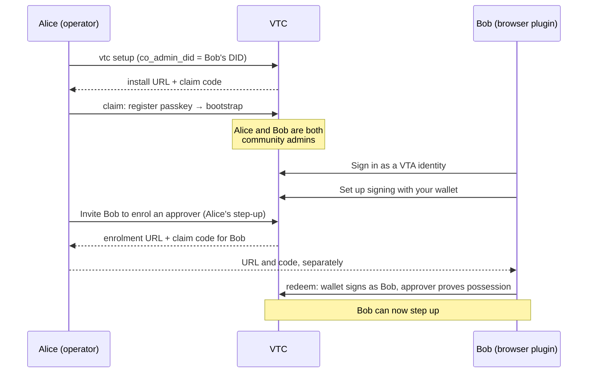

# Administrator access to a VTC

How administration works in a Verifiable Trust Community: who counts as an
administrator, what each one may do, how one person or several run a
community, and what stops one administrator — or one stolen credential — from
taking it over.

The walkthrough at the end onboards a first administrator and then a second
one who works from the VTA browser plugin.

Related: [`bootstrap-runbook.md`](bootstrap-runbook.md) (bring-up order),
[`non-interactive-setup.md`](non-interactive-setup.md) (`vtc setup --from`),
[`website-and-admin.md`](website-and-admin.md) (the console),
[`git-namespaces.md`](git-namespaces.md) (repository rights), and the
one-page [infographic](admin-access-infographic.html). The design notes are
[`vtc-admin-roles.md`](../05-design-notes/vtc-admin-roles.md),
[`vtc-action-list.md`](../05-design-notes/vtc-action-list.md) and
[`vtc-approver-step-up.md`](../05-design-notes/vtc-approver-step-up.md).

---

## 1. The model

### 1.1 An administrator is an ACL entry with an administrative role

A DID is an administrator because the VTC's access-control list (ACL) gives it
an **administrative role**. Every administrative act is authorized by reading
that entry **at the moment the act runs**: the VTC asks one question, whether
the entry holds the capability the act needs at the resource it touches
(`VtcAclEntry::can`). A credential, a session or a console key never carries
authority of its own.

An entry holds two roles, and they are independent
([`vtc-admin-roles.md`](../05-design-notes/vtc-admin-roles.md) §6):

- the **community role** — `member`, `moderator`, `issuer`, `admin`,
  `custom:<name>`, or `application` (below) — what the member's credentials
  name. On its own it confers no administrative power;
- the **administrative role** — what the member may administer.

Any administrative role can sign in to the console. A sign-in from an entry
with no administrative role is refused at the challenge.

There are no contexts at a VTC (VTI-VTC-010). An entry states its act scope
explicitly (`all` or `none`), and authority is narrowed with resource
qualifiers on capabilities, never with a context list. `vtc acl add` refuses
`--contexts`.

### 1.2 Roles and capabilities

A **capability** is one administrative power. The registry is fixed in code
(VTI-ACL-032). A capability is **authority-conferring** when holding it lets
you create authority, your own or someone else's; granting one is always a
second-party action (§3.2).

| Capability | Gates | Authority-conferring? |
|---|---|---|
| `vtc.roles.assign` | granting, changing and removing roles and capabilities; admin invites | **yes** |
| `vtc.approvals.admin` | defining and deleting custom roles (with `vtc.roles.assign`); the approvals rule list, which is not built yet (§5) | **yes** |
| `vtc.policy.admin` | `policy/upsert`, `policy/activate`, qualified by purpose (`policy:join`) | **yes** unqualified, or for the purposes that decide authority: `roleChange`, `removal`, `join`, `crossCommunityRoles`, `gitNamespace` |
| `vtc.config.admin` | `config/patch`, `vtc/config/import`, `config/reload`, `config/restart` | **yes** |
| `vtc.backup.export` | backup export | no |
| `vtc.backup.restore` | backup import | **yes** (it replaces the ACL) |
| `vtc.audit.read` | audit list and verify | no |
| `vtc.did.admin` | `did-management/did/register` | **yes** |
| `vtc.members.manage` | `vtc/members/{update,admin-remove,purge}`, member credentials, relationship suspend and restore, members' step-up factors | no |
| `vtc.join.decide` | `vtc/join-requests/decide` | no |
| `vtc.invitations.manage` | `vtc/invitations/*` | no |
| `vtc.credentials.issue` / `.revoke` | endorsements, personhood, status-list flips | no |
| `vtc.vetting.manage` | vetters, auto-grant, hidden vetting (qualified by `criterion:<id>`) | no |
| `vtc.surface.admin` | profile, branding, website, schemas, endorsement types, join criteria | no |
| `vtc.registry.admin` | registry diagnostics and sync | no |
| `vtc.sessions.revoke` | ending others' sessions and console keys | no |
| `git.ns.admin` | a git namespace (`git-ns:<forge>/<owner>`; unqualified: every namespace) | **yes** |
| `git.repo.manage` | repositories, by namespace or repository (`git-repo:<forge>/<owner>/<repo-id>`) | no |
| `git.commit.sign` | the commit right the community's CI check accepts | no — additive: no role's ceiling holds it |

An **administrative role** is a ceiling of capabilities. An entry holds its
role's full ceiling, or a narrower set from it, each optionally narrowed to one
**resource** — a git namespace or repository, a policy purpose, a join
criterion. Act authority and approve authority are separate: what an entry may
do, and what it may approve others doing (VTI-ACL-040). The built-in roles:

| Role | Ceiling | Approves by default |
|---|---|---|
| `community-admin` | every `vtc.*` capability, `git.ns.admin` and `git.repo.manage` | everything |
| `moderator` | `vtc.members.manage`, `vtc.join.decide`, `vtc.invitations.manage` | the same |
| `vetting-lead` | `vtc.vetting.manage` (optionally at a criterion) | the same |
| `repo-manager` | `git.repo.manage`, `git.ns.admin`, **qualified** to a namespace or repository | the same, at the same qualifier |
| `credential-officer` | `vtc.credentials.issue`, `vtc.credentials.revoke` | the same |
| `auditor` | `vtc.audit.read` | nothing |
| `approver` | nothing — acts nowhere | anything it is granted to approve: the least-privilege approver (VTI-ACL-041) |

A `community-admin` holding its full ceiling is what earlier releases called an
"unrestricted administrator"; the consent threshold keeps that name
(`acl.unrestricted_admin_consent_threshold`). Reading the ACL takes any
administrative role.

**Git rights are capabilities on the entry too.** The rights the `git-ns/*`
tasks grant — namespace admin, repository creation, ownership, maintenance,
commit signing — are **resource grants** on the holder's entry: `git.ns.admin`
or `git.repo.manage` (graded `create`, `own` or `maintain`) or
`git.commit.sign`, qualified by `git-ns:<forge>/<owner>` or by
`git-repo:<forge>/<owner>/<repo-id>`, each with its own granter
(`delegatedBy`) and history. They sit beside the administrative role rather
than inside it: a member with no administrative role can own a repository, and
an entry's one role does not have to be `repo-manager` to hold a git right.
They are granted and revoked only through `git-ns/right/grant` and
`git-ns/right/revoke` (same task URIs and wire types as before), bounded by
the granter's own entry (VTI-ACL-037, VTI-ACL-071) on top of the git rights
model's fixed rules; `acl/*` writes keep them unchanged, and `acl/show` /
`acl/list` 0.2 show them in `ext["org.openvtc"].resourceGrants` (without the
granter's reason). A subject that holds git rights without being a member —
the bridge, an external signer — has an entry of the community role
`application`, which never signs in and is never a membership. `git.ns.admin`
held **community-wide** (a `community-admin`'s) is the git namespaces'
community-administrator capability — it binds, reseats and ratifies — not a
namespace administrator's grant authority. See
[Git namespaces](git-namespaces.md#rights-are-capabilities-on-the-acl-entry).
The console's **Repos** page is shown to whoever holds `git.ns.admin` or
`git.repo.manage` at any qualifier, and offers each action only where the
viewer's entry holds what it needs there.

**Custom roles.** A community can define its own roles when the built-in set
does not fit — `events-team` = `vtc.surface.admin` + `vtc.invitations.manage`,
or a repo manager who is also a vetting lead, since an entry holds one
administrative role. A custom role is a record in the ACL model (stored beside
the entries, carried by a backup), never policy:

- `vtc/roles/list/0.1` and `vtc/roles/show/0.1` (any administrator) show every
  role with the ceilings it is enforced by, and how many entries hold it. The
  console's **Roles** page reads them.
- `vtc/roles/define/0.1` creates a role (or replaces one, with `replaces:
  true`), and `vtc/roles/delete/0.1` deletes one. Both take `vtc.roles.assign`
  **and** `vtc.approvals.admin`, your step-up, and the approval of other
  holders of both: they wait in the action list (§3.2). Built-in roles cannot
  be defined, replaced or deleted (`builtInRole`).
- A role's ceiling cannot name what its defining administrators — you and the
  approvers whose approval runs it — do not hold, nor an approve scope they may
  not approve (`exceedsDefinerAuthority`). `git.commit.sign` is additive and
  never sits in a ceiling (`additiveCapability`).
- A role is deleted only when no entry holds it, expired entries and grants
  waiting in the action list included (`inUse`, with the count).
- A role is a ceiling read **now**: replacing one changes what every holder may
  do at once, and a narrowing ends their sessions. An entry naming a role the
  community has no definition for confers nothing, sign-in included
  (VTI-ACL-011).
- Grant a custom role exactly as a built-in one: `acl/grant/0.2` with `role:
  "events-team"`, or the console's Add entry.

In the console, **Access control** shows each entry's administrative role, what
it **administers** (its capabilities, with their resources), and its community
role. "everything" appears only for a community administrator holding its full
ceiling, and "nothing" for an entry with no administrative role. The console's
navigation and buttons follow the capabilities `auth/whoami` reports for the
viewer. Offline, run `vtc acl list`.

**Granting is bounded by the granter**
([`vtc-admin-roles.md`](../05-design-notes/vtc-admin-roles.md) §6.3,
VTI-ACL-071):

- you can grant a capability only if you hold it **and** `vtc.roles.assign`,
  at a resource at least as wide;
- you can grant approve authority only within your own;
- no grant outlives your own entry, and nobody grants themselves anything;
- an additive capability (one the role's ceiling does not include) takes a
  `community-admin` holding its full ceiling.

Each refusal names its code (`acl/grant:delegationExceedsGranter`,
`capabilityOutsideCeiling`, `approveWiderThanGranter`, …). The VTC records the
granter as the entry's `delegatedBy`.

**A departed granter's grants go to review.** When a granter leaves — removed,
narrowed so that it no longer covers them, or expired — the entries they
granted go **to review**: one item in the **Actions** list (kind
`acl.grants.review`) for the holders who may approve `vtc.roles.assign`, the
entries under review excepted. **Re-affirm** (approve) keeps each grant the
approver covers, under the approver's own authority; **Withdraw** (decline)
removes them at once — the administrative role removed, the membership kept.
Nobody deciding within the action lifetime (`acl.action_lifetime`) withdraws
them too. Editing and saving an entry under review re-affirms it as before. A
granter who rolls to a new key (§1.4) has not left: the entries it granted
follow it.

The **git rights** a departed member granted are reviewed the same way, one
grant at a time: a separate `acl.grants.review` item lists them in its
payload's `gitGrants` (subject, right, resource), each grant stays in force and
marked meanwhile, **Re-affirm** puts each under an approver whose own entry
covers it, and **Withdraw** — or the deadline — revokes them. Git grants go to
review only when their granter **leaves the community**; narrowing a
granter's entry does not raise one. A community whose `gitNamespace` policy
sets `cascade_on_departure` revokes them at once instead. A grant with no
granter to depart (a binding's first admin, a creator's own ownership, a
break-glass, the bridge's service grant) is never reviewed.

### 1.3 How an administrator proves who they are

| Sign-in | What it is | Step-up (§3.1) |
|---|---|---|
| **Passkey** ("Sign in with passkey") | a WebAuthn passkey registered to the admin DID at this VTC | yes |
| **VTA wallet** ("Sign in as a VTA identity", via the browser plugin) | the VTA signs as one of your personas (a `did:webvh` or `did:key`) | yes, with an **approver device** bound to that DID (§3.1a), or a passkey registered to it here |
| **`cnm` / API** | a DI-signed `auth/authenticate` from a `did:key` | not interactively: answer the step-up in the console, then send the same command again (`cnm` says so) |

Approvals (§3.2) are signed by the approver's own DID whichever way they
signed in: by the wallet in the console, or by `cnm`.

Once signed in, the console signs your actions as signed Trust Task documents,
using a **console signing key**. That key is generated in the browser, cannot be
exported, and is enrolled as a delegation from your admin DID ("Set up signing"
after sign-in), approved in your wallet or with your passkey:

- it lasts at most 30 days;
- you can hold at most five at once;
- it can be used only in the console;
- it is revoked by you, or by a holder of `vtc.sessions.revoke` whose entry
  covers yours.

A console key proves only that you have the browser. The protections in §3
never accept it as a second factor or as an approval.

### 1.4 Rolling your own entry to a new key

`acl/swap-key/0.1` moves **your own** entry to a new key, with its authority
exactly as it was — role, capabilities, approve scope, label, expiry and
provenance (VTI-CLT-025 – 032). It is one of the three changes you may make to
your own entry (VTI-ACL-052, §1.4a), and it confers nothing, so it needs no
approval:

- the document is signed by the entry's current key, never a console key;
- it carries a **link proof**: a short-lived (at most 15 minutes) VP-JWT
  `AclSwapRequest` signed by the new key and addressed to this community, so a
  stolen old key cannot move the entry to a key the thief holds;
- the rotation is audited (`AclKeyRotated`) **before** it commits, and the
  move is one atomic write: concurrent rotations of one entry, one wins;
- the old key's sessions end; your membership row, your git rights and the
  entries you granted follow the new key.

### 1.4a Your own label — and, in single-administrator mode, your own entry

A subject may not modify its own entry (VTI-ACL-052). Besides rolling it to a
new key (§1.4) there are two exceptions:

- **The label, and nothing else.** The label is a name, not authority
  (VTI-ACL-001), so you can change your own on any door that writes it — the
  label cell on **Access control**, `acl/update` (0.1 or 0.2) with only
  `label`, or `vtc/members/update` with only `label` — with no step-up. The
  change is audited (a `MemberUpdated` row naming the old and new label and
  `labelSetBySubject`), and the label is marked **self-set**: the console shows
  it with a *self-set* tag, the ACL listing carries
  `ext["org.openvtc"].labelSetBySubject: true`, and the name the console shows
  for your DID elsewhere ends in "(self-set)". The mark goes when another
  administrator sets the label. A request that changes the label **and**
  anything else is refused whole.
- **In single-administrator mode, an unrestricted administrator's own entry**
  (§2.1a). If your entry has unrestricted act scope — a `community-admin`
  acting everywhere with its full ceiling — you may change the rest of it too:
  your approve scope, community role, expiry, even narrow your own
  capabilities. Each such edit takes your step-up **bound to that one
  operation** (§3.1), is audited at `Critical` (a `SingleAdminMode` row,
  `event: selfEditWaived`, naming the task and its digest, written before the
  change), and is refused if it would leave the community with **no** entry
  holding unrestricted act scope: while yours is the only one, it must stay
  unrestricted and its expiry may not come sooner. Narrowing yourself out of
  `vtc.roles.assign` is checked like any removal (§3.4).

Anything else on your own entry is refused, and the refusal says what you may
do instead. The console does not offer it: on your own row (*you*), **Edit**
is disabled with the reason, unless the mode is on and your entry is
unrestricted, in which case it asks for your step-up when you save.

### 1.5 `cnm`: one identity per community

`cnm` administers a community as a `did:key` of its own for that community, so
an operator who runs several communities holds a different key in each and
nothing links them:

- `cnm community add <name> --vtc-did <VTC DID>` mints the key, parks the
  community as *pending grant*, and prints the ways to grant it:
  `co_admin_did` at install, `vtc acl add` on the host, or an existing
  administrator's `cnm access grant` / **Access control → Add entry**.
- `cnm community continue <slug>` signs in once the grant lands, then
  **rotates** the granted key to a fresh one with `acl/swap-key` (§1.4), so the
  DID that travelled to the granting administrator loses all standing.
- `cnm community rotate <slug>` rotates a configured community's key at any
  time.

Two identities are not rotated, because their key is held somewhere the VTC's
swap does not reach: one bound to a community VTA (`--vta-did`) and one shared
with another community (`--reuse-identity`, which is never done without that
flag). The steps are in
[`bootstrap-runbook.md`](bootstrap-runbook.md#cnm-needs-its-own-administrator-entry).

## 2. One administrator or several

### 2.1 A single administrator

A community with one community administrator works for day-to-day
administration: vetting, members, invitations, policy, credentials, the website.
What a single administrator cannot do on their own, unless the community runs
in single-administrator mode (§2.1a), is anything that needs another
administrator's consent (§3.2): granting an authority-conferring capability —
`vtc.roles.assign`, `vtc.config.admin`, … — inviting an administrator,
changing a policy that decides authority, or lowering the consent threshold.
With nobody else eligible to approve, the VTC refuses it before asking for a
step-up:

> Give did:example:geoff vtc.roles.assign, … needs consent from 1 other
> holder(s) of vtc.roles.assign, … (VTI-APV-018).

The ways forward:

1. **Single-administrator mode** (§2.1a), for a community that really is run by
   one person — a household, a club with one organiser, a test deployment. Its
   administrator does all of this online on their own step-up.
2. **Grant a narrower role instead.** A `moderator`, `auditor`,
   `credential-officer` or `vetting-lead` holds nothing authority-conferring,
   so it needs only your step-up, not another administrator's consent.
3. **Name the second administrator at install** (`co_admin_did`, §4 step 2),
   which avoids the problem altogether.
4. **Add the second administrator offline**, once — the break-glass. Stop the
   daemon, then run `vtc acl add --did <did> --role admin --label "<name>"` (a
   `community-admin`; `--admin-role` and `--capability` choose another role or
   narrow it) or `vtc admin invite --did <did>`, and start it again. Each
   offline write is recorded as an `AclBreakGlassWritten` audit row at the next
   start, and raised in Actions for the administrators to acknowledge (§3.5).

A single administrator is also a single point of failure: lose every step-up
factor and the only way back is the offline route. Where more than one person
can administer the community, **run with at least two community
administrators.**

### 2.1a Single-administrator mode

Second-party consent presupposes a second party (VTI-APV-022). A community
run by one person has none — even where that person administers it under
several identifiers, one per device. In single-administrator mode, an
operation that ordinarily needs another administrator's approval — granting an
authority-conferring capability or inviting an administrator (VTI-APV-018),
lowering the consent threshold (VTI-APV-020), replacing a policy that decides
authority (VTI-VTC-022), defining or deleting a custom role, committing a
restore — is authorized by your step-up **bound to that one operation** (§3.1)
instead, **whether or not other administrators' entries exist**. The
operation runs at once; nothing waits in Actions. An administrator whose entry
is unrestricted may also edit its own entry (§1.4a).

- **Set it on the host, at install.** `vtc setup --single-admin` (interactive
  or `--from`), `single_admin_mode = true` in the setup TOML, or answer *Yes* to
  "Run as a single-administrator community?". Setup writes `[acl]
  single_admin_mode = true` to `config.toml`. Changing it later means editing
  `config.toml` on the host and restarting. It is **not** a runtime setting:
  `config/patch` and `vtc/config/import` refuse `acl.single_admin_mode` by
  name, so nobody holding only an administrator's credentials can turn it on or
  off.
- **It is a statement that every administrator is you.** The VTC cannot tell
  one person's identifiers from two people's, so it does not count entries:
  another administrator entry — your phone's, your laptop's — is no second
  party, and consent stays waived however many there are. Turn the mode on
  **only** where every administrator is the same person. If someone else
  becomes an administrator, turn it off on the host (edit `config.toml`,
  restart) and consent applies again exactly as in §3.2. Setting it together
  with `co_admin_did` is allowed, but setup warns you to keep it only if that
  DID is another of your own identifiers.
- **A reduction cools off rather than waiting for consent.** Removing or
  narrowing another administrator (VTI-APV-019) is not parked for a third
  party's consent in this mode, even where one exists: it takes your step-up,
  the subject is notified, it is audited at `Critical`, and by default it keeps
  its cooling-off (§3.4) — a delay, not a consent, so the subject sees it
  coming, suspended until it lands. A community that wants no cooling-off at
  all sets `acl.removal_cooling_off = 0`, a visible, audited configuration
  change.
- **You can remove an administrator now.** Because the cooling-off is a delay
  you impose on yourself, the mode lets you skip it for one removal: **Remove
  now** beside **Revoke** on Access control (or **Land now** on a cooling-off
  already running, in Actions; `cnm access revoke <did> --now`). You type the
  administrator's DID — or the action's id — to confirm, then make a passkey
  gesture bound to the immediate removal; a gesture made for the ordinary,
  delayed removal does not count. It lands at once, is audited at `Critical`
  (`SingleAdminMode` `reductionImmediate`, then `AuthorityReducedUnopposed`),
  and the subject is told. Without the mode it is refused: the cooling-off
  always runs.
- **It covers git separation of duties the same way.** Nobody records an
  elevated git right (`git.ns.admin`, `git.repo.create`, `git.repo.own`) for
  themselves (git-namespaces *Separation of duties*), and break-glass needs
  another administrator to ratify — so in this mode such a self-grant (`cnm git
  grant`, `create`, `adopt --owner <you>`, `reseat` to yourself, a drift
  adoption for your own account) runs on your step-up bound to that operation
  instead, whoever else holds an administrator entry or a right that could make
  the grant. The record is marked, counts toward the last-owner and last-admin
  invariants, and needs no ratification
  ([git-namespaces](git-namespaces.md#single-administrator-mode-waives-it)).
- **It is never quiet.** Every administrator sees a permanent *SINGLE ADMIN
  MODE* banner on every console page and a dashboard tile; `cnm actions list`
  prints the same notice. Each waived operation is entered in the Actions
  history marked **Consent waived**. And it is audited at `Critical`: a
  `SingleAdminMode` row at every start with the mode in effect (`inEffect`),
  another when the host configuration turned it on or off since the last start
  (`enabled` / `disabled`), one for every operation whose consent it waived
  (`consentWaived`, naming the task, the requirement and the payload digest),
  and one for every git self-grant it waived (`selfGrantWaived`, naming the
  task, its digest, the git-ns action, the right and the resource — written
  before the record, and refusing the operation if it cannot be). A waived git
  self-grant is answered with `ext.org.openvtc.selfGrantWaived`, which `cnm`
  reports as *Single-administrator waiver applied*, and shows in the git
  activity list as `gitNs.right.selfGrantWaived`.

### 2.2 Several administrators

Once there are two community administrators, everything works online. A new
one is created by one administrator and approved by another (§3.2), and
break-glass is not needed again unless you are back to one.

With three or more you can raise the consent threshold so a promotion takes
several approvals (`acl.unrestricted_admin_consent_threshold`, default and
minimum 1, maximum 16, changeable at runtime). Raising it takes effect at once;
lowering it is itself an action that needs the current threshold's approvals
(VTI-APV-020). The VTC refuses a threshold the community could never meet. It
also refuses to remove or demote an administrator when that would leave the
threshold unmeetable.

## 3. Protection against a bad administrator

The design assumes any one administrator's credentials can be stolen, or that
one administrator can go rogue. These are the controls that bound the damage.

A survey of every VTC operation on 2 October 2026 found three ways one
administrator could get round the second-administrator rule alone: remove the
other administrators, lower the consent threshold, or replace the policy that
decides authority — then promote at will. All three are closed: each is now a
second-party action in its own right (§3.2) — removals and narrowings
(VTI-APV-019), lowering the threshold (VTI-APV-020), and authority policy,
which also takes `vtc.policy.admin` at that purpose (VTI-VTC-022).

### 3.1 Step-up bound to one operation

These acts need a live step-up from the administrator performing them, made
for **that one operation**:

- granting or widening anyone's administrative authority (any administrative
  role or capability), and minting an admin invite that creates a new
  administrator;
- removing, demoting or narrowing an administrator, including bringing an
  entry's expiry forward;
- lowering the consent threshold, and changing a policy that decides
  authority;
- defining or deleting a custom role, and committing a backup restore;
- inviting a member to enrol a step-up passkey or a step-up approver, revoking
  one on their behalf, and adding or revoking your own approver;
- git-namespace break-glass.

When the act also needs other administrators' consent (§3.2), the step-up comes
first, and is the requester's only gesture: the approvals that follow are other
people's.

The VTC sends a challenge bound to a digest of the exact operation. The answer
must come from the actor's **own additional factor**, one of:

- **a passkey** — the gesture must verify the user and come from a passkey
  registered to the actor; or
- **a step-up approver** — a `did:key` bound to the actor as their step-up
  factor, such as the approver identity the VTA browser plugin holds behind a
  WebAuthn-unlocked key, one per community. The console hands the request and
  the operation to the plugin (`approveStepUp`), which shows the operation and
  signs a statement over the challenge and the operation digest; the answer
  around it is signed by the actor's **own DID** (the wallet signs it as the
  persona), never by a console key. An answer signed by a console key is
  refused with `auth/step-up/approve-response:subjectMismatch`. This is how a
  wallet administrator, who has no passkey at this VTC, steps up
  (VTI-APV-015).

The refusal says which the VTC will take (`accepts`). Once an administrator
holds a dedicated step-up factor — an approver or a step-up passkey — their
ordinary session passkeys stop counting for step-up. An administrator who
holds no factor at all is told the two routes that work for them: another
administrator's invite, or `vtc admin enrol-approver` on the host (§3.1a).

A step-up is valid for one use within 300 seconds, and raises no session.
Approving one act never approves a different one, and a script holding your
console key can't use your factor for an act you didn't see: the console key
can redeem a recorded step-up, but it can never make one.

### 3.1a Enrolling a step-up approver

A second factor can't be bound on the strength of the first, so every
enrolment rests on something independent of the subject's signing key, proves
the approver key is held (the approver signs over a fresh challenge), carries
the subject's own signature, and is audited naming how it was bound
(`enrolledVia`, VTI-APV-016):

| Route | Who | `enrolledVia` |
|---|---|---|
| Claim the install under your own DID (`vtc/install/claim/*/0.3`) | the founder, with the install URL and claim code | `install` |
| An invite from another community administrator, behind their own step-up (Members → the member → **Invite to enrol an approver**), redeemed at `/admin/enrol-approver` | a member who holds no factor | `invite` |
| Add or rotate one yourself behind a factor you already hold (**My passkeys → Approver devices**) | the subject | `selfService` |
| `vtc admin enrol-approver --did <subject>`, daemon stopped — mints the same invite | the operator, with host access | `offline` |

Nobody invites themselves. An approver DID is bound to one subject, once: a
revoked one can never be bound again. A subject holds at most five. Revoking
the last one is allowed — it costs the ability to step up with it, not the
subject's authority — and is recovered through another invite.

Every administrator made by a completed action (§3.2: an `acl/grant`,
`acl/update` or `acl/change-role` to community-admin) is issued an approver
enrolment invite automatically. The requester sees it once, on the completed
action (the URL and a claim code), and delivers the claim code to the new
administrator by a separate channel.

### 3.2 Second-party consent: the action list

These operations need the consent of **other** administrators:

| Operation | Approvers | Requirement |
|---|---|---|
| granting or widening an entry to an **authority-conferring capability** it did not hold: `acl/grant`, `acl/update`, `acl/change-role`, `vtc/admin/invites/create` | holders of the same capabilities at a covering resource | VTI-APV-018 (the generalised VTI-APV-014) |
| taking authority-conferring capabilities away from **another** entry: `acl/revoke`, a downward `acl/change-role`, a narrowing `acl/update`, `vtc/members/admin-remove` | the same, the subject excluded | VTI-APV-019 |
| lowering `acl.unrestricted_admin_consent_threshold`, by `config/patch` or `vtc/config/import` (raising it stays immediate) | holders of `vtc.roles.assign` | VTI-APV-020 |
| `policy/upsert` and `policy/activate` for the purposes that decide authority | holders of `vtc.policy.admin` at that purpose | VTI-VTC-022 |
| `vtc/roles/define`, `vtc/roles/delete` | holders of `vtc.roles.assign` and `vtc.approvals.admin` | VTI-APV-018 |
| committing a backup restore (`backup/finalize-import` with `confirm: true`) — it replaces the ACL | holders of `vtc.backup.restore` | VTI-APV-018 |
| a departed granter's grants (raised by the community itself) | holders of `vtc.roles.assign`; one approval re-affirms | VTI-ACL-071 |

An approver is anyone whose **approve scope** reaches every capability at
stake, at a covering resource (VTI-ACL-040): a repo manager for `acme` approves
inside `acme` only, and the least-privilege `approver` role — acts nowhere,
approves as granted — counts like anyone else (VTI-ACL-041). A role definition
is the exception that asks more: its ceiling is bounded by what each approver
actually holds, so an approver who holds nothing makes it fail at execution.
The requester is never an approver of their own request, and for a reduction
the subject is not one either.

Besides approvals, the action list holds three other kinds of item:
**cooling-offs** (a reduction with nobody left to approve it, §3.4),
**acknowledge** items (an operator's offline write, §3.5) and **queue** items
(a break-glass to ratify, a referred join, a withdrawn vetting statement,
§3.2a). One list, one
**Actions** page, one `cnm actions list`.

A restore is previewed (the backup opened, nothing written) before it is
parked, so a wrong password is refused at once; approvers are shown which
bundle is restored, never its password, and the staged bytes are kept until
the action closes. The number needed is the consent
threshold (§2.2). A reduction with nobody left to approve it waits out a
cooling-off instead (§3.4).

Upgrading a VTC in place over a store written before role-based
administration migrates its ACL at boot (`vtc-admin-roles.md` §9): each old row
maps to the administrative role its community role implied, a context-scoped
admin comes across with **no** administrative role and is raised here as an
acknowledge item, and a row that cannot be mapped stops the daemon with the
DID and the offline fix. Git rights held in the old rights store move onto
their holders' entries at the same boot.

An expiry put on a permanent entry, or brought forward, is a reduction of
everything the entry holds: it takes every capability away sooner. A move of a
community role that implies an administrative role (`moderator`, `issuer`, or
`admin`) is made with `acl/change-role` only; `vtc/members/update` refuses it
with `adminRoleForbidden`, because only `acl/change-role` carries the step-up
bound to the move.

1. Administrator A sends the operation. Every check runs, and A's step-up is
   asked for **first**, so a thief holding only A's signing key cannot make the
   other administrators' devices ring.
2. The VTC **parks** the operation as an *action*, storing A's signed document
   as sent. A gets HTTP 202 and a `trust-task-next-step` reply naming the
   action; the console shows "*Sent for approval — 1 of 2 must approve within
   72 hours*", linking to it. A sends nothing again.
3. Each approver finds the action in the console's **Actions** page (or `cnm
   actions list`) and approves or declines it, signing with their own DID
   (§4 step 6). One decline closes it for everyone. An open console learns of
   a new action within a second over its live channel (a hint, never the
   action — `website-and-admin.md`, *Live updates*), and polls every minute
   when that channel is down; `cnm actions watch` does the same on a terminal.
4. The approval that reaches the threshold **runs the stored operation**. The
   VTC re-checks everything first, against the community as it is then
   (VTI-APV-017):
   - A still has the authority, and separation of duties, the role-change policy
     and attrition still allow it;
   - the approvers still hold what is at stake, and the threshold is still
     met;
   - the subject's entry hasn't changed since the approvers saw it.

   It runs at most once. If a check fails, the action closes `failed` and
   nothing is written. The action is recorded as `executing` before the
   operation runs, and the operation records its effect when it writes, so an
   action interrupted by a crash is settled from that record when the VTC next
   looks at it: `completed` if the write landed, `failed` if it never did
   rather than marked failed on a timer.

An action is approved against the exact payload it parks, and each approver
answers their own challenge. It ends in one of these ways:

| Closes as | When |
|---|---|
| `completed` | the threshold was reached and the operation ran |
| `failed` | a re-check at completion refused it |
| `declined` | any approver declined |
| `cancelled` | A withdrew it (`vtc/admin/actions/cancel`), or it was invalidated: A no longer holds the authority it needs, the subject's entry changed, or too few approvers remain to reach the threshold |
| `expired` | nobody completed it within its lifetime |

An approver who loses standing simply stops counting. Closed actions stay in
**History** for 30 days.

Lifetimes and limits are community configuration, changeable at runtime with
`config/patch`. An open action keeps the expiry it was raised with.

| Setting | Default | Bounds |
|---|---|---|
| `acl.action_lifetime` (seconds) | 259200 (72 h) | 900 – 1209600 (14 days) |
| `acl.action_max_open_per_requester` | 5 | 1 – 20 |
| `acl.action_max_open` (whole community) | 50 | 10 – 500 |
| `acl.action_decline_cooldown` (seconds; same requester, kind and subject after a decline) | 3600 | 0 – 86400 |
| `acl.removal_cooling_off` (seconds; §3.4) | 86400 (24 h) | 0 – 604800 (7 days) |
| `acl.consent_request_push` (push requests to approvers' devices) | `false` | boolean |

More than three actions from one requester in 10 minutes writes a `Critical`
`AdminActionBurst` audit row and flags that requester's cards for the
approvers. An approver can make at most 10 decisions a minute.

The action list is the source of truth. The VTC can also push a VTC-signed
`task-consent/request` to each approver's device, best-effort, but only when
`acl.consent_request_push` is `true`; it is off by default.

A decision may carry extra evidence beside its signature
(`task-consent/decision/0.2`): `webauthn`, a passkey assertion, which the
console adds, or `approverSigned`, a statement from a step-up approver bound to
the signer (§3.1a), made for that decision's challenge and payload digest. The
console sends `approverSigned` when the administrator has an approver device
and the browser plugin can sign a decision (`approveDecision`); otherwise a
passkey assertion; otherwise the wallet signature alone. `cnm` and other
clients can send `approverSigned` too.

### 3.2a Queues in the action list

Three decisions the community already waited on a person for are raised in
**Actions** too, as category `queue` (`vtc-action-list.md` §8.2). Their wire
tasks are unchanged: each answer runs the operation that always decided the
record, with all of that operation's own checks, audit and notices.

| Item (`kind`) | Raised when | Decided by | Approve | Decline |
|---|---|---|---|---|
| Break-glass ratification (`gitNs.breakGlass.review`) | a git-ns break-glass is recorded, unratified | holders of `git.ns.admin` at its namespace: the namespace's administrators and community administrators, never the one who broke it | **Ratify** — `git-ns/right/ratify` | **Revoke** — `git-ns/right/revoke` |
| Join review (`member.join.review`) | a join request is referred for review (`admission: review`) | holders of `vtc.join.decide`, never the applicant | **Approve** — `vtc/join-requests/decide`, `approved` | **Reject** — the same, `rejected` |
| Vetting withdrawal review (`vetting.withdrawal.review`) | a vetter withdraws a statement a current member's admission counted (`needsReview`); one item per member | holders of `vtc.vetting.manage`, never the member | **Keep member** — recorded, nothing else changes | **Start removal** — `vtc/members/admin-remove` as the decider, which needs `vtc.members.manage` and applies the removal policy and any consent it takes |

How a queue item differs from an approval:

- **One decision, either way.** There is no threshold: one decider closes it.
  Declining is not an abort; rejecting, revoking and starting a removal are
  decisions in their own right.
- **It never expires, and nobody cancels it.** A break-glass is never accepted
  by lapse: its item waits until someone ratifies or revokes it. The one who
  broke the glass sees the item but can neither decide nor withdraw it.
- **The record decides when it closes.** Decided anywhere else (the **Join
  requests** page, `git-ns/right/ratify` sent directly, a member removed from
  **Members**), the item closes, naming who decided where the record says. The
  page and the item always show the same state.
- **A refused answer leaves it open.** If the operation refuses (the decider's
  own authority is an unratified break-glass, or they lack
  `vtc.members.manage` to start a removal), nothing is written and the item
  still waits.
- **It is a decision, not a consent.** Single-administrator mode changes
  nothing: a sole administrator holding the capability decides it alone, as on
  the **Join requests** page. A break-glass is still never ratified by the one
  who broke it (`selfRatification`).
- **It does not count against the action limits** (`acl.action_max_open`,
  per-requester), so a long join queue never stops an administrator acting.

The VTC raises each item when the record is written, and the minute sweeper
raises any that is missing (a crash between the two, a restored backup). An
administrator who gains the capability after an item was raised is given a
place to decide it at the next sweep.

### 3.3 Separation of duties

- No one can grant themselves admin, promote themselves, change their own entry
  or role, or revoke their own entry (VTI-ACL-052), except: rolling it to a new
  key (§1.4); changing its label and nothing else, which is audited and shown
  as self-set (§1.4a); and, in single-administrator mode, an unrestricted
  administrator's edit of its own entry on its operation-bound step-up,
  audited at `Critical`, never leaving the community without an unrestricted
  entry (§1.4a).
- No one can write an entry that outlives their own.
- Every promotion goes through the role-change policy and its host checks; no
  path skips them.
- No one decides their own action: the requester is never an approver, the
  subject of a reduction never approves it, and a break-glass is never
  ratified by the one who broke the glass.
- No one records an elevated git right for themselves; break-glass is the
  explicit way, ratified by another administrator. In single-administrator
  mode, where nobody else could grant it, the requester's operation-bound
  step-up stands in, audited at `Critical` (§2.1a).

### 3.4 Admins cannot remove each other down to nothing

Removals and demotions of administrators are serialized under a lock. The VTC
refuses to remove the **last holder of `vtc.roles.assign`**, or to leave fewer
holders than the consent threshold needs. Once that threshold is above 1, it
has to be lowered before the last spare approver can be removed. Narrowing an
entry so it loses `vtc.roles.assign` counts as a removal for this check.

Every removal, demotion or narrowing of an administrator takes the requester's
step-up. When it takes nothing authority-conferring away, that is all it
takes. When it takes authority-conferring capabilities away from another entry
it is also an action for their other holders to approve (§3.2, VTI-APV-019).

**Nobody left to approve: the cooling-off.** With only the requester and the
subject holding what is at stake — two community administrators, say — nobody
is left to approve. The VTC cannot tell a removal of a compromised co-admin
from a compromised admin removing the other, and must not make the first
impossible. So, after the requester's step-up, the operation is parked as an
action with no approvers and a **cooling-off** (`acl.removal_cooling_off`,
default 24 hours, 0 to 7 days, read live; `0` lands it at once). In
single-administrator mode every reduction of another administrator takes this
path, whoever else could have approved it (§2.1a):

- **The subject is suspended until it lands.** From the moment it is parked,
  the subject's entry authorizes nothing: every administrative operation it
  sends — signed by its own key or a console key, over TSP, DIDComm or REST,
  git-ns included — is refused with a message naming the action and when it
  lands, it approves and decides nothing, and it no longer counts as an
  administrator for the attrition guard. Its git rights stop being published:
  the Trust Registry records (and so the commit check) and the forge roles are
  withdrawn, while the rights themselves stay recorded
  (`git-namespaces.md`, *While its holder is suspended*). Its sessions are
  revoked. It can still sign in, see the action about itself and cancel a
  request of its own, but nothing more. Its entry is kept as it was; the
  Access control page marks it *suspended — removal lands T*. Cancelling lifts
  the suspension, restores the entry exactly and publishes its git rights
  again. The suspension survives a restart.
- The requester sees it under **Requested by me** and can **Cancel** it until
  it lands. In single-administrator mode they can also **Land now** (§2.1a).
- The subject is sent `vtc/members/authority-reduction-pending-notice/0.1`
  when it is parked (a durable push, like the other notices): what will happen
  (`revoked`, `demoted` or `narrowed`), who asked, and when it lands. They also
  see it in their list (`callerRole: subject`, in **All** and **History**,
  never **Waiting for me**) and a `Critical` console banner — "*X has asked to
  reduce your authority; it takes effect at T unless they cancel*" — but cannot
  block it. If the subject is the attacker, a veto would protect them.
- On the wire (`vtc/admin/actions/*/0.2`) it is category `coolingOff`, with
  `landsAt` and `cancellableBy: requester`, and no threshold or expiry. The
  console and `cnm` count down to `landsAt`. (A 0.1 caller still reads it as
  an `approval` with `ext["org.openvtc"].coolingOff`.)
- When the window ends the VTC lands it by itself (the sweeper runs every
  minute), audits it at `Critical` as `AuthorityReducedUnopposed`, sends the
  authority-reduced notice (`unopposed`), and closes the action `completed`
  (`landedAfterCoolingOff` at 0.2). Landing never waits on a notice being
  delivered. If the requester cancels, nothing is reduced and no further
  notice is sent.
- If a third administrator who can approve it appears meanwhile, the action is
  cancelled: there is now someone to approve, so send it again.
- **First to act wins.** The subject is suspended the moment the first
  request is raised, so it cannot answer with a request to reduce the
  requester: that is refused as suspended, before any gesture. The subject's
  own open actions are cancelled as it loses authority. Only one reduction
  cools off on a subject at a time.

Run with three or more community administrators to close the window
altogether.

When an administrator loses privilege, their sessions are revoked and they are
told with a VTC-signed notice:

- **A reduction** — `acl/revoke` (whole entry or part of its scope), a
  downward `acl/change-role`, or an `acl/update` or `acl/grant` that narrows
  the entry — sends `vtc/members/authority-reduced-notice/0.1` (VTI-APV-019),
  a durable push over TSP, DIDComm or REST, in that order of preference. It
  says what happened (`revoked`, `demoted` or `narrowed`), the previous and
  resulting role, who decided and when, the reason if one was given, and how it
  was agreed: `consented` if another administrator approved, `unopposed` if
  nobody did (a cooling-off, or a reduction that took nothing
  authority-conferring, on the requester's step-up alone).
- **A removal from the community** (`vtc/members/admin-remove`) sends the
  removal notice instead. Nobody gets both.

### 3.5 Everything is audited, including the break-glass

The audit trail has a row for every grant, update, revocation, promotion,
key rotation, admin invite and passkey or approver enrolment, and for every
step of an action (`TaskConsentRecorded`, stage `parked`, `approved`,
`declined`, `cancelled`, `invalidated`, `expired`, `completed` or `failed`).

Offline writers (`vtc acl add` and `remove`, `vtc admin invite`, `vtc admin
enrol-approver`, `vtc create-did-key --admin`, `vtc admin emergency-bootstrap`)
cannot write the audit trail while the daemon is stopped, so they leave a
marker. At its next start the daemon audits each one (`AclBreakGlassWritten`,
or `EmergencyBootstrapInvoked`) and also raises it in the action list as an
**acknowledge** item (VTI-VTC-023):

- Its `typeUri` is the record type
  `https://trusttasks.org/spec/vtc/operator/offline-write/0.1`, and its payload
  is that record: `command` (`aclAdd`, `aclRemove`, `adminInvite`,
  `createDidKeyAdmin`, `enrolApprover` or `emergencyBootstrap`), the `dids`
  whose access changed, the operator's `host` and the time `at`. The record is
  never sent on its own; a document of that type answers `unsupportedType`.
  (The boot ACL migration's item is no offline command and keeps
  `urn:openvtc:vtc:operator:acl-migration`: no record type is specified for
  it.)
  The summary names the same four things. It has no Approve or Decline, no
  expiry and no threshold.
- It is for the administrators who held an administrative role (of any kind)
  when the write was made, less anyone who has since lost every admin role. If
  none of them remain — and always after an emergency bootstrap, which removed
  them — it is for every administrator there is now.
- Until you acknowledge it, the console shows a `Critical` banner that cannot
  be dismissed, linking to **Actions**. **Acknowledge** signs
  `vtc/admin/actions/acknowledge/0.2`; acknowledging is audited. When everyone
  it is for has acknowledged, it closes `completed` (`acknowledged`) and stays
  in **History** for 30 days. Acknowledging twice answers
  `alreadyAcknowledged`; anyone it is not for gets `notAcknowledgeable`.
- A marker is cleared only after its item is raised, so a crash in between
  raises it once at the following start rather than losing it.

Offline access is the operator's last resort and bypasses every check above. It
needs the host itself. Approvals protect a community against its
administrators, not against the operator: the operator can't be constrained,
only made visible, which is what the acknowledge item does. Protect the host
the way you protect the community.

### 3.6 Other limits

| Control | Limit |
|---|---|
| Admin and install invites | single use, at most 24 hours, plus a claim code delivered separately (Argon2id-hashed); at install claim 0.3, five wrong claim codes void the token, and each is answered `invalidToken`, so the count is no oracle |
| Step-up passkey invites | issued by a different community administrator behind their own step-up, redeemed by the member's own signature; five wrong claim codes void the invite |
| Step-up approver invites | the same, at most 24 hours (15 minutes by default); the redemption is signed by the invited subject's own DID and carries the approver's proof of possession |
| Member notices | members get a signed notice when a step-up passkey is enrolled or revoked for them, naming who did it; an administrator whose authority is reduced gets an authority-reduced notice (§3.4) |
| Git-namespace break-glass | always a step-up, audited at `Critical`, announced to every other namespace administrator |

## 4. Walkthrough: first administrator, then a second one using the browser plugin

The cast:

- **Alice**, the operator. She runs `vtc setup` and becomes the first
  administrator, signing in with a passkey.
- **Bob**, who uses the VTA browser plugin and signs in with his VTA wallet
  persona, `did:webvh:…:bob`. He steps up with the plugin's approver device
  and never registers a passkey at the community.



### Step 1 — Bob gives Alice his DID (before setup, if you can)

Bob installs the VTA browser plugin, onboards it to his VTA, and chooses the
persona he will administer as. He sends its DID to Alice. If that persona's DID
document is published, Alice resolves it to check she has the right one.

Naming Bob at install is what lets the community start with two community
administrators. If the community is already running with Alice alone, skip to
step 3b.

If Bob administers from `cnm` rather than a wallet, `cnm community add
"<community>"` mints the DID he sends instead — one of his own for this
community only (§1.5). Once Alice has granted it (here, as `co_admin_did`;
later, as in step 3), `cnm community continue <slug> --vtc-did <VTC DID>`
confirms it and rotates it to a fresh key.

### Step 2 — Alice installs the community and claims her passkey

1. Run `vtc setup` (interactive) or `vtc setup --from <toml>`. Set Bob as the
   co-administrator:

   ```toml
   co_admin_did = "did:webvh:…:bob"
   ```

   Setup provisions the VTC's identity from Alice's VTA, mints her
   administrator `did:key`, and prints a one-time install URL
   (`<base>/admin/install?token=…`) and a separate **claim code**. Both are
   valid for 15 minutes.
2. Alice opens the URL ("Claim Admin Passkey"), enters the claim code and
   registers a passkey. The VTC writes **two** community-admin entries:
   Alice's, and Bob's labelled "co-admin (install bootstrap)". It audits
   `CommunityInstalled`.
3. Alice signs in with **Sign in with passkey**, then completes **Set up
   signing** with her passkey.

The claim code is the security of this step, not the URL. Keep them apart, and
note that the claim proves possession of the URL and code, not control of the
DID it names.

A founder who uses only a wallet claims the install under their own DID
instead — the install page offers it beside the passkey claim (claim 0.3,
[`bootstrap-runbook.md`](bootstrap-runbook.md), Path C): the wallet signs as
the founder's DID, and the plugin's approver device is bound as their step-up
factor at bootstrap.

### Step 3 — Bob becomes an administrator

**3a. Bob was named at install:** there is nothing to do. His entry exists.

**3b. The community is already running with Alice alone.** Unless the
community runs in single-administrator mode — where Alice adds him online on
her own step-up (§2.1a) — Alice's online grant of `community-admin` is refused,
since nobody else could approve it (§2.1). She either:

- grants Bob a **narrower role** online: Access control → **Add entry** → DID,
  an administrative role such as `moderator` (optionally ticking the
  capabilities to narrow it to) → **Create entry**, then her step-up; or
- makes him a **community administrator**, offline, once:

  ```sh
  # daemon stopped
  vtc acl add --did did:webvh:…:bob --role admin --label "Bob"
  # start the daemon; it audits AclBreakGlassWritten and raises it in Actions
  ```

### Step 4 — Bob signs in with his wallet and sets up signing

1. Bob opens the console and chooses **Sign in as a VTA identity**, picking his
   persona. The VTA signs the sign-in for him.
2. The console stops at **Set up signing** and offers **Set up signing with
   your wallet**. The VTA signs an authorization for a new console key in this
   browser.

Bob can now do every administrative act that does **not** need a step-up. An
act that does is refused for him with "*this operation needs a step-up from
did:webvh:…:bob, who holds no step-up factor at this community*", naming the
invite and the offline command. He cannot bind the first factor himself:
nobody invites themselves.

### Step 5 — Alice invites Bob to enrol an approver device

1. Alice opens Members → Bob → **Invite to enrol an approver**, confirms with
   her own step-up, and sends Bob the URL and the claim code by **different
   channels**.
2. Bob opens the URL (`/admin/enrol-approver#token=…`), types the code, and
   approves twice in the plugin: his wallet signs the redemption **as his own
   DID**, and the plugin's approver identity for this community — unlocked by a
   WebAuthn gesture — signs the enrolment statement.
3. From then on, when a step-up is asked of Bob the console hands the request
   and the operation to the plugin (`approveStepUp`), which shows the
   operation and signs; his wallet signs the answer as his DID.

With no other administrator to ask, the operator runs `vtc admin
enrol-approver --did did:webvh:…:bob` on the host with the daemon stopped; it
mints the same invite and is audited as a break-glass at the next start.

### Step 5b — Or: Bob registers a passkey at the community

If Bob would rather step up with a passkey:

1. Access control → **Admin invites** → **Invite admin** → Bob's DID →
   **Mint invite**. Bob already holds an admin entry, so the invite grants
   nothing, and needs neither Alice's step-up nor anyone's consent.
2. She sends Bob the install URL and the claim code by **different channels**.
3. Bob opens the URL, enters the code, and registers a passkey. It is recorded
   against his DID (`AdminPasskeyRegistered`).

From then on Bob's step-up works whichever way he signs in, because the gesture
is checked against the passkeys registered to his DID — until he enrols a
dedicated factor (an approver), after which only that counts (§3.1).

### Step 6 — Make sure each approver can sign

An approval (§3.2) is a `task-consent/decision` signed by the approver's **own
DID**, never by a console key. There are two ways to sign one:

- **The console, with the browser wallet.** **Approve** and **Decline** on the
  Actions page sign the decision through the wallet, as the admin DID itself.
  The VTA holds that key, whether it is the admin `did:key` the VTA minted or
  the wallet persona. The console adds one extra factor, in this order: the
  admin's **approver device**, when they have one enrolled and the plugin
  offers `approveDecision` (the device signs a `decision`-purpose statement
  over the per-approver salted digest, and the wallet then signs the decision
  carrying it as `approverSigned` evidence, without a second prompt); else a
  **passkey** assertion, when the session has one; else none. The extra factor
  never replaces the signature. If the device is dismissed, the console asks
  before sending without it.
- **`cnm`**, for an administrator without a wallet. It signs with the
  `did:key` of its profile. The console shows the command to run instead of
  the buttons. A client may attach `approverSigned` evidence (§3.2).

Bob signs from the console. Alice signs from the console if she uses the
wallet, or from `cnm` if she doesn't; for that, the `cnm` identity needs its
own administrator entry with approve authority over what it approves, as
`bootstrap-runbook.md` describes ("`cnm` needs its own administrator entry").

### Step 7 — A third administrator, entirely online

Say Bob makes Carol a community administrator:

1. Bob creates or promotes Carol in the console and confirms with his step-up
   (the plugin's approver device). The console shows *Sent for approval — 1 of
   1 must approve within 72 hours*, with a link to the action. Bob is done; he
   sends nothing again.
2. Alice sees **Actions (1)** in the console's navigation, a banner after she
   signs in, and `(1)` in the tab title. (The **Join requests** entry carries
   the same kind of bubble for join requests awaiting a decision, and the
   dashboard's **Members** and **Join requests** tiles show both counts — see
   `website-and-admin.md`, "What the console shows at a glance".) Under **Waiting for me** the card says
   what the action does, who asked, and when it expires. She checks it and
   chooses **Approve**. From `cnm` instead:

   ```sh
   cnm actions list --view waiting                  # what is waiting for you
   cnm actions show <actionId>                      # what it does, and who asked
   cnm consent approve --action <actionId>          # or: --match-code <code>
   cnm consent deny    --action <actionId> --reason "not expected"
   ```

   `cnm` fetches the action, renders its summary from the payload itself, and
   shows a six-character match code derived from the payload digest.
3. Alice's approval reaches the threshold, so the VTC re-checks everything and
   runs Bob's stored operation. Carol has an entry, and the action shows as
   *completed* in both their **History**. Bob's completed action shows, once,
   an approver enrolment invite for Carol (§3.1a); he sends her the URL and,
   by another channel, the claim code. Carol then follows step 4, and enrols
   her approver from the invite (step 5) or registers a passkey (step 5b).

Promotions that Alice starts are approved the same way, by Bob or Carol: the
requester is never the approver of their own request.

## 5. What is not built yet

- **The approvals rule list.** The VTC's approval rules are fixed in code
  (§3.2). A rule list keyed on Trust Task URI, and the optional rules a
  community could add with it (backup export, purging members, vetter grants,
  …), are designed
  ([`vtc-action-list.md`](../05-design-notes/vtc-action-list.md) §8.3), not
  built; `vtc.approvals.admin` gates only custom roles today.
- **The requester can't be required at completion.** An action completes on
  the N-th approval; a policy that makes the requester finish it with a fresh
  step-up (`requireRequesterAtCompletion`) is designed, not built
  ([`vtc-action-list.md`](../05-design-notes/vtc-action-list.md) §4.3).
- **Record types for the community's own review and queue items.** The
  departed-granter review (`urn:openvtc:vtc:acl:grants-review`), the boot
  migration's acknowledge item (`urn:openvtc:vtc:operator:acl-migration`) and
  the three queues of §3.2a (`urn:openvtc:vtc:git-ns:break-glass-review`,
  `urn:openvtc:vtc:join:review`, `urn:openvtc:vtc:vetting:withdrawal-review`)
  name their payload with a placeholder `urn:openvtc:` URI; no record type is
  specified for them yet, as `vtc/operator/offline-write/0.1` is for offline
  writes.
- **A join review with more than one decider.** Every queue item (§3.2a) is
  decided by one holder of the capability; a community asking for N > 1
  decisions for some join criteria is not built.
- **Combined VTC and VTA key rotation.** A `cnm` community identity bound to a
  community VTA (`--vta-did`), or shared with another community, is not rotated
  (§1.5): rotating it needs the VTC's and the VTA's entries moved together.
- **Hand-off marker rollover** (VTI-ACL-054 – 058). `acl/swap-key` is
  self-rotation (VTI-CLT-025 – 032); hand-off markers are not implemented.
- **Mobile approvers** are phase 2 of
  [`vtc-approver-step-up.md`](../05-design-notes/vtc-approver-step-up.md).
- **A co-administrator named at install** has no install token of their own,
  and is not made by an action, so gets no automatic invite; they enrol an
  approver through an invite (step 5) after the bootstrap.

## 6. Quick reference

| I want to… | Do this |
|---|---|
| add a moderator, auditor, vetting lead, … | Access control → Add entry → administrative role (tick capabilities to narrow it) → your step-up; or `cnm access grant <did> --admin-role moderator` |
| add a repository manager for one namespace | Add entry → `repo-manager` → tick `git.repo.manage`, resource `git-ns:<forge>/<ns>`; or `cnm access grant <did> --admin-role repo-manager --capability git.repo.manage@git-ns:<forge>/<ns>` |
| add a least-privilege approver | `cnm access grant <did> --admin-role approver --approve-only` |
| add a community administrator, with 2+ of them | Add entry → `community-admin` → it waits in Actions → another admin approves and it runs |
| add a community administrator, as the only one | in single-administrator mode (§2.1a): Add entry → your step-up, and it runs; otherwise offline `vtc acl add … --role admin`, daemon stopped |
| run a community with one administrator | `vtc setup --single-admin` (or `[acl] single_admin_mode = true` in `config.toml` on the host, then restart) — never online |
| narrow an administrator | Access control → Edit → untick capabilities; or `cnm access update <did> --capability …` |
| give an existing admin a console passkey | Access control → Admin invites → Invite admin |
| give a member a step-up passkey | Members → member → Step-up passkeys → Invite… |
| give a wallet admin an approver device | Members → member → Invite to enrol an approver; or offline `vtc admin enrol-approver --did …` |
| install as a wallet-only founder | the install page's wallet claim (claim 0.3); see `bootstrap-runbook.md`, Path C |
| add, rotate or revoke your own approver | My passkeys → Approver devices |
| approve a promotion | console → Actions → Waiting for me → Approve (wallet), or `cnm consent approve --action <actionId>` |
| see what is waiting | console → Actions, or `cnm actions list` |
| withdraw my request, including a cooling-off | console → Actions → Requested by me → Cancel |
| remove an administrator now (single-administrator mode only) | Access control → Remove now, or Actions → the cooling-off → Land now; `cnm access revoke <did> --now [--action <id>]` — type their DID (or the action id), then the passkey |
| acknowledge an offline write | console → the banner, or Actions → Acknowledge |
| give approvers longer | `acl.action_lifetime` (seconds, default 72 h, at most 14 days) |
| change the cooling-off | `acl.removal_cooling_off` (seconds, default 86400, at most 604800; `0` lands at once) |
| push requests to approvers' devices | `acl.consent_request_push = true` (default `false`) |
| require two approvers | set `acl.unrestricted_admin_consent_threshold = 2` (needs 3+ community admins) |
| see who did what | Audit trail (`vtc.audit.read`); filter for `AclBreakGlassWritten` or `EmergencyBootstrapInvoked` to see offline writes |
| administer a community from `cnm` | `cnm community add <name> --vtc-did <did>` → grant → `cnm community continue <slug>` |
| define a role of our own | Roles → Define role → it waits in Actions → another holder of `vtc.roles.assign` + `vtc.approvals.admin` approves |
| delete a custom role | move or revoke every holder first, then Roles → Delete (waits in Actions) |
| keep or drop a departed granter's grants | Actions → the `acl.grants.review` item → Re-affirm or Withdraw |
| ratify or revoke a break-glass | Actions → the break-glass item → Ratify or Revoke (§3.2a) |
| decide a referred join request | Actions → the join review → Approve or Reject, or the **Join requests** page; either closes both |
| act on a withdrawn vetting statement | Actions → the vetting review → Keep member or Start removal |
| move my admin entry to a new key | `cnm community rotate <slug>`, or `acl/swap-key/0.1` with a link proof from the new key |
| restore a backup | `backup/*` upload, preview, then commit — the commit waits in Actions for another holder of `vtc.backup.restore` |
