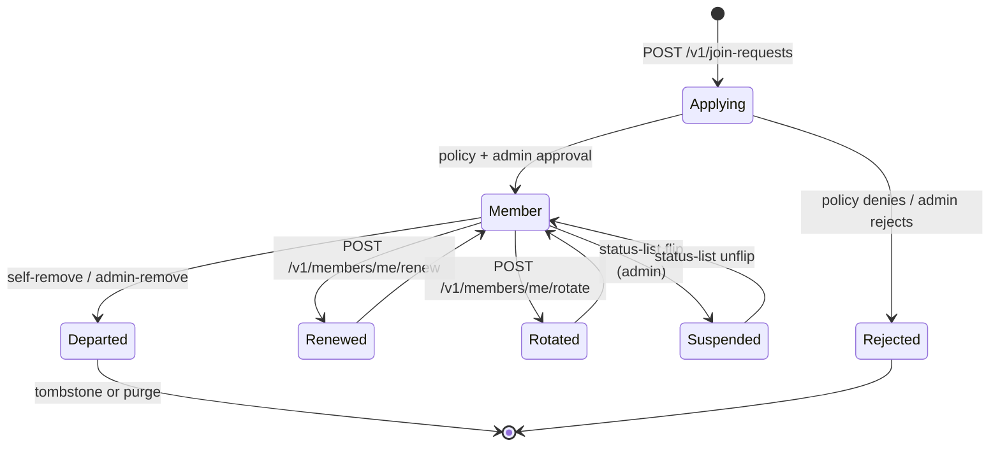
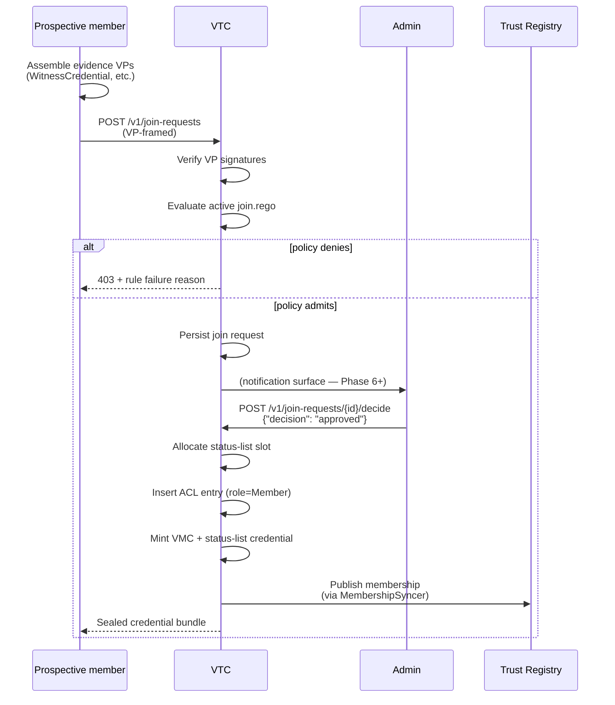
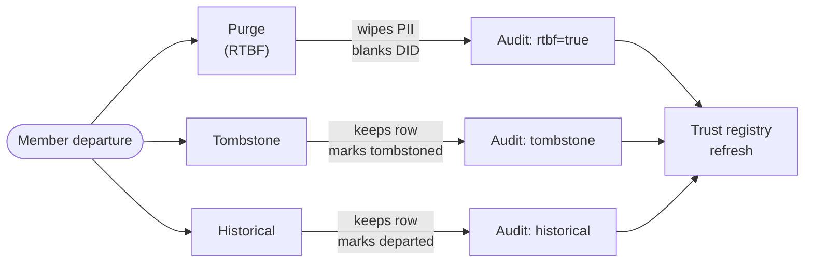
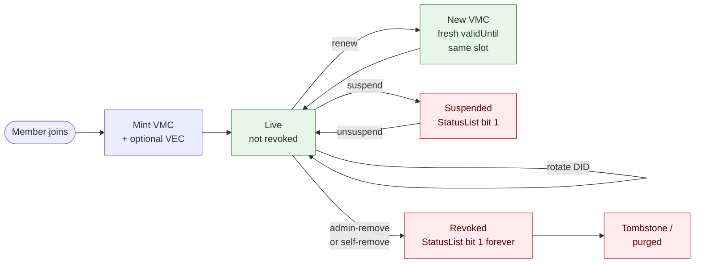
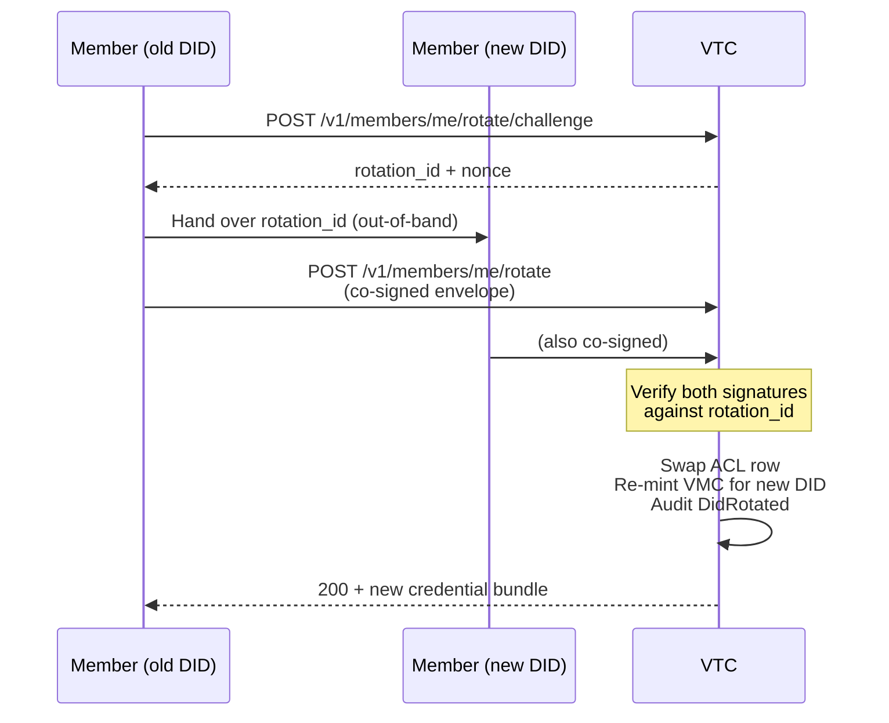

# Community lifecycle

How a member joins, what credentials they receive, how they
maintain membership, and how they leave. The lifecycle is driven
by **Rego policies**: the VTC ships defaults that default-deny, and
operators upload site-specific policies to actually admit anyone.

## Lifecycle states



The VTC tracks every state transition in the audit log
(`AuditEvent::MemberAdded` / `MemberUpdated` / `MemberRemoved` /
`StatusListFlipped` / `MembershipRenewed` / `DidRotated` / …).

## Policies that gate the lifecycle

| Policy | Trigger | Default | Purpose |
|---|---|---|---|
| `join.rego` | `POST /v1/join-requests` | deny-all | `join` |
| `removal.rego` | `DELETE /v1/members/{did}` | deny-all | `removal` |
| `personhood.rego` | `POST /v1/members/{did}/personhood/assert` | allow if VP carries a `WitnessCredential` whose digest binds to an edge this community holds, or this community's own `IdentityVerification` endorsement | `personhood` |
| `relationships.rego` | `POST /v1/relationships` | allow if both parties are current members | `relationships` |
| `registry.rego` | `MembershipSyncer` reconciliation | `publish_on_join: true; default_departure: tombstone` | `registry` |
| `cross_community_roles.rego` | `POST /v1/auth/recognise` | deny-all (no peer recognition) | `crossCommunityRoles` |

Policies are authored over the admin REST API: upload a revision with
`POST /v1/policies`, dry-run it with `POST /v1/policies/{id}/test`, and put it
in force with `POST /v1/policies/{id}/activate`. There is no `cnm` command for
policies.

Each policy gets a canonical input shape supplied by the VTC. See
the VTC spec [§8](../05-design-notes/vtc-mvp.md) for the full input
schemas.

## Join flow (happy path)



Both ends use VP/VC envelopes throughout — there is no
bespoke-JSON authorisation format. The credential bundle the member
receives is HPKE-sealed to their `did:key` (the same sealed-transfer
envelope every VTI bootstrap uses).

## Removal dispositions

When a member leaves (self-remove or admin-remove), the operator
chooses one of three dispositions. The choice surfaces in the
trust-registry record so peer communities see the same intent:



- **Purge** — RTBF (right-to-be-forgotten). The member row's PII
  is wiped; the row becomes a tombstone with `purged: true`. The
  trust-registry record is removed (batched per
  `registry.rtbf_batch_window_hours` to break timing correlation).
- **Tombstone** — the member row stays but is marked
  `tombstoned: true`. PII fields stay; further authentication
  fails.
- **Historical** — the member row stays editable for audit /
  historical research. The status-list slot still flips (revoked).

The active `registry.rego` determines which dispositions are
permitted (`removal_options` field) and the default
(`default_departure`). A self-initiated `Purge` always overrides
`min_disposition` (RTBF cannot be downgraded by community policy).

## VMC / VEC lifecycle



- **VMC** = Verifiable Membership Credential. Mandatory for every
  member; `validUntil` is bounded (default 30 days, configurable).
  Inside the community the ACL is authoritative — an expired VMC
  doesn't lock the member out, they just renew via
  `POST /v1/members/me/renew`.
- **VEC** = Verifiable Endorsement Credential. Optional. Adds a
  role or attribute claim (Issuer, Moderator, custom endorsement
  type).
- **VRC** = Verifiable Relationship Credential. Self-issued by
  members to declare trust edges to other members (see
  [`personhood-and-graph.md`](personhood-and-graph.md)).

Each credential has its own slot on the shared BitstringStatusList.
Revocation flips the bit; the public list is served at
`GET /v1/status-lists/{purpose}` so external verifiers can check
without authenticating.

## Renewal failure modes

`POST /v1/members/me/renew` re-evaluates `personhood.rego` against
the member's current evidence. The operator-configured
`renewal.on_personhood_fail` (Phase 4 D5) decides what happens when
the policy returns `false` for a member whose previous
`personhood` flag was `true`:

| Mode | Behaviour |
|---|---|
| `downgrade` (default) | Flip `personhood = false`, re-mint VMC without the flag, audit `PersonhoodRevoked { reason: "renewal-policy" }`, return success. |
| `refuse` | Reject renewal with 403. The member keeps the *old* VMC until they re-present evidence sufficient to pass `personhood.rego`. |

## DID rotation

Members can rotate the DID they authenticate with via a
two-step ceremony:



Both the old and new DID sign the rotation request. The VTC
preserves the member's status-list slot — the same audit identity
moves to the new DID. `did:key` and `did:webvh` are both supported;
for `did:webvh` rotations the VTC resolves the new DID document
and verifies the signing key against it.

## Changing the community's transports after mint

The community's DID document says how anyone reaches it: `#tsp`
(`TSPTransport`) and `#didcomm` (`DIDCommMessaging`), each naming the
mediator by DID, alongside `#vtc-rest`. `vtc setup` renders the ones you
chose, but they are not fixed there. To add a transport later — `#tsp`
on a community minted with DIDComm only, say — or to change or drop one,
edit the document at the VTA and publish the new log entry.

The VTA holds the keys that extend the community's DID log, so the edit
always happens there. What happens next depends on who serves the log.
Check first:

```sh
pnm did-mgmt dids get <community-did>
#   Server:          serverless     ← the VTC serves its own log: steps 1–3
#   Server:          <server-id>    ← a DID host serves it: step 1 only
```

**A VTC on a DID host** (`[webvh] server_id` in the setup TOML, a DID
of the form `did:webvh:<scid>:<host>:<path>`) needs only step 1: the
VTA pushes the new entry to the host as part of the edit, and there is
nothing to deliver.

**A serverless VTC** (`did:webvh:<scid>:<host>`, served by the VTC
itself at `/.well-known/did.jsonl`) needs all three: the VTA cannot
reach the copy the VTC serves, so you carry the log across.

1. **Edit the document** at the VTA, with a `pnm` profile that manages
   the community's DID:

   ```sh
   pnm did-mgmt dids edit --did <community-did>
   ```

   This opens the current document in `$EDITOR`. Add the entry to
   `service`, then save and confirm:

   ```json
   {
     "id": "<community-did>#tsp",
     "type": "TSPTransport",
     "serviceEndpoint": "<mediator-did>"
   }
   ```

   `serviceEndpoint` is the mediator's **DID**, not a URL; the URL lives
   in the mediator's own document. Name the same mediator as the
   `#didcomm` entry. For a scripted run, pass the edited document with
   `--document <file> --no-confirm`
   ([edit walkthrough](../02-vta/runtime-service-management.md#walkthrough-edit-an-existing-did-document)).
   For a serverless DID the command ends by printing the two commands
   below.

2. **Fetch the complete log** from the VTA:

   ```sh
   pnm did-mgmt dids get-log <community-did> --out did.jsonl
   ```

3. **Install it at the community**:

   ```sh
   cnm did-log install --file did.jsonl
   ```

   `cnm` authenticates to the VTC as the community profile's DID, which
   needs a super-admin row in the VTC's ACL
   ([bootstrap runbook](bootstrap-runbook.md#cnm-needs-its-own-super-admin-row)).
   It reads the VTC's URL from the DID (`https://<host>/v1`); pass
   `cnm --url <base> did-log install …` to override it, and `-c <slug>`
   to pick a community profile other than the active one.

   The VTC verifies the log before serving it. It refuses one that does
   not verify, is for a different DID, or drops or rewrites an entry it
   already serves, so only a log the key holder signed can be installed,
   whoever delivers it. The new log is served at once, with no restart.
   Resolvers see the new version as their caches expire.

Then confirm the VTC can actually serve what the document now
advertises. Clients prefer TSP over DIDComm over REST, so an advertised
transport that nothing answers on strands every client that picks it:

```sh
vtc status        # on the VTC host: "Transports" compares document and build
```

- The VTC has to be connected to the mediator the entry names:
  `[messaging]` in its `config.toml`. A VTC minted with no messaging
  needs `[messaging]` added and a restart. One that is already connected
  needs neither: `#tsp` and `#didcomm` share one mediator, and the
  shipped build serves both.
- The mediator must itself route the protocol. Nothing on the VTC side
  can check that. Confirm the mediator's own DID document advertises
  the matching service before you add the entry.
- Keep `#didcomm` when you add `#tsp`. A document that offers TSP alone
  leaves every peer that does not speak TSP with no messaging route.

The same three steps publish any other change to the community's
document after mint, such as a `TrustRegistry` referral added or
changed, or a key rotated.

## Quick reference

Member, join-queue, policy and credential administration happens in the admin
console or over the admin REST API. `cnm` has no commands for these. Every
route needs a `Trust-Task` header and an admin bearer token
([bootstrap runbook](bootstrap-runbook.md#authenticating-a-script)).

| Task | Admin console | REST (under `/v1`) |
|---|---|---|
| List members, show one | **Members** | `GET /members`, `GET /members/{did}` |
| Remove a member | **Members** | `DELETE /members/{did}`, body `{"disposition": "tombstone"}` |
| List join requests | **Join requests** | `GET /join-requests` |
| Approve or reject a request | **Join requests** | `POST /join-requests/{id}/decide`, body `{"decision": "approved"}` or `"rejected"` |
| Upload, test, activate a policy | — | `POST /policies`, `POST /policies/{id}/test`, `POST /policies/{id}/activate` |
| Issue an endorsement | — | `POST /credentials/endorsements` |
| Revoke an endorsement | **Members** | `DELETE /credentials/endorsements/{id}` |

`cnm` covers the rest of community administration. It needs the community
profile to name the VTC (`cnm community set-vtc <vtc-did>`) and the profile's
DID to hold a super-admin row in the VTC's ACL
([bootstrap runbook](bootstrap-runbook.md#cnm-needs-its-own-super-admin-row)):

```sh
cnm vetting vetters {list,grant,revoke,resend}   # vetter grants
cnm vetting auto-grant {show,set}                # automatic vetter grants
cnm vetting ask {show,set}                       # what applicants are asked
cnm vetting branding {show,set}                  # how the community presents itself
cnm vetting revocations                          # vetting statement withdrawals
cnm vetting bootstrap-pgp …                      # first vetters from a PGP web of trust
cnm audit verify                                 # the community's audit chain
cnm backup {export,import}                       # encrypted full-state backup
cnm did-log install --file did.jsonl             # a self-hosted community's DID log
```

See [`../04-reference/cli-style.md`](../04-reference/cli-style.md)
for the conventions every CLI verb follows.

## See also

- [Credentials](credentials.md) — VMC / VEC details + status-list
  mechanics.
- [Credential delivery](credential-delivery.md) — how the admitted
  member receives its credentials.
- [Bootstrap runbook](bootstrap-runbook.md) — the first admin and
  the first vetter of a new community.
- [Trust-registry integration](trust-registry.md) — publication
  + cross-community recognition.
- [Personhood + relationships](personhood-and-graph.md) — VRC
  graph + personhood ceremony.
- [VTC MVP spec §5-6](../05-design-notes/vtc-mvp.md) — full
  reference.
