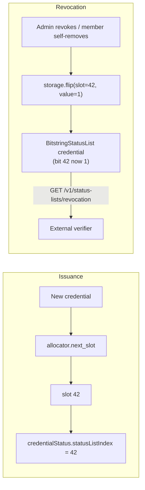
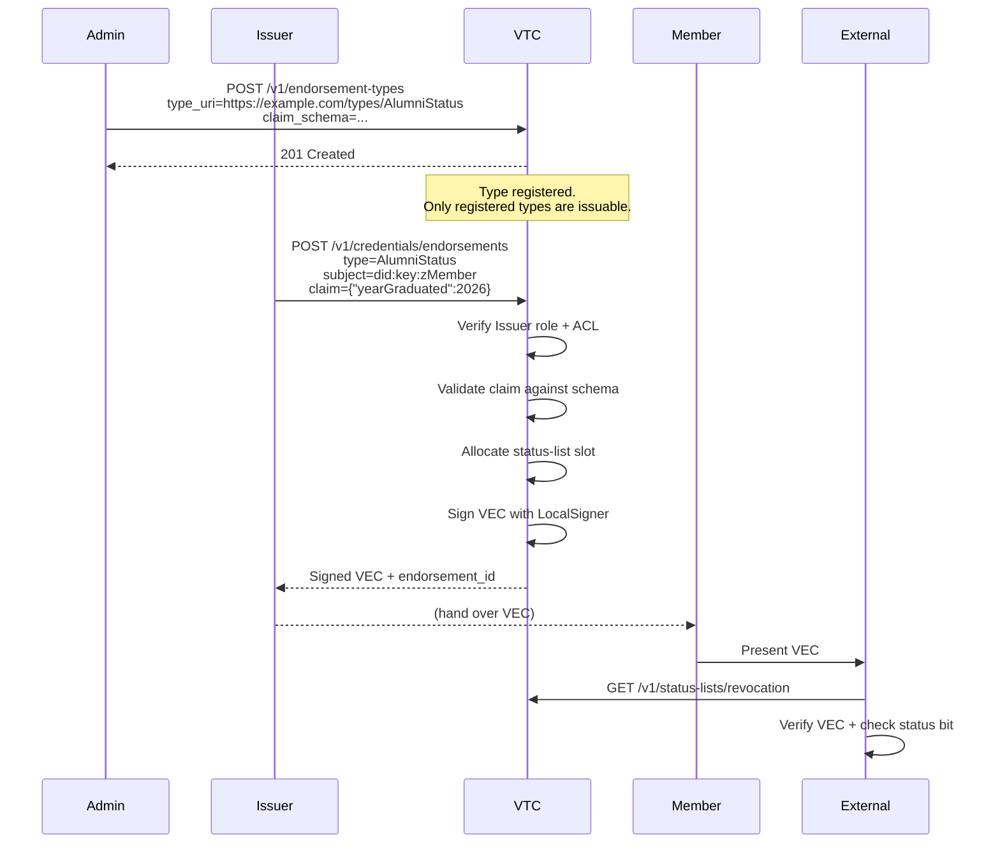

# Credentials

The VTC issues four kinds of W3C Verifiable Credentials, every one
backed by a Bitstring Status List slot for revocation. All use the
`eddsa-jcs-2022` data-integrity proof suite from
`affinidi-data-integrity`.

| Credential | Subject | Issued by | Typical issuance trigger |
|---|---|---|---|
| **VMC** — Verifiable Membership Credential | Member DID | VTC | On join approval, on renewal, on DID rotation |
| **VEC** — Verifiable Endorsement Credential | Member DID | VTC | On role assignment (Moderator, Issuer) or admin-issued endorsement |
| **VRC** — Verifiable Relationship Credential | Other member's DID | Member (self-issued) | `POST /v1/relationships` |
| **Custom endorsement** | Member DID | VTC on behalf of Issuer role | `POST /v1/credentials/endorsements` (Phase 4 M4.7) |

## Credential lifecycle

```mermaid
graph TB
    issue[Issue credential]
    slot[Allocate status-list slot<br/>via slot allocator]
    sign["Sign with LocalSigner<br/>(cached VTA key)"]
    persist[Persist credential row]
    audit_i[Audit: VmcIssued / VecIssued / ...]
    return[Return signed VC<br/>+ status-list reference]

    issue --> slot --> sign --> persist --> audit_i --> return

    use([External verifier reads VC])
    fetch[GET /v1/status-lists/&#123;purpose&#125;]
    check[Check bit at credentialStatus.statusListIndex]

    use --> fetch --> check

    revoke[Revoke credential]
    flip[Flip status-list bit to 1]
    audit_r[Audit: StatusListFlipped<br/>+ CredentialRevoked]
    persist_r[Update credential row]

    revoke --> flip --> audit_r --> persist_r
```



Bit flipping is the source of truth for revocation — the credential
itself stays in the issuer's records, but the verifier sees the
slot as revoked the next time they fetch the public list.

## VMC details

A VMC contains:

```json
{
  "@context": ["https://www.w3.org/ns/credentials/v2", "..."],
  "type": ["VerifiableCredential", "VerifiableMembershipCredential"],
  "issuer": "did:webvh:community.example.com:abc",
  "validFrom": "2026-05-14T...",
  "validUntil": "2026-06-13T...",
  "credentialSubject": {
    "id": "did:key:z6Mk...",
    "membership": {
      "community": "did:webvh:community.example.com:abc",
      "joinedAt": "2026-05-01T...",
      "personhood": true,
      "role": "member"
    }
  },
  "credentialStatus": {
    "id": "https://community.example.com/v1/status-lists/revocation#42",
    "type": "BitstringStatusListEntry",
    "statusPurpose": "revocation",
    "statusListIndex": "42",
    "statusListCredential": "https://community.example.com/v1/status-lists/revocation"
  },
  "proof": { "type": "DataIntegrityProof", "cryptosuite": "eddsa-jcs-2022", "..." }
}
```

`validUntil` is **mandatory + finite**, defaulting to 30 days
(configurable per community). External verifiers MUST see a bounded
VMC. Inside the community the ACL is authoritative — expired VMC
does NOT lock the member out (renewal is unconditional on ACL
membership).

## Reading a member's credentials

`GET /v1/members/{did}/credentials` (Trust Task
`vtc/members/credentials/0.1`, admin only) returns the documents the
community holds for one member, verbatim:

- `membershipCredential` — the VMC this community issued (the grant);
- `roleCredential` — the role VEC;
- `memberVmc` + `memberVmcReceivedAt` — the member-issued reciprocal VMC
  (the acknowledgement that completes the edge), always as a pair;
- `memberVmcBound` — always present: whether the acknowledgement's digest
  was verified against the grant when it arrived.

A missing document is a real answer, not an error: a member who has not
sent their half of the pair comes back with `memberVmcBound: false` and no
`memberVmc`. An unknown member is a 404 carrying
`code: "vtc/members/credentials:notFound"`. `members/show` still carries
only the identifiers — this task is for one member, never a roster.

Every read writes a `MemberCredentialsRead` audit row naming the documents
disclosed (not their contents), because the response is the credential
bodies themselves. The admin console's member detail page reads this route
for its **Credentials** card, and where the edge is not bound it shows the
grant on record beside the digest the acknowledgement names, so the reason
— and the next step, **Request member VMC** — is visible.

## Status list mechanics



Two status lists exist by default:

- `revocation` — flipped on member removal, credential revocation,
  custom endorsement revocation. Once flipped to `1`, never flips
  back (permanent revocation).
- `suspension` — flipped on admin suspension, can flip back to `0`
  on un-suspend.

Both lists are minted at first boot once `public_url` is configured;
the list URLs are baked into each credential's `credentialStatus`
field so verifiers can locate them.

**Reserved-index discipline** (VTC spec §6.2): slots 0-3 are
reserved as decoys (always flipped to 1 at initial mint) so a
brand-new community doesn't reveal "this is index 0, you're the
first member". The slot allocator skips them.

## Custom endorsements



Custom endorsement issuance is **Issuer-role gated** (or admin).
The Issuer role is granted via a VEC; checking the Issuer role
reads the VTC's ACL directly (the JWT-level role degrades Issuer →
Reader, per the Phase 1 deviation).

Revocation is `DELETE /v1/credentials/endorsements/{endorsement-id}` (Trust
Task `vtc/endorsements/revoke/0.1`), or the member's page in the admin console.

This emits a paired audit:

- `CustomEndorsementRevoked { endorsement_id, endorsement_type }`
- `StatusListFlipped { purpose: "revocation", index: <slot>, revoked: true }`

## Renewal vs DID rotation

| | Renewal | DID rotation |
|---|---|---|
| Triggered by | `POST /v1/members/me/renew` | `POST /v1/members/me/rotate/challenge` + `…/rotate` |
| What changes | `validUntil` extended + (optionally) `personhood` re-evaluated | Member's authenticating DID swapped |
| Old credential | Superseded but bit stays 0 until separately revoked | Same — replaced by the new-DID VMC |
| Status-list slot | Preserved | Preserved |
| Audit | `MembershipRenewed` (+ `PersonhoodRevoked { reason: "renewal-policy" }` on downgrade) | `DidRotated { from, to, method }` |

Both operations preserve the member's audit identity — the
slot doesn't change, so an external verifier who pinned the
`credentialStatus.statusListIndex` sees continuous, uninterrupted
membership across renewals and rotations.

## Quick reference

There is no CLI for endorsements, endorsement types, renewal or rotation;
neither `cnm` nor `pnm` has these commands. They are REST routes (under `/v1`,
each needing its `Trust-Task` header and a bearer token):

| Task | Route | Who |
|---|---|---|
| List, register, delete endorsement types | `GET /endorsement-types`, `POST /endorsement-types`, `DELETE /endorsement-types/{type_uri}` | admin |
| Issue an endorsement | `POST /credentials/endorsements` | issuer or admin |
| List, show endorsements | `GET /credentials/endorsements`, `GET /credentials/endorsements/{id}` | issuer or admin |
| Revoke an endorsement | `DELETE /credentials/endorsements/{id}` | issuer or admin |
| Renew membership | `POST /members/me/renew` | the member |
| Rotate the member's DID | `POST /members/me/rotate/challenge`, then `POST /members/me/rotate` | the member |

`cnm vetting vetters revoke <endorsement-id>` revokes a vetter grant, which is
an endorsement, but is meant for vetter grants only (see
[vetting](vetting.md)).

## See also

- [Community lifecycle](community-lifecycle.md) — when credentials
  get issued in the broader join → renew → leave flow.
- [Credential delivery](credential-delivery.md) — how an admitted
  member receives its VMC and role VEC.
- [Personhood + relationships](personhood-and-graph.md) — the VRC
  graph + personhood ceremony.
- [VTC MVP spec §6](../05-design-notes/vtc-mvp.md) — full
  credentials reference.
