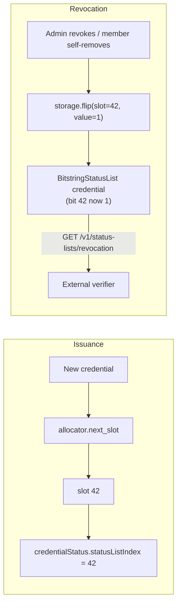
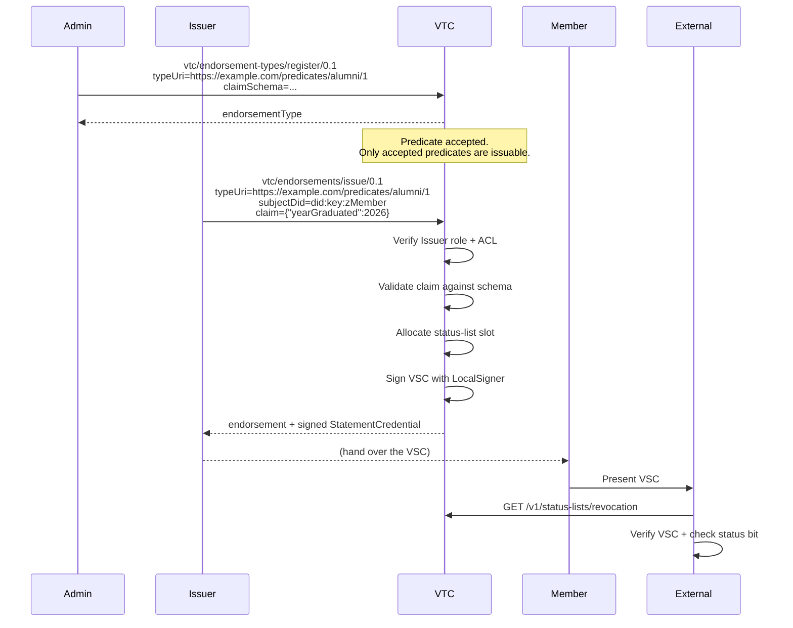

# Credentials

The VTC issues W3C Verifiable Credentials, all using the
`eddsa-jcs-2022` data-integrity proof suite from
`affinidi-data-integrity`. Every **DTG** credential it mints conforms to the
DTG Credentials Core Specification's v1 context — `@context`
`["https://www.w3.org/ns/credentials/v2", "https://registry.trustoverip.org/dtg/context/v1"]`,
`type` `["VerifiableCredential", "DTGCredential", <exactly one subtype>]` and a
top-level `issuerScope`, which is always `public`: the community issues as
itself, under the DID every verifier recognises
(`vtc-service/src/credentials/dtg.rs`). The retired
`firstperson.network` context, and the retired endorsement and witness types,
are refused on ingress with no alias (`credentials/ingress.rs`).

| Credential | `type` | Subject | Issued by | Typical issuance trigger |
|---|---|---|---|---|
| **VMC** — Verifiable Membership Credential (the grant) | `MembershipCredential` (+ optional `PersonhoodCredential` hint) | Member DID | VTC | On join approval, on renewal, on DID rotation |
| **Role VAC** — Verifiable Authority Credential | `AuthorityCredential`, `authority` `{ scope: <community DID>, actions: ["role:<role>"], maxAttenuation: 0 }` | Member DID | VTC | On admission with a role, role change, renewal, rotation; a vetter grant (`role:vetter`) |
| **VSC** — Verifiable Statement Credential | `StatementCredential`, `predicate` = a registered predicate, `object.value` = the claim | Member DID | VTC on behalf of Issuer role | `vtc/endorsements/issue/0.1`; a VEC under `endorses/1` |
| **VIC** — Verifiable Invitation Credential | `InvitationCredential` | Invitee DID | VTC | `vtc/invitations/issue` |
| **IDVC** — Identity Verification Credential | `IdentityVerificationCredential` — a plain W3C VC, **not** a DTG credential | Member DID | VTC | `vtc/endorsements/issue/0.1` with the reserved `typeUri` (see [personhood](personhood-and-graph.md#in-person-vetting)) |
| **VRC** — Verifiable Relationship Credential | `RelationshipCredential`, with the issuer's own `issuerScope` | Other member's DID | Member (self-issued) | `vtc/relationships/publish` |

A role VAC's action is `role:` followed by the ACL role's wire name —
`role:admin`, `role:moderator`, `role:issuer`, `role:member`,
`role:custom:<name>` — so a recognising community maps it back to a role
exactly; the vetter grant's is the bare `role:vetter` the vetting
specifications name.

## Credential lifecycle


```mermaid
graph TB
    issue[Issue credential]
    slot[Allocate status-list slot<br/>via slot allocator]
    sign["Sign with LocalSigner<br/>(cached VTA key)"]
    persist[Persist credential row]
    audit_i[Audit: VmcIssued / VecIssued / ...]
    return[Return signed VC<br/>+ status-list reference]

    issue --> slot --> sign --> persist --> audit_i --> return

    use([External verifier reads VC])
    fetch[GET /v1/status-lists/&#123;purpose&#125;]
    check[Check bit at credentialStatus.statusListIndex]

    use --> fetch --> check

    revoke[Revoke credential]
    flip[Flip status-list bit to 1]
    audit_r[Audit: StatusListFlipped<br/>+ CredentialRevoked]
    persist_r[Update credential row]

    revoke --> flip --> audit_r --> persist_r
```

Bit flipping is the source of truth for revocation — the credential
itself stays in the issuer's records, but the verifier sees the
slot as revoked the next time they fetch the public list.

## VMC details

A VMC contains:

```json
{
  "@context": ["https://www.w3.org/ns/credentials/v2",
               "https://registry.trustoverip.org/dtg/context/v1"],
  "id": "urn:uuid:…",
  "type": ["VerifiableCredential", "DTGCredential", "MembershipCredential",
           "PersonhoodCredential"],
  "issuer": "did:webvh:community.example.com:abc",
  "issuerScope": "public",
  "validFrom": "2026-05-14T...",
  "validUntil": "2026-06-13T...",
  "credentialSubject": { "id": "did:key:z6Mk..." },
  "credentialStatus": {
    "id": "https://community.example.com/v1/status-lists/revocation#42",
    "type": "BitstringStatusListEntry",
    "statusPurpose": "revocation",
    "statusListIndex": "42",
    "statusListCredential": "https://community.example.com/v1/status-lists/revocation"
  },
  "proof": { "type": "DataIntegrityProof", "cryptosuite": "eddsa-jcs-2022", "..." }
}
```

`validUntil` is **mandatory + finite**, defaulting to 30 days
(configurable per community). External verifiers MUST see a bounded
VMC. Inside the community the ACL is authoritative — expired VMC
does NOT lock the member out (renewal is unconditional on ACL
membership).

## Reading a member's credentials

`GET /v1/members/{did}/credentials` (Trust Task
`vtc/members/credentials/0.1`, admin only) returns the documents the
community holds for one member, verbatim:

- `membershipCredential` — the VMC this community issued (the grant);
- `roleCredential` — the role VAC;
- `memberVmc` + `memberVmcReceivedAt` — the member-issued reciprocal VMC
  (the acknowledgement that completes the edge), always as a pair;
- `memberVmcBound` — always present: whether the acknowledgement's digest
  was verified against the grant when it arrived.

A missing document is a real answer, not an error: a member who has not
sent their half of the pair comes back with `memberVmcBound: false` and no
`memberVmc`. An unknown member is a 404 carrying
`code: "vtc/members/credentials:notFound"`.

The member-issued acknowledgement is a DTG `MembershipCredential` issued by
the member about the community, whose `credentialSubject.digestMultibase`
digests the grant. The member may declare whatever `issuerScope` is true of
its DID; the grant it acknowledges must declare `public`, and an
acknowledgement of a grant that does not (one stored before the v1 context)
completes no edge — the member renews first. `members/show` still carries
only the identifiers — this task is for one member, never a roster.

Every read writes a `MemberCredentialsRead` audit row naming the documents
disclosed (not their contents), because the response is the credential
bodies themselves. The admin console's member detail page reads this route
for its **Credentials** card, and where the edge is not bound it shows the
grant on record beside the digest the acknowledgement names, so the reason
— and the next step, **Request member VMC** — is visible.

## Status list mechanics


```mermaid
graph LR
    subgraph Issuance
        new[New credential] --> alloc[allocator.next_slot]
        alloc --> slot42[slot 42]
        slot42 --> vc[credentialStatus.statusListIndex = 42]
    end

    subgraph Revocation
        rev[Admin revokes / member self-removes]
        rev --> bit["storage.flip(slot=42, value=1)"]
        bit --> list["BitstringStatusList credential<br/>(bit 42 now 1)"]
        list -->|GET /v1/status-lists/revocation| verifier[External verifier]
    end
```

Two status lists exist by default:

- `revocation` — flipped on member removal, credential revocation,
  custom endorsement revocation. Once flipped to `1`, never flips
  back (permanent revocation).
- `suspension` — flipped on admin suspension, can flip back to `0`
  on un-suspend.

Both lists are minted at first boot once `public_url` is configured;
the list URLs are baked into each credential's `credentialStatus`
field so verifiers can locate them.

**Reserved-index discipline** (VTC spec §6.2): slots 0-3 are
reserved as decoys (always flipped to 1 at initial mint) so a
brand-new community doesn't reveal "this is index 0, you're the
first member". The slot allocator skips them.

## Statements and the predicate accept list

A DTG statement's meaning is its `credentialSubject.predicate`, an absolute
IRI, never a type string: every statement is a `StatementCredential`. The
community's registered **endorsement types** (`vtc/endorsement-types/*`, names
kept from before) are the **predicates it accepts**:

- A registered `typeUri` must be an absolute predicate IRI — a DTG VSC
  predicate registry IRI (`https://registry.trustoverip.org/dtg/vsc/…/1`) or
  one in a namespace the community controls. Anything else is `invalidUri`;
  the workspace's own row kinds (`role:vetter`,
  `IdentityVerificationCredential`) are `reserved`. Roles are VACs and are
  never registered here.
- A new community accepts the registry's four core predicates — `endorses/1`,
  `witnessed/1`, `vetted/1`, `presented/1` — seeded once at first boot
  (`endorsement_types::seed_defaults`, guarded by a marker so a default an
  operator deletes stays deleted).
- **Verification fails closed.** A presented statement — a Vetting Statement
  at join, a witness at personhood assert, any statement in a `present`
  vp_token — under a predicate the community has not registered is refused,
  never processed as a generic statement (`endorsement_types::accept_list`, a
  `dtg_credentials::PredicateAcceptList`).
- **Issuance** (`vtc/endorsements/issue/0.1`) mints a VSC under a registered
  predicate: issuer the community, `issuerScope` `public`, `object.value` the
  claim, validated against the predicate's `claimSchema`, with a revocation
  slot. A predicate whose profile requires `taskContext` (`vetted/1`,
  `witnessed/1`, `presented/1`) is refused with `predicateNotIssuable`: those
  are made by the party that ran the exchange, never the community.


```mermaid
sequenceDiagram
    participant Admin
    participant Issuer
    participant VTC
    participant Member

    Admin->>VTC: vtc/endorsement-types/register/0.1<br/>typeUri=https://example.com/predicates/alumni/1<br/>claimSchema=...
    VTC-->>Admin: endorsementType
    Note over VTC: Predicate accepted.<br/>Only accepted predicates are issuable.

    Issuer->>VTC: vtc/endorsements/issue/0.1<br/>typeUri=https://example.com/predicates/alumni/1<br/>subjectDid=did:key:zMember<br/>claim={"yearGraduated":2026}
    VTC->>VTC: Verify Issuer role + ACL
    VTC->>VTC: Validate claim against schema
    VTC->>VTC: Allocate status-list slot
    VTC->>VTC: Sign VSC with LocalSigner
    VTC-->>Issuer: endorsement + signed StatementCredential
    Issuer-->>Member: (hand over the VSC)
    Member->>External: Present VSC
    External->>VTC: GET /v1/status-lists/revocation
    External->>External: Verify VSC + check status bit
```

### `claimSchema` is checked when the type is registered

A type's optional `claimSchema` binds every claim issued against it, so
`POST /v1/endorsement-types` refuses a `claimSchema` that is not itself
valid JSON Schema — `400` with the framework's `malformedRequest` code and
a message naming the part of the document that is wrong (`at
/properties/level/type: …`). Fix the schema and register again.

The check exists because the schema is only read at *issuance*: a stored
document that will not compile fails there, not here, and the caller being
refused is the issuer with a perfectly good claim. If a type registered
before this check carries a broken schema, issuance answers `500` naming
the type and saying the type must be re-registered, and the daemon logs one
`WARN` per broken type at boot. `DELETE` the type and register it again.

Statement issuance is **Issuer-role gated** (or admin). Checking the Issuer role
reads the VTC's ACL directly (the JWT-level role degrades Issuer →
Reader, per the Phase 1 deviation).

Revocation is the signed Trust Task `vtc/endorsements/revoke/0.1` with the
`endorsementId`, or the member's page in the admin console. The same task
revokes a vetter grant's VAC and an IDVC, which are recorded under the same
kind of row.

This emits a paired audit:

- `CustomEndorsementRevoked { endorsement_id, endorsement_type }`
- `StatusListFlipped { purpose: "revocation", index: <slot>, revoked: true }`

## Renewal vs DID rotation

| | Renewal | DID rotation |
|---|---|---|
| Triggered by | `POST /v1/members/me/renew` | `POST /v1/members/me/rotate/challenge` + `…/rotate` |
| What changes | `validUntil` extended + (optionally) `personhood` re-evaluated | Member's authenticating DID swapped |
| Old credential | Superseded but bit stays 0 until separately revoked | Same — replaced by the new-DID VMC |
| Status-list slot | Preserved | Preserved |
| Audit | `MembershipRenewed` (+ `PersonhoodRevoked { reason: "renewal-policy" }` on downgrade) | `DidRotated { from, to, method }` |

Both operations preserve the member's audit identity — the
slot doesn't change, so an external verifier who pinned the
`credentialStatus.statusListIndex` sees continuous, uninterrupted
membership across renewals and rotations.

## Quick reference

There is no CLI for statements, accepted predicates, renewal or rotation;
neither `cnm` nor `pnm` has these commands. They are signed Trust Task
documents, or REST routes under `/v1` each needing its `Trust-Task` header and a
bearer token:

| Task | Route | Who |
|---|---|---|
| List accepted predicates | `GET /endorsement-types` | admin |
| Register, delete accepted predicates | signed `vtc/endorsement-types/{register,delete}/0.1` documents at `POST /trust-tasks` (no REST route) | admin |
| Issue a statement (or an IDVC) | signed `vtc/endorsements/issue/0.1` (no REST route) | issuer or admin |
| List, show statements | signed `vtc/endorsements/{list,show}/0.1` (no REST route) | issuer or admin |
| Revoke a statement, vetter grant or IDVC | signed `vtc/endorsements/revoke/0.1` (no REST route) | issuer or admin |
| Renew membership | `POST /members/me/renew` | the member |
| Rotate the member's DID | `POST /members/me/rotate/challenge`, then `POST /members/me/rotate` | the member |

`cnm vetting vetters revoke <endorsement-id>` revokes a vetter grant, which is
recorded as an endorsement row, but is meant for vetter grants only (see
[vetting](vetting.md)).

## See also

- [Community lifecycle](community-lifecycle.md) — when credentials
  get issued in the broader join → renew → leave flow.
- [Credential delivery](credential-delivery.md) — how an admitted
  member receives its VMC and role VAC.
- [Personhood + relationships](personhood-and-graph.md) — the VRC
  graph + personhood ceremony.
- [VTC MVP spec §6](../05-design-notes/vtc-mvp.md) — full
  credentials reference.
