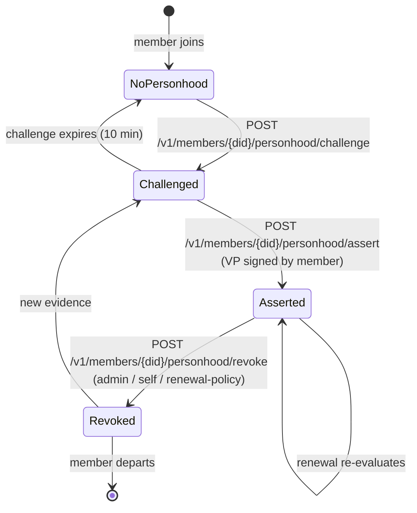
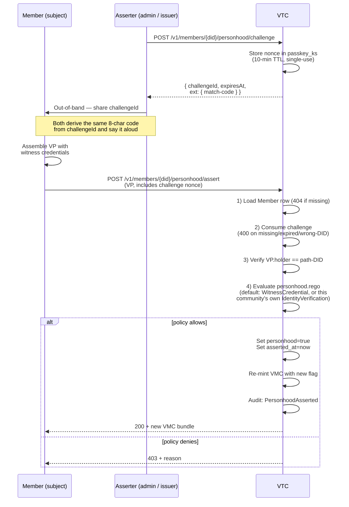
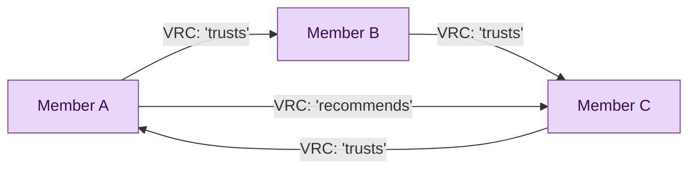
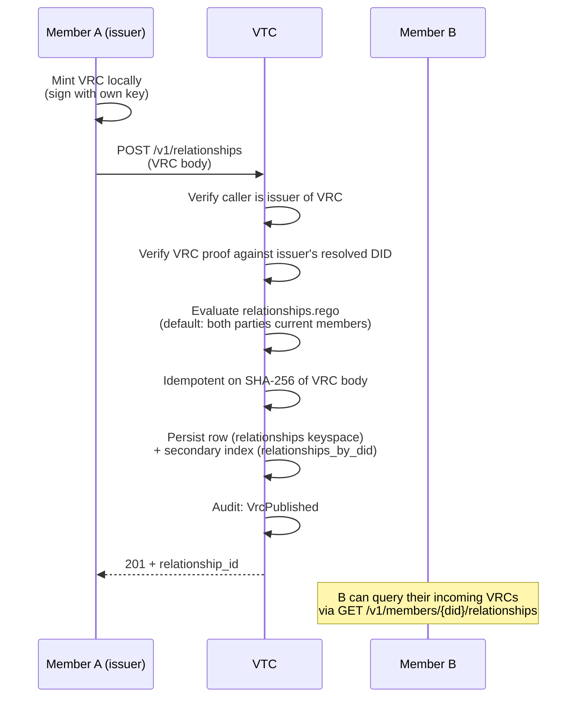

# Personhood + relationships

The VTC ships two member-graph features in Phase 4:

- **Personhood** — a member asserts that they are a human, backed by
  evidence the operator's `personhood.rego` accepts: a third party's
  witness credential, or an identity verification this community
  performed in person. The flag lands as a `PersonhoodCredential` type
  on the member's VMC, which is what DTG Credentials means by a PHC —
  read [What this does and does not establish](#what-this-does-and-does-not-establish)
  before relying on it as one.
- **VRC graph** — members self-issue Verifiable Relationship
  Credentials declaring trust edges to other members, forming a
  community-internal trust graph.

Both surfaces are optional. Communities that don't need them never
emit the underlying audit events.

## Personhood lifecycle



The flag lives on the Member row alongside an `asserted_at`
timestamp; tombstoning a member wipes both fields.

### Assertion ceremony



**VP-only assert** (Phase 4 D2): the request body is purely a
Verifiable Presentation. The handler verifies the VP and discards
it — no `personhood_evidence` JSON field, no separate signed-blob
shape. The verify-then-discard semantics keep PII out of the
request log.

### In-person vetting

The default policy accepts a second evidence shape: an
`IdentityVerification` endorsement **this community issued to this
member**. That is the in-person ceremony — an administrator meets the
person, satisfies themselves that the DID they present is theirs, and
issues the record to that DID. The member later presents it over a
single-use challenge, and the community's own signature is the evidence.

It needs no new Trust Task and no new credential type. DTG Credentials
§Identity Verification Credentials defines an IDVC as *"any W3C VC
satisfying a VTC/VTN's identity-proofing requirements"* and explicitly
**not** a `DTGCredential` subtype, so a community acting as its own
identity-verification provider is the simplest case of that. Issuing it
through the endorsement surface means it is revocable through the
community's existing status list, like every other endorsement.

**One-time setup** — register the type:

```bash
# vtc/endorsement-types/register/0.1
POST /v1/endorsement-types  { "typeUri": "IdentityVerification" }
```

**Per member** — after meeting them:

```bash
# vtc/endorsements/issue/0.1
POST /v1/credentials/endorsements
{
  "subjectDid": "did:key:zMember...",
  "type": "IdentityVerification",
  "claim": { "method": "in-person-id", "verifiedBy": "did:key:zAdmin..." }
}
```

The `claim` body is free-form and opaque to the policy — the default
rule reads only the endorsement's `type`, its issuer and its subject, so
what an operator records about *how* they verified is theirs to decide.
Issuance is admin-or-issuer gated and consumes a revocation status-list
slot, so withdrawing a vetting later is a `DELETE` on the endorsement
rather than anything personhood-specific.

The member then runs the normal challenge + assert flow, presenting that
credential. Three bindings have to hold, and each is enforced by the
default policy:

| Binding | Why it is there |
|---|---|
| `issuer` == this community's DID | An endorsement type is a *name*, not an authority. Without this, any issuer anywhere could mint `IdentityVerification` and unlock personhood here. |
| `credentialSubject.id` == the asserting member | The route's holder-match binds the *presenter*; this binds the *credential*, so a member cannot present a vetting record about someone else. |
| `endorsement.type` == `IdentityVerification` | A role VEC is also community-issued and also names the member. Without the type check, every member holding a role credential would satisfy the policy — which is every member. |

#### The spoken match code

`challengeId` is a UUID: fine on a wire, hopeless read aloud. The
challenge response therefore also carries an eight-character code under
`ext["org.openvtc.match-code"]`:

```json
{
  "challengeId": "6f1c4f9e-7c2a-4f4b-9a3e-2b1d0c5e8a77",
  "expiresAt": "2026-08-24T10:15:00Z",
  "ext": { "org.openvtc.match-code": "7F4K-2QX9" }
}
```

It is **derived from the challenge id** (`SHA-256`, Crockford base32 —
no `I`, `L`, `O` or `U`, so nothing in it is mishearable), never
transmitted as an independent secret and never accepted as one. Both
parties compute it from the `challengeId` they already hold and say it
to each other; nothing checks it server-side, because there is nothing
it could prove that `proof.challenge` does not already prove. It is a
confirmation channel — a Bluetooth pairing code, not a password.

The code rides in `ext` rather than as a top-level field because
`vtc/members/personhood/challenge/0.1`'s response schema is
`additionalProperties: false`; `ext` is what the framework reserves for
ecosystem-defined members (SPEC §4.5.1), and its key pattern is why the
member is `match-code` and not `matchCode`.

#### What this does and does not establish

DTG Credentials §Personhood Credentials requires governance enforcing
**both** real human personhood **and exactly one membership per
person**. In-person vetting is evidence for the first only — see
[Declaring personhood governance](#declaring-personhood-governance) for
publishing the claim, and [One membership per
person](#one-membership-per-person) for the second half.

### Declaring personhood governance

The spec puts PHC status outside the credential: *"PHC status is
determined by governance and trust registries, not by credential
structure"*, and the `PersonhoodCredential` type this daemon stamps on a
vetted member's VMC is *"a non-authoritative hint"*. §Governance
Considerations is blunter: *"Whether a VMC qualifies as a PHC is a
governance determination, not a schema property."*

So a community publishes what its governance requires, on its profile:

```json
"personhood": {
  "realHuman": true,
  "singleMembership": true,
  "acceptedIdvps": ["did:webvh:idvp.example"],
  "governanceFrameworkUrl": "https://acme.example/governance"
}
```

This is served **unauthenticated** at `GET /v1/community/public-profile`,
because the party who needs it is a verifier holding one of your VMCs —
someone who is not a member and has no token.

Both booleans default to `false`. A community that has not considered the
question asserts nothing, which is the only safe default for a claim a
verifier may act on.

**Setting both requires naming at least one accepted IDVP.** A community
claiming PHC status while naming nobody it trusts to verify identity has
not written its governance down, and a verifier cannot tell an unwritten
policy from a permissive one. A community that vets in person lists its
own C-DID — §IDVC permits acting as your own identity-verification
provider.

### One membership per person

`singleMembership` is not just a declaration: **setting it turns on
enforcement.** The published claim and the check are the same switch, so a
community cannot advertise PHC status to verifiers while quietly not
checking it.

Nothing in the credential graph distinguishes one person with two DIDs
from two people — a member who joins twice presents two perfectly valid
sets of evidence, and every check passes twice. The community needs an
anchor that is stable per human, and it must come from outside.

That anchor is a **pseudonym**: an IDVP that can actually deduplicate
people — a state eID scheme, a biometric provider, a bank — derives a
deterministic value per (person, community). The same person returning
yields the same pseudonym; a different community yields an unlinkable
one. This is the rate-limiting-identifier construction from [Personhood
Credentials (Adler et al. 2024)](https://arxiv.org/abs/2408.07892), which
the spec's PHC definition cites.

The daemon reads it from either shape, and **only from an issuer in
`acceptedIdvps`**:

| Shape | Where |
|---|---|
| A plain IDVC | `credentialSubject.pseudonym` |
| This community's own endorsement | `credentialSubject.endorsement.claim.pseudonym` |

An assertion carrying no accepted pseudonym is refused with
`personhood-pseudonym-missing`; one whose pseudonym another member already
holds is refused as a conflict, worded so it does not disclose who that
member is.

**The pseudonym itself is never stored.** It is a stable per-person
identifier, so a database full of them is the correlation target the
construction exists to avoid. What is stored is a salted digest keyed to
this community, which answers "is this person already here" and nothing
else.

**Claims are released on purge only** — not on revoke, and not on leaving.
Revoking personhood withdraws the community's assertion; it is not
evidence that the human stopped existing, and they are still a member.
If either released the claim, one-membership-per-person would be defeated
by revoking and rejoining under a fresh DID.

#### What this still does not give you

The guarantee is the IDVP's, not the community's. Uniqueness is exactly as
good as your accepted providers' deduplication — which is why the spec
makes acceptable IDVPs part of what governance must publish.

**In-person vetting is the weak case.** When a community is its own IDVP,
the "pseudonym" is an administrator's judgement that they have not met this
person before. That genuinely supports one-membership-per-person in a
community small enough for one person to hold in their head, and genuinely
does not beyond it. Say so in your governance framework rather than
letting the flag imply more.

Finally, this is per-community by definition — the spec's glossary says
*"exactly one membership in that VTC"*. Personhood that means something
*across* communities is a VTN-level property; see the spec's VTN
definition and the [First Person Network](https://www.firstperson.network/).

### Revocation

Three triggers:

| Trigger | Audit `reason` field |
|---|---|
| Admin via `DELETE /v1/members/{did}/personhood` | `"admin"` |
| Self via `DELETE /v1/members/me/personhood` | `"self"` |
| Renewal-policy downgrade (operator-configured) | `"renewal-policy"` |

The third is the operator-configurable failure mode discussed in
[`community-lifecycle.md`](community-lifecycle.md#renewal-failure-modes).

## VRC trust graph

A Verifiable Relationship Credential declares "I, member A, trust
member B in some specific way". The VTC stores the VRC if both
parties are current members (default policy); listing endpoints
strip VRCs naming a `Purge`-departed member.



### Publication



The secondary index makes the per-DID lookup O(matched rows)
rather than scanning the entire VRC table.

### Listing + filtering

`GET /v1/members/{did}/relationships` returns every VRC where the
DID is issuer or subject. The handler strips VRCs whose **other
party** has departed with `Purge` disposition — the VRC's
counter-party is permanently anonymised, so the listing hides the
relationship to preserve the §12.3 spec invariant.

VRCs naming a `Tombstone` or `Historical` departure stay visible
(the counter-party's DID is still recoverable).

### Self-issued only (MVP)

Bilateral counter-signing (where B confirms A's VRC) is **v2**.
For Phase 4, every VRC is self-issued by the originator.

### The connections graph: half-edges vs complete edges

`GET /v1/relationships/graph` (admin-only) returns the whole edge
set for the admin UI's connections view. DTG Credentials defines a
DTG edge as **two** VRCs, one in each direction, so the response
groups by unordered pair rather than listing one entry per stored
credential:

```json
{
  "nodes": [{ "did": "did:key:zA" }, { "did": "did:key:zB" }],
  "edges": [{
    "endpoints": ["did:key:zA", "did:key:zB"],
    "halves": [
      { "id": "…", "issuerDid": "did:key:zA", "subjectDid": "did:key:zB", "createdAt": "…" },
      { "id": "…", "issuerDid": "did:key:zB", "subjectDid": "did:key:zA", "createdAt": "…" }
    ],
    "complete": true
  }]
}
```

`complete` is true only when a VRC exists in **both** directions.
A single-direction edge is a *half-edge* — one party's claim that
the other has not answered.

The distinction matters because it is what replaced a check.
Publishing used to require the subject to be a current member; that
check was the community asserting on the subject's behalf that the
edge was legitimate. #1061 dropped it, on the DTG rule that
"community membership is not a precondition for issuing, holding,
or presenting a VRC", and on the reasoning that the subject's
consent to an edge is *their publication of the reciprocal VRC*.
That consent signal is only visible to an operator if the graph
shows whether the reciprocal VRC arrived — which is what
`complete` is.

`endpoints` is DID-sorted so a pair has one identity whichever
half was published first. `halves` can hold more than two entries:
idempotency is keyed on the credential hash, not on direction, so a
party can publish several VRCs the same way round. That does not
make an edge complete — the check is for a VRC in each direction,
not for two credentials.

Design record:
[`../05-design-notes/vrc-publish-proof-of-possession.md`](../05-design-notes/vrc-publish-proof-of-possession.md).

## Custom endorsements

Phase 4 also adds operator-defined custom endorsements via an
in-process type registry. See [`credentials.md`](credentials.md)
for the issuance + revocation flow. Three pieces compose:

1. **Type registry** — admin uploads endorsement types
   (`POST /v1/endorsement-types`) with optional JSON schema for
   claim validation.
2. **Issuance** — Issuer role (or admin) calls
   `POST /v1/credentials/endorsements` with type + subject +
   claim.
3. **Revocation** — `DELETE /v1/credentials/endorsements/{id}`
   flips the shared status-list slot.

Reserved type URIs (`CommunityRole`) are blocked from operator
registration to keep the workspace's role taxonomy stable.

## Audit events

| Event | When emitted |
|---|---|
| `PersonhoodAsserted { reason, asserter_did_hash }` | Successful `assert` |
| `PersonhoodRevoked { reason, revoker_did_hash }` | Any revoke path |
| `VrcPublished { vrc_id, issuer_did_hash, subject_did_hash }` | `POST /v1/relationships` success |
| `VrcRevoked { vrc_id }` | `DELETE /v1/relationships/{id}` |
| `CustomEndorsementIssued { endorsement_id, type_uri, ... }` | Endorsement issuance |
| `CustomEndorsementRevoked { endorsement_id, type_uri }` | Endorsement revoke + paired `StatusListFlipped` |
| `EndorsementTypeRegistered { type_uri }` | Admin uploads type |
| `EndorsementTypeDeleted { type_uri }` | Admin deletes unused type |

All actor DIDs are HMAC-hashed per the §11.1 PII policy.

## CLI quick reference

```sh
# Personhood (admin / issuer view)
cnm members personhood challenge <did>
cnm members personhood assert <did> --vp ./evidence-vp.json
cnm members personhood revoke <did>

# Relationships (member view via pnm)
pnm vtc relationships list
pnm vtc relationships publish --subject did:key:zOther... --type 'trusts'
pnm vtc relationships revoke <id>
```

## See also

- [Community lifecycle](community-lifecycle.md) — personhood
  interacts with renewal failure modes.
- [Credentials](credentials.md) — VRC + custom endorsement
  status-list mechanics.
- [VTC MVP spec §6.4, §7, §12.3](../05-design-notes/vtc-mvp.md).
