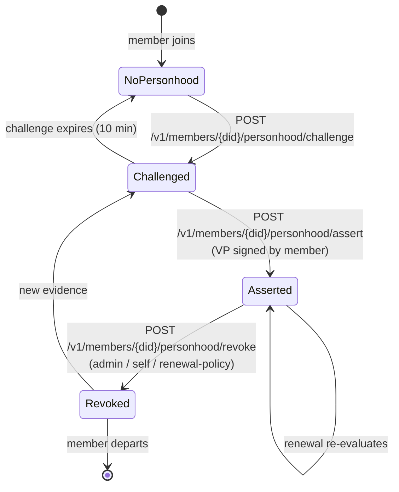
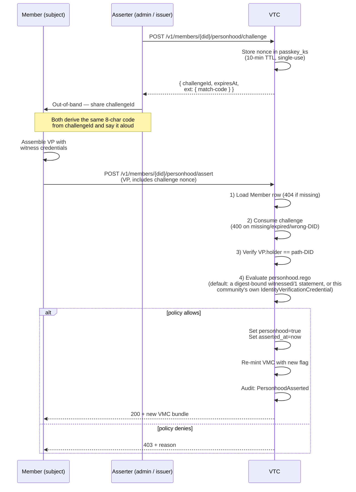
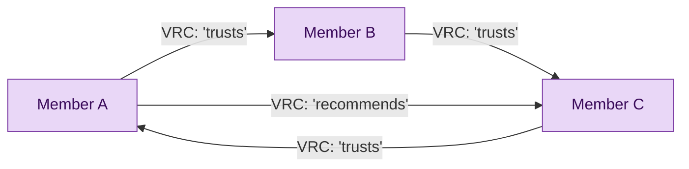
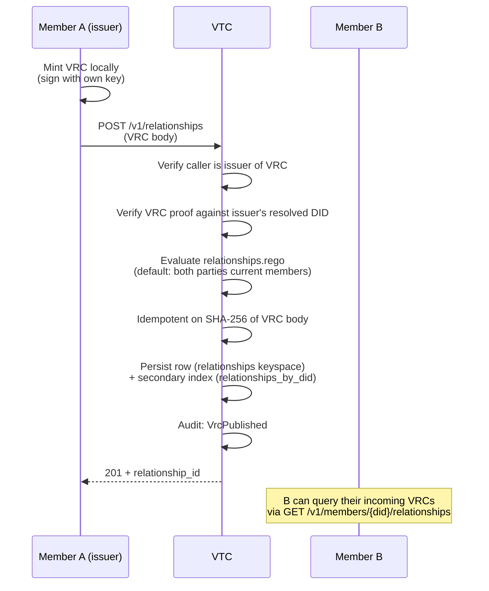

# Personhood + relationships

The VTC ships two member-graph features in Phase 4:

- **Personhood** — a member asserts that they are a human, backed by
  evidence the operator's `personhood.rego` accepts: a third party's
  witness credential, or an identity verification this community
  performed in person. The flag lands as a `PersonhoodCredential` type
  on the member's VMC, which is what DTG Credentials means by a PHC —
  read [What this does and does not establish](#what-this-does-and-does-not-establish)
  before relying on it as one.
- **VRC graph** — members self-issue Verifiable Relationship
  Credentials declaring trust edges to other members, forming a
  community-internal trust graph.

Both surfaces are optional. Communities that don't need them never
emit the underlying audit events.

## Personhood lifecycle


```mermaid
stateDiagram-v2
    [*] --> NoPersonhood : member joins
    NoPersonhood --> Challenged : POST /v1/members/{did}/personhood/challenge
    Challenged --> NoPersonhood : challenge expires (10 min)
    Challenged --> Asserted : POST /v1/members/{did}/personhood/assert<br/>(VP signed by member)
    Asserted --> Revoked : POST /v1/members/{did}/personhood/revoke<br/>(admin / self / renewal-policy)
    Revoked --> Challenged : new evidence
    Asserted --> Asserted : renewal re-evaluates
    Revoked --> [*] : member departs
```

The flag lives on the Member row alongside an `asserted_at`
timestamp; tombstoning a member wipes both fields.

### Assertion ceremony


```mermaid
sequenceDiagram
    participant M as Member (subject)
    participant A as Asserter (admin / issuer)
    participant VTC as VTC

    A->>VTC: POST /v1/members/{did}/personhood/challenge
    VTC->>VTC: Store nonce in passkey_ks<br/>(10-min TTL, single-use)
    VTC-->>A: { challengeId, expiresAt,<br/>ext: { match-code } }
    A->>M: Out-of-band — share challengeId
    Note over A,M: Both derive the same 8-char code<br/>from challengeId and say it aloud
    M->>M: Assemble VP with<br/>witness credentials
    M->>VTC: POST /v1/members/{did}/personhood/assert<br/>(VP, includes challenge nonce)
    VTC->>VTC: 1) Load Member row (404 if missing)
    VTC->>VTC: 2) Consume challenge<br/>(400 on missing/expired/wrong-DID)
    VTC->>VTC: 3) Verify VP.holder == path-DID
    VTC->>VTC: 4) Evaluate personhood.rego<br/>(default: a digest-bound witnessed/1 statement, or this<br/>community's own IdentityVerificationCredential)
    alt policy allows
        VTC->>VTC: Set personhood=true<br/>Set asserted_at=now
        VTC->>VTC: Re-mint VMC with new flag
        VTC->>VTC: Audit: PersonhoodAsserted
        VTC-->>M: 200 + new VMC bundle
    else policy denies
        VTC-->>M: 403 + reason
    end
```

**VP-only assert** (Phase 4 D2): the request body is purely a
Verifiable Presentation. The handler verifies the VP and discards
it — no `personhood_evidence` JSON field, no separate signed-blob
shape. The verify-then-discard semantics keep PII out of the
request log.

### Witness credentials

A Verifiable Witness Credential (VWC) is a DTG Verifiable Statement
Credential (`StatementCredential`) under the predicate
`https://registry.trustoverip.org/dtg/vsc/witnessed/1`; the VTC recognises it
by that predicate, never by a type string. It names the edge it witnessed
only by digest: `credentialSubject.object.digestMultibase`, a `sha2-256`
multihash over the witnessed relationship credential's JCS canonical form with
its top-level `proof` removed (DTG Credentials §Digest Encoding), and its
`credentialSubject.id` must be the **issuer** of that credential (the profile's
subject–object rule). Before policy runs, the VTC refuses any statement under a
predicate the community does not accept (the fail-closed accept list), then
recomputes the digest against every relationship credential it holds —
comparing decoded digest bytes, never encoded strings — and writes its verdict
onto each `witnessed/1` entry in `input.vp_claims.credentials` as
`witness_binding`:

| `witness_binding.state` | Meaning |
|---|---|
| `bound` | The digest names an edge this community holds, issued by the statement's subject; `relationship_id` says which. |
| `subjectMismatch` | The digest names an edge held here, but someone other than the statement's subject issued it. Never evidence; `relationship_id` names the edge. |
| `unresolved` | A well-formed digest naming no edge held here. Not forgery — the edge may live on another community. |
| `absent` | The VWC carries no digest, so it witnesses nothing in particular. |
| `malformed` | The digest is not a `sha2-256` multihash. |

The verdict is the VTC's, not the presenter's: a `witness_binding`
member inside a presented credential never reaches the policy.

The **default policy accepts only `bound`**. A community that trusts
witnesses of edges held elsewhere can accept `unresolved` in its own
`personhood.rego`:

```rego
allow if {
	some cred in input.vp_claims.credentials
	"StatementCredential" in cred.type
	cred.credentialSubject.predicate == "https://registry.trustoverip.org/dtg/vsc/witnessed/1"
	cred.witness_binding.state in {"bound", "unresolved"}
}
```

A VTC whose personhood policy is still a default an earlier release
installed — one that accepted any witness with a non-empty issuer, or one
written for the credential shapes before the DTG v1 context, which recognises
no current witness statement — has it replaced by the current default at boot
(`policy::default::upgrade_stale_personhood_default`, decided by evaluating
the stored policy, not by its bytes). A personhood
policy an operator uploaded is never replaced.

### In-person vetting

The default policy accepts a second evidence shape: an
**Identity Verification Credential** (IDVC) **this community issued to this
member**. That is the in-person ceremony — an administrator meets the
person, satisfies themselves that the DID they present is theirs, and
issues the record to that DID. The member later presents it over a
single-use challenge, and the community's own signature is the evidence.

DTG Credentials §Identity Verification Credentials defines an IDVC as *"any
W3C VC satisfying a VTC/VTN's identity-proofing requirements"* and explicitly
**not** a `DTGCredential` subtype, so the VTC issues it as a plain W3C VC — the
credentials v2 context alone, no `DTGCredential`, no `issuerScope`:

```json
{
  "@context": ["https://www.w3.org/ns/credentials/v2"],
  "id": "urn:uuid:…",
  "type": ["VerifiableCredential", "IdentityVerificationCredential"],
  "issuer": "did:…community",
  "validFrom": "…", "validUntil": "…",
  "credentialSubject": { "id": "did:key:zMember…", "method": "inPerson",
                         "verifiedBy": "did:key:zAdmin…" },
  "credentialStatus": { "type": "BitstringStatusListEntry", "statusPurpose": "revocation", "…": "…" }
}
```

**No setup.** `IdentityVerificationCredential` is not a predicate and is never
registered as an endorsement type — it is reserved, and registering it is
refused with `reserved`.

**Per member** — after meeting them, a signed `vtc/endorsements/issue/0.1`
document with the reserved `typeUri`:

```json
{
  "type": "https://trusttasks.org/spec/vtc/endorsements/issue/0.1",
  "payload": {
    "subjectDid": "did:key:zMember...",
    "typeUri": "IdentityVerificationCredential",
    "claim": { "method": "inPerson", "verifiedBy": "did:key:zAdmin..." }
  }
}
```

The `claim` members are copied into `credentialSubject` beside `id` (a claim
naming `id` is refused), and are opaque to the policy — the default rule reads
only the credential's `type`, its issuer and its subject, so what an operator
records about *how* they verified is theirs to decide. Issuance is
admin-or-issuer gated, consumes a slot on the community's revocation status
list and is recorded as an endorsement row, so withdrawing a vetting later is
`vtc/endorsements/revoke/0.1` rather than anything personhood-specific
(`vtc-service/src/credentials/idvc.rs`).

> **Recorded divergence.** `vtc/endorsements/issue/0.1` says the task mints a
> Verifiable Statement Credential under the registered predicate `typeUri`.
> For the one reserved `typeUri` `IdentityVerificationCredential` this VTC
> mints an IDVC instead — a plain W3C VC, not a statement. It is the only
> administrator issuance path that keeps the community's revocation machinery
> and needs no unspecified Trust Task. The intended resolution is a dedicated
> identity-verification issuance task in dtgwg-trust-tasks-tf; until it lands,
> this reuse is the divergence.

The member then runs the normal challenge + assert flow, presenting that
credential. Three bindings have to hold, and each is enforced by the
default policy:

| Binding | Why it is there |
|---|---|
| `issuer` == this community's DID | A type is a *name*, not an authority. Without this, any issuer anywhere could mint an `IdentityVerificationCredential` and unlock personhood here. |
| `credentialSubject.id` == the asserting member | The route's holder-match binds the *presenter*; this binds the *credential*, so a member cannot present a vetting record about someone else. |
| `type` includes `IdentityVerificationCredential`, and not `DTGCredential` | A role VAC and a VMC are also community-issued and also name the member. Without the type check, every member holding one would satisfy the policy — which is every member. |

#### The spoken match code

`challengeId` is a UUID: fine on a wire, hopeless read aloud. The
challenge response therefore also carries an eight-character code under
`ext["org.openvtc.match-code"]`:

```json
{
  "challengeId": "6f1c4f9e-7c2a-4f4b-9a3e-2b1d0c5e8a77",
  "expiresAt": "2026-08-24T10:15:00Z",
  "ext": { "org.openvtc.match-code": "7F4K-2QX9" }
}
```

It is **derived from the challenge id** (`SHA-256`, Crockford base32 —
no `I`, `L`, `O` or `U`, so nothing in it is mishearable), never
transmitted as an independent secret and never accepted as one. Both
parties compute it from the `challengeId` they already hold and say it
to each other; nothing checks it server-side, because there is nothing
it could prove that `proof.challenge` does not already prove. It is a
confirmation channel — a Bluetooth pairing code, not a password.

The code rides in `ext` rather than as a top-level field because
`vtc/members/personhood/challenge/0.1`'s response schema is
`additionalProperties: false`; `ext` is what the framework reserves for
ecosystem-defined members (SPEC §4.5.1), and its key pattern is why the
member is `match-code` and not `matchCode`.

#### What this does and does not establish

DTG Credentials §Personhood Credentials requires governance enforcing
**both** real human personhood **and exactly one membership per
person**. In-person vetting is evidence for the first only — see
[Declaring personhood governance](#declaring-personhood-governance) for
publishing the claim, and [One membership per
person](#one-membership-per-person) for the second half.

### Declaring personhood governance

The spec puts PHC status outside the credential: *"PHC status is
determined by governance and trust registries, not by credential
structure"*, and the `PersonhoodCredential` type this daemon stamps on a
vetted member's VMC is *"a non-authoritative hint"*. §Governance
Considerations is blunter: *"Whether a VMC qualifies as a PHC is a
governance determination, not a schema property."*

So a community publishes what its governance requires, on its profile:

```json
"personhood": {
  "realHuman": true,
  "singleMembership": true,
  "acceptedIdvps": ["did:webvh:idvp.example"],
  "governanceFrameworkUrl": "https://acme.example/governance"
}
```

This is served **unauthenticated** at `GET /v1/community/public-profile`,
because the party who needs it is a verifier holding one of your VMCs —
someone who is not a member and has no token.

Both booleans default to `false`. A community that has not considered the
question asserts nothing, which is the only safe default for a claim a
verifier may act on.

**Setting both requires naming at least one accepted IDVP.** A community
claiming PHC status while naming nobody it trusts to verify identity has
not written its governance down, and a verifier cannot tell an unwritten
policy from a permissive one. A community that vets in person lists its
own C-DID — §IDVC permits acting as your own identity-verification
provider.

### One membership per person

`singleMembership` is not just a declaration: **setting it turns on
enforcement.** The published claim and the check are the same switch, so a
community cannot advertise PHC status to verifiers while quietly not
checking it.

Nothing in the credential graph distinguishes one person with two DIDs
from two people — a member who joins twice presents two perfectly valid
sets of evidence, and every check passes twice. The community needs an
anchor that is stable per human, and it must come from outside.

That anchor is a **pseudonym**: an IDVP that can actually deduplicate
people — a state eID scheme, a biometric provider, a bank — derives a
deterministic value per (person, community). The same person returning
yields the same pseudonym; a different community yields an unlinkable
one. This is the rate-limiting-identifier construction from [Personhood
Credentials (Adler et al. 2024)](https://arxiv.org/abs/2408.07892), which
the spec's PHC definition cites.

The daemon reads it from `credentialSubject.pseudonym`, and **only from an
issuer in `acceptedIdvps`** — a foreign IDVP's IDVC, or this community's own
`IdentityVerificationCredential`, whose `claim` members (a `pseudonym` among
them) are copied into `credentialSubject`.

An assertion carrying no accepted pseudonym is refused with
`personhood-pseudonym-missing`; one whose pseudonym another member already
holds is refused as a conflict, worded so it does not disclose who that
member is.

**The pseudonym itself is never stored.** It is a stable per-person
identifier, so a database full of them is the correlation target the
construction exists to avoid. What is stored is a salted digest keyed to
this community, which answers "is this person already here" and nothing
else.

**Claims are released on purge only** — not on revoke, and not on leaving.
Revoking personhood withdraws the community's assertion; it is not
evidence that the human stopped existing, and they are still a member.
If either released the claim, one-membership-per-person would be defeated
by revoking and rejoining under a fresh DID.

#### What this still does not give you

The guarantee is the IDVP's, not the community's. Uniqueness is exactly as
good as your accepted providers' deduplication — which is why the spec
makes acceptable IDVPs part of what governance must publish.

**In-person vetting is the weak case.** When a community is its own IDVP,
the "pseudonym" is an administrator's judgement that they have not met this
person before. That genuinely supports one-membership-per-person in a
community small enough for one person to hold in their head, and genuinely
does not beyond it. Say so in your governance framework rather than
letting the flag imply more.

Finally, this is per-community by definition — the spec's glossary says
*"exactly one membership in that VTC"*. Personhood that means something
*across* communities is a VTN-level property; see the spec's VTN
definition and the [First Person Network](https://www.firstperson.network/).

### Revocation

Three triggers:

| Trigger | Audit `reason` field |
|---|---|
| Admin via `DELETE /v1/members/{did}/personhood` | `"admin"` |
| Self via `DELETE /v1/members/me/personhood` | `"self"` |
| Renewal-policy downgrade (operator-configured) | `"renewal-policy"` |

The third is the operator-configurable failure mode discussed in
[`community-lifecycle.md`](community-lifecycle.md#renewal-failure-modes).

## VRC trust graph

A Verifiable Relationship Credential declares "I, member A, trust
member B in some specific way". The VTC stores the VRC if both
parties are current members (default policy); listing endpoints
strip VRCs naming a `Purge`-departed member.


```mermaid
graph LR
    A[Member A]
    B[Member B]
    C[Member C]

    A -->|VRC: 'trusts'| B
    B -->|VRC: 'trusts'| C
    C -->|VRC: 'trusts'| A
    A -->|VRC: 'recommends'| C

    classDef mem fill:#e9d7f7,stroke:#7e3fa6,color:#3a0a5a
    class A,B,C mem
```

### Publication


```mermaid
sequenceDiagram
    participant Issuer as Member A (issuer)
    participant VTC as VTC
    participant Subject as Member B

    Issuer->>Issuer: Mint VRC locally<br/>(sign with own key)
    Issuer->>VTC: POST /v1/relationships<br/>(VRC body)
    VTC->>VTC: Verify caller is issuer of VRC
    VTC->>VTC: Verify VRC proof against issuer's resolved DID
    VTC->>VTC: Evaluate relationships.rego<br/>(default: both parties current members)
    VTC->>VTC: Idempotent on SHA-256 of VRC body
    VTC->>VTC: Persist row (relationships keyspace)<br/>+ secondary index (relationships_by_did)
    VTC->>VTC: Audit: VrcPublished
    VTC-->>Issuer: 201 + relationship_id
    Note over Subject: B can query their incoming VRCs<br/>via GET /v1/members/{did}/relationships
```

The secondary index makes the per-DID lookup O(matched rows)
rather than scanning the entire VRC table.

### `issuerScope` and the identifier form

Every VRC (and VPC) must declare the DTG `issuerScope` of its issuer's
identifier; the VTC refuses one without it. The publish path reads the
**identifier form** the `relationships.rego` policy sees as
`input.identifier_form` from that declaration, and passes the raw value too, as
`input.issuer_scope`:

| VRC `issuerScope` | `identifier_form` | Meaning |
|---|---|---|
| `pairwise` | `pairwise` | A relationship DID for this one counterparty — the same claim. Must carry a publish authorization (`pop`), and is refused if the DID already has an edge to anyone else. |
| `directed` | `attributed` | A persona recognised by a set of counterparties. |
| `public` | `attributed` | An identifier anyone can recognise, such as the member's membership DID. |

`attributed` has no `issuerScope` of its own: it means "not
per-counterparty", which `directed` and `public` both are — a policy that
needs to tell them apart reads `issuer_scope`. A VRC issued under the
caller's **membership DID** cannot truthfully declare `pairwise` (the whole
community recognises it) and is refused with `publish:vrcInvalid`. Whether a
`pop` is needed is unchanged: it is required whenever the VRC's issuer is not
the document signer.

### Listing + filtering

`GET /v1/members/{did}/relationships` returns every VRC where the
DID is issuer or subject. The handler strips VRCs whose **other
party** has departed with `Purge` disposition — the VRC's
counter-party is permanently anonymised, so the listing hides the
relationship to preserve the §12.3 spec invariant.

VRCs naming a `Tombstone` or `Historical` departure stay visible
(the counter-party's DID is still recoverable).

### Self-issued only (MVP)

Bilateral counter-signing (where B confirms A's VRC) is **v2**.
For Phase 4, every VRC is self-issued by the originator.

### The connections graph: half-edges vs complete edges

`GET /v1/relationships/graph` (admin-only) returns the whole edge
set for the admin UI's connections view. DTG Credentials defines a
DTG edge as **two** VRCs, one in each direction, so the response
groups by unordered pair rather than listing one entry per stored
credential:

```json
{
  "nodes": [{ "did": "did:key:zA" }, { "did": "did:key:zB" }],
  "edges": [{
    "endpoints": ["did:key:zA", "did:key:zB"],
    "halves": [
      { "id": "…", "issuerDid": "did:key:zA", "subjectDid": "did:key:zB", "createdAt": "…" },
      { "id": "…", "issuerDid": "did:key:zB", "subjectDid": "did:key:zA", "createdAt": "…" }
    ],
    "complete": true
  }]
}
```

`complete` is true only when an **in-force** VRC exists in both
directions. A single-direction edge is a *half-edge* — one party's
claim that the other has not answered.

"In force" and not merely "present": a half whose VRC has expired,
or which has been suspended, superseded or withdrawn, no longer
completes an edge. Before this the graph was read back without
re-checking anything, so a half-edge whose reciprocal had expired
years ago was indistinguishable from a live mutual relationship.
The halves themselves are still listed whatever their state — the
credential was published, and hiding it would make a lapsed edge
look like one that never existed.

The distinction matters because it is what replaced a check.
Publishing used to require the subject to be a current member; that
check was the community asserting on the subject's behalf that the
edge was legitimate. #1061 dropped it, on the DTG rule that
"community membership is not a precondition for issuing, holding,
or presenting a VRC", and on the reasoning that the subject's
consent to an edge is *their publication of the reciprocal VRC*.
That consent signal is only visible to an operator if the graph
shows whether the reciprocal VRC arrived — which is what
`complete` is.

`endpoints` is DID-sorted so a pair has one identity whichever
half was published first. `halves` can hold more than two entries:
idempotency is keyed on the credential hash, not on direction, so a
party can publish several VRCs the same way round. That does not
make an edge complete — the check is for a VRC in each direction,
not for two credentials.

Design record:
[`../05-design-notes/vrc-publish-proof-of-possession.md`](../05-design-notes/vrc-publish-proof-of-possession.md).

### Edge lifecycle: suspend, restore, supersede

An edge used to have two states — published, and deleted. A
community with a reason to stop relying on one *temporarily* had to
destroy it, and the member had to re-issue and re-publish to get it
back. That is not a smaller version of revocation; it is a
different act.

| Verb | Endpoint | Reversible |
|---|---|---|
| suspend | `POST /v1/relationships/{id}/suspend` | yes, by restore |
| restore | `POST /v1/relationships/{id}/restore` | — |
| supersede | automatic, on publishing a new VRC to the same counterparty | no |
| withdraw | `DELETE /v1/relationships/{id}` (deletes the row) | no |

Suspend and restore are authorized exactly as revocation is: the
issuer's session DID, an admin, or — for an edge published under a
pairwise relationship DID — a `VrcSuspendAuthorization` /
`VrcRestoreAuthorization` proving control of that DID, in the same
request-body `pop` field revocation uses. Both take an optional
`reason`, stored verbatim on the event and in the audit trail.

Neither touches the credential. The VRC's signature, its window and
its digest are unchanged; what changes is what the community has
recorded against it. That separation is what lets suspension exist
at all for a credential type that deliberately carries no
`credentialStatus` (planning-review D7).

**Supersession is automatic.** Publishing a second VRC to a
counterparty you already have an edge to records the displacement
on the earlier row. DTG Credentials requires an R-DID to be unique
per counterparty, so the (issuer, subject) pair *is* the
relationship, and re-issuing to it is a renewal or a correction
rather than a second relationship. Re-sending an identical
credential is still idempotent and displaces nothing.

**Restoration reverses a suspension and nothing else.** An edge
that has been superseded or withdrawn is terminal — you give effect
back by issuing a fresh VRC, which produces a new signature, a new
window and a record that a *new* assertion was made. Restoring an
edge whose `validUntil` passed while it was suspended succeeds and
still reports `expired`: a recorded event can put an artifact out
of force at any time, but no event can put one **into** force that
its own window excludes.

The precedence rule is stated once, in
`vtc-service/src/credentials/lifecycle.rs`, and every read path
resolves through it rather than re-deriving dates at the call
site.

## Community statements

Phase 4 also adds community-issued statements under an in-process
predicate registry. See [`credentials.md`](credentials.md#statements-and-the-predicate-accept-list)
for the issuance + revocation flow. Three pieces compose:

1. **Predicate accept list** — the registered endorsement types
   (`vtc/endorsement-types/register/0.1`) are predicate IRIs, each with an
   optional JSON Schema for the statement's `object.value`. Seeded once with
   the DTG VSC registry's core predicates; fail-closed for presented
   statements.
2. **Issuance** — Issuer role (or admin) sends
   `vtc/endorsements/issue/0.1` with predicate (`typeUri`) + subject +
   claim; the VTC mints a `StatementCredential` (a VEC under `endorses/1`).
3. **Revocation** — `vtc/endorsements/revoke/0.1` flips the shared
   status-list slot.

Reserved type URIs (`role:vetter`, `IdentityVerificationCredential`) are
blocked from registration: they are the workspace's own row kinds, and roles
are VACs, never endorsement types.

## Audit events

| Event | When emitted |
|---|---|
| `PersonhoodAsserted { reason, asserter_did_hash }` | Successful `assert` |
| `PersonhoodRevoked { reason, revoker_did_hash }` | Any revoke path |
| `VrcPublished { vrc_id, issuer_did_hash, subject_did_hash }` | `POST /v1/relationships` success |
| `VrcRevoked { vrc_id }` | `DELETE /v1/relationships/{id}` |
| `VrcSuspended { vrc_id, recorded_by, reason? }` | `POST /v1/relationships/{id}/suspend` |
| `VrcRestored { vrc_id, recorded_by, reason? }` | `POST /v1/relationships/{id}/restore` |
| `VrcSuperseded { vrc_id, superseded_by_digest_multibase }` | A later VRC to the same counterparty displaced this one |
| `CustomEndorsementIssued { endorsement_id, type_uri, ... }` | Endorsement issuance |
| `CustomEndorsementRevoked { endorsement_id, type_uri }` | Endorsement revoke + paired `StatusListFlipped` |
| `EndorsementTypeRegistered { type_uri }` | Admin uploads type |
| `EndorsementTypeDeleted { type_uri }` | Admin deletes unused type |

All actor DIDs are HMAC-hashed per the §11.1 PII policy.

## CLI quick reference

```sh
# Personhood (admin / issuer view)
cnm members personhood challenge <did>
cnm members personhood assert <did> --vp ./evidence-vp.json
cnm members personhood revoke <did>

# Relationships (member view via pnm)
pnm vtc relationships list
pnm vtc relationships publish --subject did:key:zOther... --type 'trusts'
pnm vtc relationships revoke <id>
```

## See also

- [Community lifecycle](community-lifecycle.md) — personhood
  interacts with renewal failure modes.
- [Credentials](credentials.md) — VRC + custom endorsement
  status-list mechanics.
- [VTC MVP spec §6.4, §7, §12.3](../05-design-notes/vtc-mvp.md).
