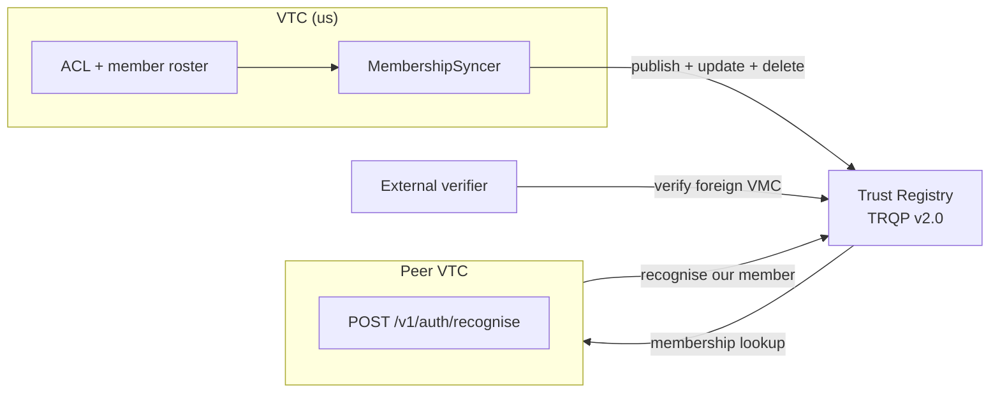
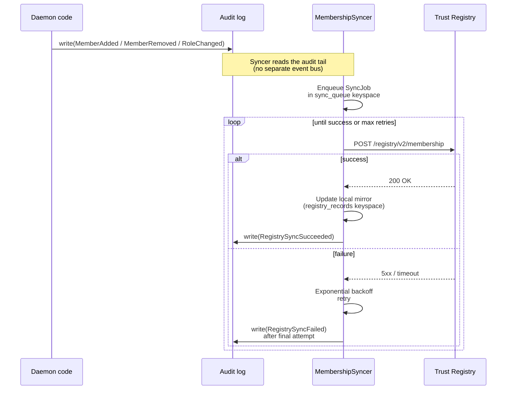
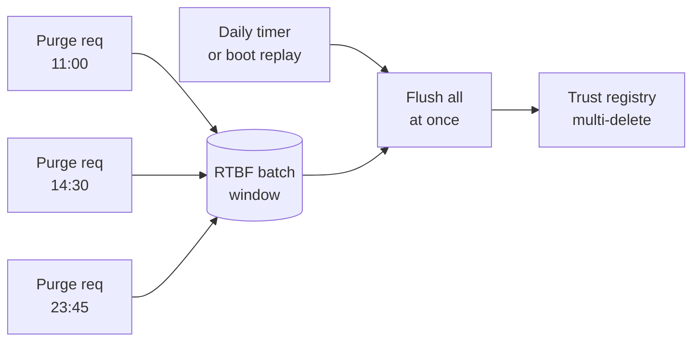
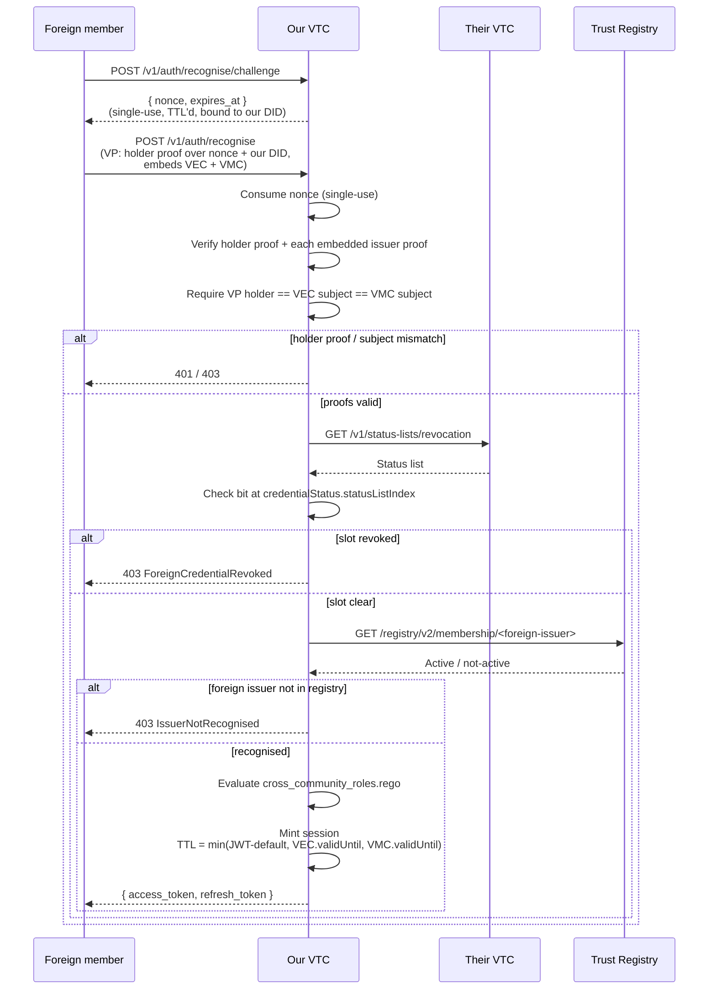

# Trust-registry integration

How the VTC publishes its membership to an external trust registry,
how the `MembershipSyncer` keeps the published view in step with
the local ACL, and how cross-community recognition lets one VTC
mint a session for a member of a peer community.

## Why a trust registry?

A trust registry answers the question **"is `did:key:zFoo...` an
active member of community X right now?"** for verifiers who don't
have direct access to the community's ACL. The VTC writes to it;
external verifiers read from it.



The VTC uses **TRQP v2.0** (Trust Registry Query Protocol) via the
`affinidi-trust-registry-rs` client (or any TRQP-compatible
backend).

## How the VTC reaches the registry

The registry is addressed by **DID** (`registry.did`), not by URL.
The VTC resolves that DID, reads the transports it advertises, and
uses the highest-preference one both sides speak — TSP, then
DIDComm, then REST — matched on the service `type`. Every
interaction rides that transport as a canonical Trust Task:

| Operation | Trust Task | Proof |
|---|---|---|
| Publish / update a member | `registry/record/put/0.1` | signed |
| Remove a member (RTBF, departure) | `registry/record/delete/0.1` | signed |
| Read a member's record | `registry/record/query/0.1` | none |
| Recognition check | `registry/recognition/0.1` | none |
| Health probe | `registry/record/query/0.1` (limit 1) | none |

Writes are signed with the VTC's assertion key (`{vtc_did}#key-0`)
— the same identity that mints VMC/VEC — and the registry must
carry that DID in its admin list, or every write is
`permissionDenied`.

A send returning `Ok` is never treated as delivery. Each call
registers a waiter keyed by the request document id, and completes
only when the correlated reply arrives; silence is a retriable
failure the syncer backs off on.

`registry.url` remains as the REST arm for a registry that
advertises `TRQPRest` and no messaging transport.

## Publication



The syncer:

- Subscribes to audit-tail events (`MemberAdded` / `MemberRemoved`
  / `RoleChanged`, and `MemberUpdated` when it changes
  `publishConsent`) — the audit log is the source of truth for
  triggers, not a separate event bus.
- Persists each pending job in a `sync_queue` fjall keyspace so
  pending work survives restarts. At boot, the syncer replays
  outstanding jobs.
- Uses exponential backoff on failure (default starts at 30s,
  doubles, caps at 1h).
- Surfaces health on `GET /v1/health/diagnostics`:
  - `registry_status: "active" | "degraded"`
  - `sync_queue_depth: <u32>`
  - `last_sync_at: <iso8601>`
  - `last_failure_reason: <string>`

`registry_status` flips to `degraded` when the queue is ≥1h behind
(configurable via `registry.degraded_threshold_seconds`).

## Who is published: member consent

A member is published **only if they consented**. The consent is the
member's `publishConsent` flag, set at admission from the applicant's
`registryConsent` on `vtc/join-requests/submit` (the spec's
*Consent/purpose* section: it is the applicant's consent to
trust-registry publication) and changeable afterwards by an admin
through `vtc/members/update`.

The syncer reads the flag when it dispatches each job, not when the job
was queued, and enforces it in code:

| Member | `registry.rego` `publish_on_join` | Result |
|---|---|---|
| consented | `true` (default) | published |
| consented | `false` | not published |
| did not consent | anything | **not published** |

`publish_on_join` is the operator's rule and can only narrow. No
policy can publish a member who did not consent: consent is the
applicant's to give, not the community's. The rule receives
`input.member.publishConsent` (with `input.member.did` and
`input.action == "publish"`) if a policy wants to state it.

Consent can change after admission:

- **Withdrawn** (`true → false`): the member's record is **removed**
  from the registry on the next sync tick (a delete, not a
  `Departed` record: the member has not left, they have stopped
  agreeing to be listed).
- **Granted** (`false → true`): the member is published on the next
  tick, subject to `publish_on_join`.

A departure (`MemberRemoved` with `tombstone` / `historical`) updates
the record to `Departed` only if the member was published. A member who
was never published is not published on the way out.

### Upgrading: members admitted before consent was honoured

Before this change the syncer ignored consent, and before #1682 every
admission stored `publishConsent = false`. So on an existing deployment
**every member admitted before #1682 reads as not consenting**, and may
be in the registry anyway.

Upgrading does not remove them all at once: the syncer acts per member
when something re-decides that member (a role change, a consent change,
a retried job, or a replay of the audit log). At that point a
non-consenting member who holds a registry record is removed. That is
the intended result, since they never consented. If you need them listed,
record their consent (with their agreement) before it happens:

```bash
# For each member who has agreed to be listed:
curl -X PATCH "$VTC/v1/members/$MEMBER_DID" \
  -H "Authorization: Bearer $ADMIN_TOKEN" \
  -H 'Content-Type: application/json' \
  -d '{"publishConsent": true}'
```

(or the `vtc/members/update` Trust Task with `{"did": …,
"publishConsent": true}`). The next tick publishes the member if they
are not already listed.

## RTBF batching

A self-initiated `Purge` (right-to-be-forgotten) is timing-sensitive:
if a single member purges and the registry record disappears within
seconds, a malicious observer can correlate the audit event with the
specific member.

The VTC defends with **batched RTBF deletes**:



`registry.rtbf_batch_window_hours` (default 24) coalesces every
RTBF deletion into one daily batch. The batch trigger fires on a
periodic timer AND at boot (so a daemon restart doesn't leak
batched purges that haven't yet flushed).

## Cross-community recognition

A peer community's member asks our VTC for a session by **presenting**
their `(VEC, VMC)` pair inside a holder-signed Verifiable Presentation.
A VEC + VMC are bearer artifacts: anyone who captures the pair (a relayed
join, an audit log, a compromised member device) would otherwise hold a
replayable impersonation token for that subject. So recognition is a
**two-step, proof-of-possession-bound** flow (P0.2, PRs #351 + #354) —
the caller first fetches a single-use challenge, then presents the
credentials inside a VP whose holder proof commits to that challenge.
Our VTC verifies the holder + issuer proofs, checks the peer registry,
runs `cross_community_roles.rego` to map their role to ours, and (on
success) mints a session.



**Session-mint hardening invariants** (every one is load-bearing):

- **Holder proof-of-possession.** The VP's `eddsa-jcs-2022` holder proof
  (`proofPurpose: authentication`) must verify and commit to the
  single-use challenge `nonce` (freshness/replay) plus this VTC's DID as
  `domain` (audience). A captured VEC + VMC is inert without the
  subject's private key, and a replayed VP finds its nonce already
  consumed.
- **Subject binding.** The verified VP holder DID must equal the VEC
  `credentialSubject.id`, and the VMC subject must equal the VEC subject.
  The VMC only attests "live, non-revoked member"; without the
  `vmc.subject == vec.subject` check, member A's role VEC paired with any
  *other* current member B's VMC (same issuer) would pass the gate.
- Foreign VEC + VMC must pass a **live** status-list revocation check.
- Foreign issuer must be in the trust-registry recognition graph
  **at mint time**.
- Minted session TTL = `min(JWT-audience-default,
  foreign-VEC.validUntil, foreign-VMC.validUntil)`.
- **No caching, no refresh** — every mint re-runs holder/issuer proof +
  policy + status-list + registry checks. Cross-community sessions
  (`xc-`-prefixed) never refresh; a peer community removed mid-session
  loses access when the clamped TTL elapses.
- **Untrusted denied-path audit actor.** On a rejected recognise the
  audit envelope's actor is the cryptographically-proven VP holder (the
  signer), never an unverified DID lifted from the credential body.

## Configuration

```toml
# config.toml
[registry]
did = "did:webvh:Qm…:webvh.example:trust-registry"
http_timeout_seconds = 30
health_probe_interval_seconds = 300       # 5 minutes; 0 disables
rtbf_batch_window_hours = 24              # daily flush
degraded_threshold_seconds = 3600         # status flips to degraded after 1h lag
# url = "https://trust-registry.example.org"   # optional REST arm
```

Configuring neither `did` nor `url` disables registry features
entirely — the daemon runs in "no-registry" mode,
`registry_status` reports `degraded`, and `cross_community_roles`
short-circuits to deny-all. Configuring `url` alone gives you TRQP
queries without membership sync: record writes exist only as Trust
Tasks, so they need a DID to address.

## Operator surface

There is **no `cnm registry` command** — an earlier version of this
document listed one that was never built. What exists today:

```sh
# Reconciler state: registry_status, queue_depth, failed_count,
# oldest_pending_age_seconds, last_error, syncer liveness, plus the
# transport view below.
curl -H "Authorization: Bearer $TOKEN" \
  https://vtc.example.org/v1/health/diagnostics | jq .
```

Two transport fields on that payload answer "how are we actually
talking to it?":

```jsonc
"registry_transport": {
  "did": "did:webvh:…:trust-registry",
  "advertised": ["tsp", "didcomm"],   // the registry's own DID document
  "active": "tsp"                     // what the last call chose
},
"transports": [                        // this VTC's own document
  { "protocol": "tsp",     "advertised": true,  "serviceable": true  },
  { "protocol": "didcomm", "advertised": false, "serviceable": true  }
],
"ext": {
  "org.openvtc": {
    "transportFindings": [             // what that table *means*
      {
        "code": "noDidcommFallback",
        "severity": "warn",
        "summary": "the DID document advertises TSP with no DIDComm fallback — …",
        "message": "this VTC advertises TSP but no DIDComm mediator, so …"
      },
      {
        "code": "servedNotAdvertised",
        "severity": "info",
        "protocol": "didcomm",
        "summary": "this build serves didcomm, but the DID document does not …",
        "message": "this build serves didcomm but the DID document does not …"
      }
    ]
  }
}
```

`transportFindings` is the same list `vtc status` prints and the daemon
logs at messaging start, from one function
(`transport_capability::findings_for_build`) — so no two surfaces can
tell you a different story about the same document. Four codes, and
`code` is the stable identity: `message` is prose written for a human
and will be reworded, so match on the code and never on a substring.

It lives under `ext` rather than at the top level because
`spec/vtc/registry/diagnostics/0.1#response` is `additionalProperties:
false`, and the daemon's own response-conformance layer enforces that.
`ext` is the extension point the spec provides for exactly this (SPEC.md
§4.5.1, reverse-DNS namespaces); promoting the field to the top level is
a `trust-tasks-rs` spec release, not a change in this repo.

| `code` | `severity` | What it means |
|---|---|---|
| `advertisedNotServable` | `error` | The document promises a transport this build cannot answer. Every conforming client picks it and fails — the more correct the client, the harder. |
| `noMessagingAdvertised` | `warn` | No `TSPTransport` and no `DIDCommMessaging`: REST-only. Legal (it is what the `vtc-host` template mints by default) but nothing reaches this VTC over a mediator. |
| `noDidcommFallback` | `warn` | TSP advertised with nothing behind it. A peer that does not speak TSP has no messaging route in. |
| `servedNotAdvertised` | `info` | The binary serves more than it promises. Normal mid-rollout — ship the capable binary, then add the service entry. Never a fault. |

The first two are statements about the *shape* of the advertised set,
not about any one protocol, so they cannot be reconstructed from the
`transports` table above. Read the findings; do not re-derive them.

An empty `transportFindings` with a **non-empty** `transports` means the
document and the binary agree. Empty *both* means this VTC's DID did not
resolve — that is "unknown", not "nothing advertised".

`advertised` and `active` are separate on purpose. A registry that
advertises only TSP while this VTC can answer only DIDComm is
configured and unreachable at the same time, and a single
"protocol" field would have to drop one of those two facts. When
selection fails, `active` is absent and `error` carries the
reason — `advertised` still shows what the peer offered, which is
the half that tells you which side to fix.

In the admin UI: the **Dashboard** names the live mediator
protocols on its tile, adds a trust-registry tile (active
protocol + status), lists the registry DID under Identity, and
always carries a "Transport advertisement" card — the `transports`
table, then the findings above, rendered at their own severity.

Read that card against the tiles rather than alongside them. The
mediator and trust-registry tiles describe **other parties'**
documents: the mediator this VTC dials, the registry it syncs with.
The card describes **this community's own**. A registry tile reading
`advertises TSP, DIDComm` next to a card reading `not advertised:
DIDComm` is not a contradiction — it is two different DID documents,
and the card says so on its face. The **Recognition** page
shows the registry DID, what it advertises, what we are
connecting over, and the last transport error. The **Audit** page
carries `RegistryStatusChanged` / `RegistrySyncSucceeded` /
`RegistrySyncFailed`.

### Reading the sync queue

Recognition's **Membership sync** card is where a stalled
reconciler becomes visible. It polls every 15s and shows:

| Counter | What it means |
|---|---|
| **Pending** | Queued + in-flight jobs, with the age of the oldest *dispatchable* one. Depth alone is normal — a burst of joins drains. Depth that stays **old** is a stuck reconciler; ≥1h is the spec's degraded SLI. |
| **Failed** | Terminal rows: `attempts > max_attempts`, or a `Permanent` / `Incompatible` error such as `permissionDenied` or `unsupportedType`. **The syncer will not retry these** — they never clear on their own. Every one is listed in full underneath; see [Triaging a failed job](#triaging-a-failed-job). |
| **RTBF batched** | Deletions parked behind the daily flush window. Expected to be non-zero between flushes. |
| **Syncer** | `running` / `stopped` / `off`, plus the panic-restart count. `enabled` but not `running` means the task is spawned and dead; a rising restart count is a "keeps crashing" signal. |

Last success / last failure / last error sit underneath. The
dashboard's trust-registry tile surfaces the two states worth
interrupting for — any failed job, or a queue ≥1h behind — in
place of the transport line, so a registry that answers while
nothing is landing does not read as healthy.

### Registry records, and drift

Recognition's **Registry records** card compares two views that nothing
previously compared: the local `registry_records` mirror — what this
community believes it published — against what the registry actually
holds. The mirror had been written on every successful sync since Phase 3
and never read; its own model doc said it existed "so the daemon can
detect drift at boot", and no drift check was ever built.

The distinction matters because the three signals on this page answer
three different questions, and only the last one is about your members:

| Signal | Answers |
|---|---|
| `registryStatus` | does the registry respond? |
| Membership sync counters | were our writes *accepted*? |
| Registry records | are they still *there*? |

A disagreement is reported in one of three directions, because they have
opposite fixes:

- **missing at registry** — we published it, the registry does not have
  it. A lost write; the member is invisible to every other community.
  This is what a failed `publishMember` leaves behind, and it survives
  the job being swept.
- **unknown locally** — the registry has a record we have no note of.
  Usually benign: an earlier deployment, or another admin. Reported, but
  not counted as a fault, because it makes no member invisible.
- **status mismatch** — both hold the record and disagree on whether the
  member is active. A removal that half-landed.

The comparison runs on its own timer — `[registry]
drift_check_interval_seconds`, default 900 — rather than on page load,
because enumerating the graph is several round trips and the console
polls diagnostics every 15 seconds. Set it to `0` to disable.

Two readings that are **not** the same, and the card keeps them apart:

- **"Not checked yet"** — no comparison has completed. Unknown, not
  clean. A freshly-booted VTC shows this for the first half minute.
- **"The two views agree"** — a comparison completed and found nothing.

If a check fails, the previous findings are kept rather than cleared, and
the failure is stated alongside them. A registry that was briefly
unreachable is not evidence that drift went away, and clearing a real
finding on a transient error would silently cancel an operator's alarm.

### Browsing the records themselves

Recognition's **Trust records** card enumerates the graph, from either side
of the comparison above: **Registry** asks the trust registry what it holds,
**Ours** asks this community what it believes it published.

A registry read is a live round trip every time. It is never served from the
local mirror — a stale local answer presented as the registry's is the exact
fault the drift check exists to detect — so an unreachable registry is an
error on this card rather than a quietly substituted list, and the card is
not polled. Refresh is deliberate.

The assertion column has **three** states, not two. `recognized` and
`authorized` each appear only on the record type that carries them, and an
absent one means the record makes no such assertion. It is not `false`:
showing "not authorised" against a recognition record would invent a refusal
the registry never made.

`vtc/registry/records/list/0.1`, admin-gated. The API takes the full filter
set (`entityId`, `authorityId`, `action`, `resource`) and a cursor; the card
shows the first page unfiltered, which is the whole graph for any community
that has not outgrown one page.

### Triaging a failed job

Below the counters, every failed job is listed in full: the member
DID, which operation was being published, how many attempts it made,
when it gave up, when the retention sweeper will purge the row, and
the registry's verbatim error. The member DID is the field that makes
the list actionable and the one the audit trail cannot give you —
`RegistrySyncFailed` envelopes carry only `targetDidHash` (§11.1).

`attempts` distinguishes the two ways a job dies, and they have
nothing in common:

- **`1`** — the registry answered and refused. Read the error.
- **`17`** (`DEFAULT_MAX_ATTEMPTS` + 1) — the registry never answered
  across ~18 hours of backoff. A reachability problem, not a
  contract one.

Three errors account for almost everything:

| Error | What it means | Fix |
|---|---|---|
| `permissionDenied` | This VTC's DID is not in the registry's `admin_dids`. Reads work, writes do not. | Add the VTC's DID at the registry. |
| `unsupportedType` | The registry does not route that Trust Task **at all** — the deployed registry is out of step with this VTC. Nothing about this community's configuration is wrong. | Upgrade the trust registry. `registry/record/put/0.1` and `registry/record/query/0.1` need affinidi-trust-registry-rs **≥ 0.10.0**, whose cutover removed `registry/record/{create,update,read,list}/0.1` with no dual-accept. |
| `proofInvalid` | The registry rejected our Data-Integrity proof. | Check the VTC's signing key bundle and the DID document it resolves to. |

A registry answering `unsupportedType` also drives the **Status**
field to `degraded`, and the page carries an explicit banner. This is
deliberate and was not always true: the liveness probe counts an
ordinary rejection as proof the registry is alive — it read the
document, routed it, and refused it — but an `unsupportedType` on the
probe's own task proves the opposite, and reporting it as `active` is
how a community can publish nothing for weeks behind a green
dashboard.

Fixing the cause does **not** re-drive the jobs. The sync cursor
advanced past the audit envelopes that created them long ago, and
nothing re-derives a `Failed` row.

Each failed row in the admin console carries **Retry** and **Discard**,
and a **Retry all failed** control appears when more than one shares a
cause. Retry reports both halves of what it did: jobs requeued, and jobs
declined with the reason — `notFailed` when the reconciler still owns
one, `notFound` when it was swept between the page load and the click.
Neither is an error, so one ineligible row does not defeat a bulk retry.
Discard confirms first and is irreversible; it deletes the community's
record that the change never landed, and does **not** touch the
registry, so a discarded publish leaves the member unpublished
permanently with nothing left to show it.

These are `vtc/registry/sync-jobs/{list,retry,discard}/0.1`, admin-gated
like the rest of the page.

The same three operations also run offline, on a **stopped** daemon —
the break-glass path for a VTC that will not start, which is exactly
when an HTTP route is no use:

```bash
vtc sync-jobs list                      # what failed, and why
vtc sync-jobs retry --job-id <uuid>     # requeue one
vtc sync-jobs retry --all               # requeue every failed job
vtc sync-jobs discard --job-id <uuid>   # drop one that should not be retried
```

`retry` resets the row to `Pending` with a clean attempt budget, so
the syncer dispatches it on its next tick after you restart. It
refuses anything that is not `Failed` — a pending or in-flight row
belongs to the syncer. `discard` deletes the row and changes nothing
at the registry: for a failed `publishMember` that means the member
stays unpublished, permanently.

fjall takes an exclusive lock, so these fail while the daemon is
running, and they are not available in TEE deployments. The online and
offline surfaces share one eligibility rule — only a `Failed` row may
move — so they cannot disagree about what a retry does.

Doing nothing is also a decision with a deadline. The retention
sweeper purges `Failed` rows `[join_requests] retentionDays` after
they gave up (default 30). That clears the counter and the table; it
does not publish the member.

## See also

- [Trust-registry deployment](trust-registry-deployment.md) — the
  operational runbook: standing up a registry, sourcing its
  identity from a VTA, wiring this `[registry]` block.
- [VTC MVP spec §8](../05-design-notes/vtc-mvp.md) — full TRQP
  binding + reconciliation details.
- [Community lifecycle](community-lifecycle.md) — what events
  trigger registry sync (`MemberAdded`, etc.).
- [Credentials](credentials.md) — status-list mechanics that
  recognition relies on.
