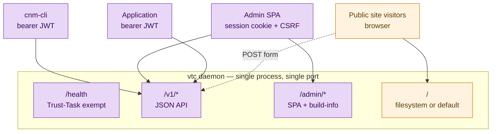
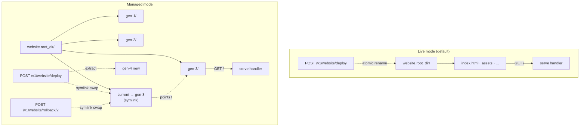
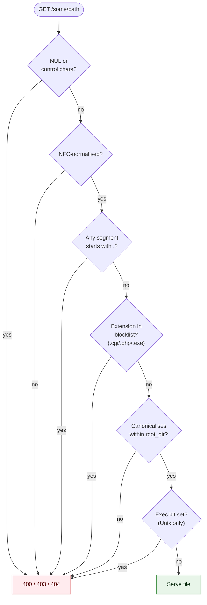
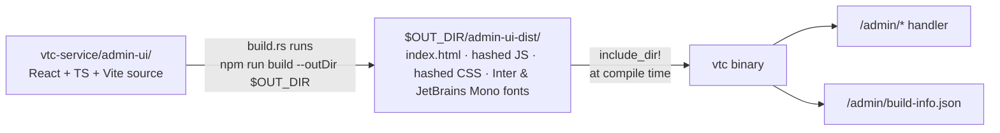
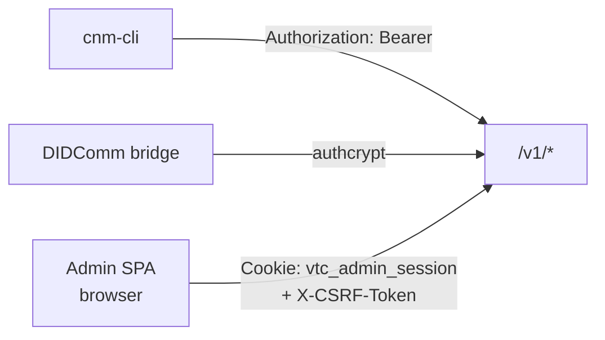
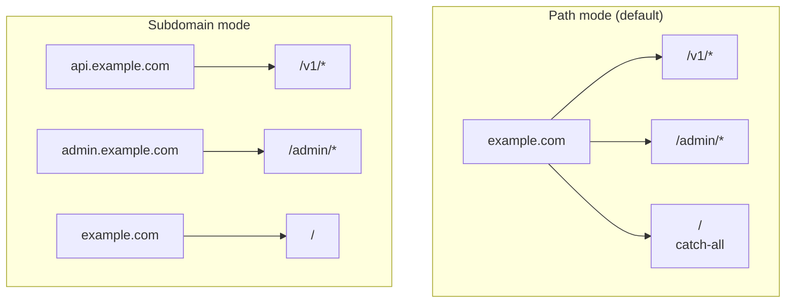

# Website + admin UX

Phase 5 ships three operator-facing surfaces on the same VTC
process: the **JSON API** at `/v1/*`, the **admin SPA** at
`/admin/*`, and the **public community website** at `/`. Each has
its own cookie scope, body cap, and CSP. This page covers the
public-website and admin-UX surfaces; the routing infrastructure
that makes them coexist safely is shared.

## Surface map



The default routing assignment:

| Mount | Purpose | Body cap | CSP |
|---|---|---|---|
| `/health` | Health probe (Trust-Task exempt) | 1 MiB | — |
| `/v1/*` | JSON API | 1 MiB global, per-route override on website mgmt | — (JSON wire) |
| `/admin/*` | Admin SPA + `/admin/build-info.json` | 1 MiB | default-src 'self' |
| `/` (catch-all) | Public website | 1 MiB | default-src 'self' (overridable per site) |

Operators can rewrite these mounts via `routing.api.mount`,
`routing.admin_ui.mount`, `routing.website.mount`, or switch to
subdomain mode by setting per-surface `host = "..."`. Phase 5 path-
prefix mode is the default.

## Public website

### Deploy modes



| Mode | Where served from | Bundle deploy | Operator workflow |
|---|---|---|---|
| **`live`** (default) | `website.root_dir/` directly | Extract to `<root>.staging.<ts>/` + atomic rename | `scp` / `rsync` / `git pull` directly into `root_dir`, OR `POST /v1/website/deploy` |
| **`managed`** | `website.root_dir/current/` via symlink to `gen-N/` | Extract to `gen-N+1/` + symlink swap + prune | `POST /v1/website/deploy` for new gen; `POST /v1/website/rollback/{gen}` for rollback |

In managed mode the `current` symlink swap is atomic via the
`symlink + rename` idiom — concurrent readers never see a broken
link. `managed_generations_keep` (default 5) prunes oldest gens.

### Which of these are Trust Tasks

Most of the `/v1/*` API requires a `Trust-Task` header naming the operation.
The website management surface is the exception, and deliberately so: a Trust
Task's payload is a JSON document, and three of these endpoints move **raw
file bytes**.

| Endpoint | `Trust-Task` header |
|---|---|
| `GET /v1/website/files` | `spec/vtc/website/files/list/0.1` |
| `GET /v1/website/files/{path}` | **none** — file bytes out |
| `PUT /v1/website/files/{path}` | **none** — file bytes in |
| `DELETE /v1/website/files/{path}` | `spec/vtc/website/files/delete/0.1` |
| `POST /v1/website/deploy` | **none** — bundle bytes in |
| `GET /v1/website/generations` | `spec/vtc/website/generations/list/0.1` |
| `POST /v1/website/rollback/{gen}` | `spec/vtc/website/rollback/0.1` |

`DELETE` carries a path rather than a payload, so it is a Trust Task like any
other. The three byte-moving endpoints are not, and no canonical spec will ever
supersede them — there is no document shape to write.

Sending no header on the three exempt endpoints is correct. Sending a stale one
is harmless there (nothing checks it) but **fails on `DELETE`** with
`TrustTaskMismatch` (415): it previously accepted
`openvtc/vtc/website/files/show/1.0`, which labelled a delete as a read.

Losing the header requirement is **not** losing an authorization gate — every
endpoint above still requires an admin bearer token or admin session cookie.

### Path safety

Every request walks through the same safety chain before hitting
the filesystem:



Bundle uploads run the same chain on every entry **before**
extraction. A bundle containing a single forbidden entry is rejected
in toto.

### CSP override

Default CSP: `default-src 'self'; script-src 'self'; object-src
'none'; base-uri 'self'`.

Operators relax it by dropping a `.vtc-website.toml` at the root:

```toml
# vtc-service/website.example.com/.vtc-website.toml
csp = "default-src 'self'; script-src 'self' 'unsafe-inline'; img-src 'self' data:"
```

The file is read on every request (no daemon restart needed). Empty
or missing file → default CSP applies.

### Default landing page

When `website.root_dir` is **unset**, the daemon serves a small
in-tree landing page (HTML/CSS/JS at `vtc-service/website-default/`)
that fetches `/v1/community/profile` + `/health` and renders them.
The moment an operator sets `root_dir`, the filesystem handler
takes over and the default is unreachable.

### Community DID as a QR code

The default landing page shows the community DID as a QR code beside
the community name, so a wallet (Keyring first) can add the community
by scanning it instead of retyping the DID. The daemon renders it:

```console
$ curl -s https://community.example/v1/community/did-qr.svg -o did-qr.svg
```

`GET /v1/community/did-qr.svg` is public and unauthenticated, like
`public-profile`, and it encodes the **bare DID** and nothing else: the
same string the page's Copy button copies, and the profile's
`communityDid`. A DID is already a URI (scheme `did`), so no `did://`
or app-specific wrapper is added; a phone's camera hands the scan to
whichever app registers the `did` scheme. It returns 404 until the
community profile is initialised. An operator site under
`website.root_dir` can show the same code with
``.

### Transport connectivity

`GET /v1/community/public-profile` (public, unauthenticated) carries a
`transports` array, and the default landing page renders it as a
**Transports** row. Anyone can use it to check how to reach the
community and whether each route currently answers:

```console
$ curl -s https://community.example/v1/community/public-profile | jq .transports
[
  { "protocol": "tsp",     "advertised": true,  "serviceable": true,
    "endpoint": "did:webvh:QmTS3…:mediator" },
  { "protocol": "didcomm", "advertised": false, "serviceable": true },
  { "protocol": "rest",    "advertised": true,  "serviceable": true,
    "endpoint": "https://community.example" }
]
```

Each transport carries **two** facts, and they mean different things:

| Field | Question it answers |
|---|---|
| `advertised` | Does the community's DID document offer this transport, so a resolving client will find it? |
| `serviceable` | Can this VTC answer on it *right now* — protocol compiled in, and the mediator connection live? |

A transport is genuinely reachable only when **both** are true. The
interesting combinations:

- `advertised: true, serviceable: false` — clients will choose this
  transport and get nothing. This is the state that silently broke a
  live deployment; the daemon also refuses to start if *no* advertised
  transport is serviceable (see `vtc status`).
- `advertised: false, serviceable: true` — the binary supports it but
  the DID document has not caught up. Normal mid-rollout; nothing
  routes to it yet.
- An **empty** array means the community's own DID could not be
  resolved, so the answer is *unknown* — not "offers nothing".

Because it is a plain unauthenticated GET, it works from a browser,
from `curl`, and from a monitoring check. Note the endpoint — not the
page — is the durable surface: an operator who replaces the website
with their own keeps the endpoint and can render it however they like.

> **The DID document stays authoritative.** This field is a *view* of
> it, resolved at request time, published so connectivity can be
> validated without resolving the DID by hand. A client selecting a
> transport must still match on the document's service `type`. If the
> two ever disagree, the document wins.

Deliberately **not** published here: build feature flags, version
strings, and the operator-facing remediation text. Those stay in
`vtc status` and the daemon log. Everything in `transports` is either
already public in the DID document or discoverable by attempting the
transport.

## Admin UX



The admin SPA source is **in-tree** (Phase 5 D1, refined after the
initial Phase-5 deviation note in `docs/05-design-notes/vtc-mvp.md`
§12.2): React + TypeScript + Vite source under
`vtc-service/admin-ui/`, with `build.rs` invoking
`npm install && npm run build` to produce a bundle which
`include_dir!` bakes into the binary. The end-to-end source-to-
binary path stays a single `cargo build`; operators on air-gapped
hosts opt out of the npm step with `VTC_SKIP_ADMIN_UI_BUILD=1` and
ship a pre-built `admin-ui/dist/` instead, which `build.rs` reads
and bakes.

The bundle lands under `$OUT_DIR`, **not** `admin-ui/dist`, and the
build script writes nothing into the source tree. That is load-
bearing rather than tidiness: `include_dir!` expands to one
`include_bytes!` per file, so all 312 baked files are compile
inputs of the lib. While the script regenerated them in-tree — and
`npm install` refreshed `package-lock.json`, one of the script's own
`rerun-if-changed` inputs — `cargo build -p vtc-service` was never a
no-op, and every local build, test, clippy run and rust-analyzer
check-on-save recompiled the crate from scratch (#1243). CI guards
it with a "vtc-service rebuild is a no-op" step, since a cold-cache
CI run cannot notice the problem on its own.

Why in-tree React rather than the original "plain HTML/CSS/JS
placeholder":

- **Plugin API** (in-tree React + framework-agnostic custom
  elements for third-party plugins, see
  `docs/03-vtc/admin-ui-plugins.md`) outgrew the placeholder.
- **Design language**
  (`docs/05-design-notes/admin-ui-design-language.md`) needed a
  component model the placeholder couldn't carry — toasts,
  modals, sortable tables, a session-expiry redirect.

### What the console shows at a glance

Navigation follows the viewer's capabilities, and two nav entries carry a
count bubble while something waits:

- **Actions** — actions waiting for your decision (`vtc/admin/actions/list`
  `counts.waitingForMe`), with a banner after sign-in and the count in the tab
  title. This includes the **queues** (`admin-access.md` §3.2a): break-glass
  ratifications (Ratify / Revoke), join requests referred for review (Approve
  / Reject) and withdrawn vetting statements a membership rests on (Keep
  member / Start removal). A queue item has no threshold and no expiry, and
  closes however its record is decided.
- **Join requests** — join requests awaiting an administrator's decision,
  for a viewer holding `vtc.join.decide`. Hidden at zero. Each is also a queue
  item in **Actions**; deciding it in either place closes it in both.

Both are fetched at sign-in, whenever the tab regains focus or becomes
visible, whenever the live channel says they moved (below), and on a poll —
every 60 s while the console is offline, every 5 minutes while it is live. The
dashboard opens with a **Members** tile (current
members, for `vtc.members.manage`) and a **Join requests** tile (the badge's
pending count, for `vtc.join.decide`), each linking to its screen and hidden
from a viewer without the capability.

Each count is **one read**. `vtc/members/list/0.1` and
`vtc/join-requests/list/0.1` apply their filter (role, status) before paging,
so the cursor walks only matching rows and a page is never empty while a match
lies further on, and they fill `totalEstimate` with the exact number of
matches. Exact is cheap at a community's size: the page is already cut from
the whole keyspace held in memory. So the console asks for `limit: 1` and reads
the total. The **Join requests** page shows the same total for its status
filter, and the dashboard's **Awaiting a vetting decision** tile reads the
total pending from it and checks the first 50.

Every page size the console sends a signed listing is held to that listing's
specification maximum: `admin-ui/src/lib/list-limits.json` pins the maxima,
`vtc-service`'s `console_list_limits` test compares them to the generated
schemas, the console's `list-limits.test.ts` census checks every call site,
and the signer refuses an over-limit page before signing. A page size over
the maximum is refused by the VTC as `malformedRequest`; that is how the
admission-criteria page read nothing until #1921.

### Live updates, and polling as the fallback

A signed-in console holds **one live channel** per session:
`vtc/admin/events/subscribe/0.1`, sent as a signed document to the ordinary
`POST /v1/trust-tasks` with `Accept: text/event-stream, application/json;q=0.5`
and answered as a **streamed response** (HTTPS binding 0.3 §2.1): `200
text/event-stream`, whose first event is the signed `#response` and whose later
events are `vtc/admin/events/event/0.1` **hints**. There is no other route — no
`GET`, no WebSocket — and nothing about the door changes for any other task.

**A hint is never data.** It names a topic, when it changed, and for the three
badge topics the viewer's count:

| Topic | Re-reads | `count` | Who hears it |
|---|---|---|---|
| `actions` | the Actions page and its badge | `waitingForMe` | every administrator |
| `acknowledgements` | the operator-write banner (the badge read) | open acknowledge items owed | every administrator |
| `joinRequests` | the Join requests page, badge and tile | pending requests — the list's own `totalEstimate` | every administrator |
| `members` | the Members page and tile | — | every administrator |
| `singleAdminMode` | the single-administrator banner | — | every administrator |
| `config` | the configuration and profile screens | — | holders of `vtc.config.admin` |

The console reacts to a hint only by invalidating the react-query keys of that
topic's own signed read, so authorization stays on every read: a hint can
neither leak a record nor grant one, and a forged hint costs one unnecessary
request. A hint never carries a record, a record id or a DID — the community's
integration tests assert the shape of every one it sends. Within a count topic,
a change the viewer's read would not show them sends no hint (the VTC compares
a digest of what that read shows). Who hears a topic is decided by exactly the
check its read makes — one table in the VTC (`admin_events::read_capability`)
that the read handlers gate on too — so whoever the community would answer on
the read gets its hints, and nobody else.

**Live or offline.** The nav shows **Live** only while bytes are arriving —
an event, or the heartbeat comment the VTC sends at least every
`heartbeatSeconds` (25 by default). Silence for twice that, an ended stream or
any failure shows **Polling** at once, re-reads every topic, and the badge and
tile polls go back to 60 s. The console re-subscribes with a **freshly signed**
document carrying `since` (the last resume token it saw), backing off
exponentially with jitter (1 s doubling to 60 s, any `retry:` the stream sent
as the floor). `resumed: true` means the VTC replayed a hint for every topic
that changed while it was away; `resumed: false` — an unknown, expired or
another caller's token, or a VTC that restarted — means the console re-reads
everything, and is never an error. A refusal that will not change this session
(`streamUnavailable`, `notAdministrator`, `permissionDenied`, `unsupportedType`)
leaves it polling; `tooManyStreams` backs off and tries again.

**What the VTC holds to.** A refusal is the ordinary JSON `trust-task-error`
and never opens a stream; once the `#response` is written nothing but hints
and heartbeats follow, and the stream simply ends (no reason, no error) when:
the client goes; the service stops; the authority it was opened on lapses — the
signer's ACL entry, the console key's delegation, or the document's own
`expiresAt`; an hour passes; a write stalls for twice the heartbeat; or the
viewer's readable topics shrink (re-checked on every ACL change, before every
hint, and at least once a heartbeat). Each end costs one freshly signed
subscribe, which re-authorizes everything. A subscribe is accepted only inside
a five-minute `issuedAt` window, and a replayed one opens nothing (`204`).
`Last-Event-ID` is only a cross-check: one that disagrees with `since` is
`malformedRequest`. Hints are coalesced to at most one per topic per second.

Limits: **5** concurrent streams per administrator (each console key counts
against the administrator it acts for — several tabs or devices) and **256**
in all; past either, `tooManyStreams` (retryable). Resumption history is kept
in memory for 10 minutes or 4096 changes, whichever is shorter.

Proxies in front of the VTC must not buffer `text/event-stream` responses (the
VTC sends `X-Accel-Buffering: no` for nginx) and must allow an idle read of at
least twice the heartbeat. `cnm actions watch` prints the same hints on a
terminal.

Operators wanting a different UX point `admin_ui.mode = "external"`
at their own origin; that knob skips the embedded SPA and adds the
operator-supplied origin to `cors.allowed_origins` so an
externally-hosted SPA can drive the API.

### `/admin/build-info.json`

Unauthenticated. Returns:

```json
{
  "version": "0.6.0",
  "indexSha256": "<sha256 of index.html>",
  "fileCount": 4,
  "mode": "embedded"
}
```

The `indexSha256` matches the `AdminUiServed` audit envelope emitted
exactly once at boot — operators who suspect compromise can pin the
running build against the audit record.

### Cookie session vs bearer



Three concurrent auth paths:

- **Bearer JWT** — `Authorization: Bearer <jwt>`. Used by
  `cnm-cli`, DIDComm bridges, programmatic clients.
- **Cookie session** — `Cookie: vtc_admin_session=<jwt>`. Used by
  the admin SPA. Scoped `Path=/` (the API lives at `/v1`, not under
  `/admin`, so the SPA→API call needs the cookie there — an earlier
  `Path=/admin` design was reverted). HttpOnly keeps JS from reading
  it on any path; Secure + SameSite=Strict prevent cross-site sends.
  **Path mode does not isolate a deployed website on `/` from this
  cookie** — same-origin website JS can still `fetch('/v1/...',
  {credentials})` and ride it. The posture that *does* isolate is a
  dedicated website host (see [Routing modes](#routing-modes)); a
  filesystem website now requires one.
- **CSRF double-submit** — `csrf=<random>` cookie (JS-readable) +
  `X-CSRF-Token` header. Required on every mutating call from the
  cookie session. Bearer-only callers don't carry CSRF.

Both flow through the same `AuthClaims` extractor in `vti-common`,
which tries bearer first then falls back to cookie. Bearer wins
when both are present.

### Admin login

Admin login is two calls, both on canonical Trust Tasks:

1. `POST /v1/auth/` (`spec/auth/authenticate/0.1`) — the DIDComm-packed or
   SIOP challenge response, returning `{ session, tokens }` with a bearer
   access token.
2. `POST /v1/auth/admin-session` (`spec/vtc/auth/admin-session/0.1`) — post
   that access token back; the daemon validates it (signature, VTC audience,
   expiry) and returns `Set-Cookie` headers carrying the session JWT + CSRF
   token. No privilege escalation: the caller already held a token it could
   have used as a bearer, so this only mirrors it into the cookie the browser
   SPA expects.

Passkey login is a single call — `POST /v1/auth/passkey-login/finish` mints
the same cookie pair directly.

There was a one-shot `POST /v1/auth/admin-login` that fused step 1 and step 2;
it was removed in #710. It ran exactly the same mint as `POST /v1/auth/` and
differed only by appending the cookies, so it was a second way to
authenticate for no wire-visible gain.

### Signing keys — what the console signs with

Every admin verb is served as a **signed Trust Task document** at
`POST /v1/trust-tasks`; the bearer twins are gone (#1641, #1808). A document
carries its own authentication: the daemon verifies its `eddsa-jcs-2022`
proof, binds the proof to the document's `issuer`, requires the community as
`recipient`, bounds its age and records its `id` against replay — none of
which a cookie can supply. The console therefore needs a key before it can do
anything for an administrator.

**First sign-in on a browser.** After sign-in (passkey or VTA wallet), the console checks
whether this browser holds a key the community accepts (one signed
`auth/signing-key/list/0.1`). If it does not — a new browser, a first install,
a key that expired or was revoked, or a community restored from backup, which
drops every delegation by design — the operator sees **Set up signing**
instead of the dashboard: name the browser, approve in your wallet or confirm
with your passkey, done.
Nothing in the console signs until that has happened, so an unenrolled key
never spends the anonymous rate-limit budget that its enrolment needs. If a
signed document is later refused outright, the console checks again and
returns to that page when the key has stopped being accepted.

- **What it is.** A non-extractable WebCrypto Ed25519 key, generated in the
  browser and kept in that profile's IndexedDB as a `CryptoKey` — never as
  bytes, and not readable by script in the origin. Its public half becomes a
  `did:key:z6Mk…`.
- **What it authorises.** Nothing on its own. The daemon records a
  *delegation* — "this key may act as that admin DID" — and authority stays
  the admin's ACL row, read afresh each time a document executes. Revoking
  the row, or the key, stops it.
- **Enrolling one** needs proof that you control your identity, so a stolen
  session cannot leave a signing key behind (the key signs with no gesture
  at use time). Either:
  - **your VTA wallet** — signed in with the VTA browser wallet, you approve
    once in the wallet and your VTA signs the enrolment's terms as your
    identity (`auth/signing-key/authorize/0.1`, carried in
    `auth/signing-key/enroll/0.2`). No passkey is needed, and this is the
    default for a wallet sign-in; or
  - **a passkey** — a live gesture bound to this one enrolment (the same
    step-up `acl/grant` uses). The default for a passkey sign-in.
- **Per browser, not per operator.** Each profile, machine and private
  window enrols its own, listed and individually revocable, exactly as
  passkeys are. The key is per **origin**: `https://vtc.example` and
  `https://vtc.example:8443` — or `localhost` and `127.0.0.1` — hold
  different keys, so reach the console at one address.
- **Always a fresh key.** The daemon never enrols a key twice: a revoked
  key is tombstoned, and an *expired* delegation still answers
  `alreadyEnrolled`. So every enrolment — first setup, re-setup and renewal —
  generates a new key, stores it only once the daemon has accepted it, and
  then revokes the key it replaced.
- **Lifetime.** A delegation lasts at most 30 days. Five days before it ends
  the console shows a renewal banner; renewing is one passkey confirmation
  on the Signing keys screen.
- **Durability.** The key survives signing out and restarting the browser,
  the OS or the VTC. It ends when the browser deletes the origin's storage:
  clearing site data, a private window closing, eviction under disk pressure
  (the console asks for persistent storage to avoid this), or Safari's
  seven-day limit on storage for sites not visited. Losing it costs one
  re-setup, not access.
- **Required.** A browser without WebCrypto Ed25519 (below Chrome 137 /
  Firefox 130 / Safari 17) cannot administer the community; the console
  says so at sign-in.
- **At most five active per administrator.** Each lost browser leaves its
  delegation live until it expires, so an operator who loses browser storage
  repeatedly can reach the cap. Setup then lists your active keys (only after
  your wallet or passkey has been accepted), least recently used first; pick
  one to **replace** and confirm once more — it is revoked in the same step
  the new key is enrolled (`replaces`). No working browser is needed.

Design note: `docs/05-design-notes/vtc-console-signing.md`.

### Banners that cannot be dismissed

Three conditions put a banner on every console page that has no dismiss
button and goes away only when the condition does. All three are read from
the same signed `vtc/admin/actions/list` the Actions badge makes
(`ext["org.openvtc"]`), so they cost no request of their own:

- **An offline change waits for your acknowledgement** (`Critical`) — the
  operator wrote the ACL with the daemon stopped; it clears when you
  acknowledge the item in **Actions** (VTI-VTC-023).
- **A reduction of your authority is cooling off** (`Critical`) — another
  administrator asked to remove or narrow you with nobody else to approve; it
  names who and when it lands, and clears when it lands or is cancelled
  (VTI-APV-019).
- **SINGLE ADMIN MODE** — the host runs the community in
  single-administrator mode; shown to every administrator for as long as it is
  on, with a dashboard tile (VTI-APV-022).

What each means, and what to do, is in
[`admin-access.md`](admin-access.md) §2.1a, §3.4 and §3.5.

## Routing modes



Subdomain mode is enabled by setting per-surface `host = "..."` in
the routing config. A tower middleware (`routing::host_dispatch`)
enforces two things in strict mode (default):

1. **Host membership** — an unrecognised `Host` header 404s
   (`HostNotRecognised`). Set `routing.subdomain_mode_strict = false`
   to fall back to path matching for unknown hosts — debug aid only,
   and it disables (2).
2. **Surface isolation** — a recognised host serves **only** the
   surface bound to it. The request path is routed to its owning
   surface (`/v1…`→api, `/admin…`→admin, else website) and 404s
   (`SurfaceNotOnHost`) unless that surface is the one on this host.
   So `admin.example.com/v1/acl` and `api.example.com/admin` both
   404 — the API and SPA are reachable only on their own hosts.
   (Parent-root infra routes — `/health`, `/openapi.json`,
   `/.well-known/did.jsonl` — answer on every recognised host.)

This is what actually isolates a deployed website origin from the
admin session: on its own host the website has no `/v1`/`/admin`
route to hit, and the admin cookie (host-only, `SameSite=Strict`) is
never sent there. **Because path mode can't provide this, a
filesystem website (`website.root_dir`) requires its own
`routing.website.host`, distinct from the api/admin host — the
daemon refuses to start otherwise.** The admin SPA and API may (and
should) share a host. The in-tree default landing page (no
`root_dir`) is trusted and may stay co-resident.

**WebAuthn `RP ID`** must be set correctly per mode:

| Mode | `admin_ui.rp_id` |
|---|---|
| Path mode | Base host (e.g. `example.com`) |
| Subdomain mode | Base **domain** so passkeys remain valid across `api.` + `admin.` (e.g. `example.com`, not `admin.example.com`) |

Migrating the admin UX to a different base domain forces every
passkey to re-register. Operator runbook.

## CLI quick reference

```sh
# Website management
cnm website files list
cnm website files show <path>
cnm website files write <path> --content @file.html
cnm website files delete <path>
cnm website deploy --bundle ./site.tar.gz

# Managed mode
cnm website generations list
cnm website rollback --to-gen 2

# Admin UX
cnm admin build-info     # → /admin/build-info.json output
```

## Configuration

```toml
[website]
root_dir = "/var/lib/community/site"      # unset → default landing page
deploy_mode = "live"                       # or "managed"
live_cache_ttl_seconds = 5
managed_generations_keep = 5
cache_control = "public, max-age=300"
executable_blocklist = [".cgi", ".php", ".exe"]
max_bundle_size_mb = 50
max_file_size_mb = 10
csp_override_file = ".vtc-website.toml"

[admin_ui]
mode = "embedded"                          # or "external"
external_origin = "https://admin.example.com"   # only when mode=external
rp_id = "example.com"                      # WebAuthn RP ID

[routing]
subdomain_mode_strict = true

# Host mode with an isolated filesystem website. The API + admin SPA
# share one host (the Path=/ admin cookie needs them co-resident); the
# website gets its own host so deployed content can't ride that cookie.
# Required whenever website.root_dir is set.
[routing.api]
mount = "/v1"
host = "app.example.com"

[routing.admin_ui]
mount = "/admin"
host = "app.example.com"                    # same host as the API

[routing.website]
mount = "/"
host = "www.example.com"                     # dedicated host (distinct)

[cors]
allowed_origins = []                       # add SPA origin for external mode
```

In pure **path mode** (omit every `host`), all three surfaces share
one origin. That's fine for the trusted built-in landing page, but
`website.root_dir` is then refused at startup — point the website at
its own host as above, or drop `root_dir` to serve the default page.

## See also

- [VTC MVP spec §9, §12](../05-design-notes/vtc-mvp.md) — routing
  + website + admin UX surface.
- [Community lifecycle](community-lifecycle.md) — the public form
  POST to `/v1/join-requests` originates from the public website.
- [Architecture](architecture.md) — how the routing middleware
  composes.
