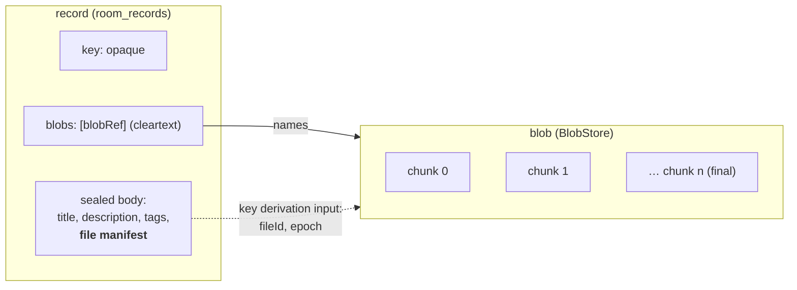

# Data rooms — files, blob stores, and working with a room from a VTC

Status: **proposal.** Nothing here is built. It extends
[`data-rooms.md`](data-rooms.md) (the design) and
[`../02-vta/data-rooms.md`](../02-vta/data-rooms.md) (the operator guide), and
assumes the member portal on `feat/vtc-member-portal`.

Two things are missing before a community can use a room as a real working
space:

1. **Files.** A room holds records: text bodies, sealed as one blob, at most one
   64 KiB Trust Task document on a VTC. A deal room, a board pack or a case file
   is mostly PDFs, spreadsheets and images. Nothing in the `rooms/*` family can
   carry them, and §6.1's "bodies are human-readable text" is the right rule
   for records and the wrong place to put a 40 MB deck.
2. **A way in.** A VTC hosts rooms, and its administrators can see a table of
   them (`plugins/rooms.tsx`). A member cannot use a room from the community's
   site at all, and the room's owner cannot run it from anywhere but Rust. The
   operator guide's §2 ("What works today") is a list of tasks with no surface.

This note settles both. It keeps every invariant the rooms design already holds.
The host never reads content, authorization is the room's chain and never the
VTC's ACL, and a room can move hosts without reissuing anything.

---

## 1. Decisions already taken

Settled with the product owner on 2026-10-10. Not to be re-litigated here.

| | Decision |
|---|---|
| **Where blobs live** | **Pluggable.** Three backends: a **local directory** of plain files, **S3-compatible** object storage, and **[Walrus](https://github.com/MystenLabs/walrus)**. |
| **How big a file can be** | **Configured per room by the hosting VTC.** It is not a protocol constant. |
| **Who holds the room keys when a member uses the portal** | **The member's VTA.** The VTA keeps the MLS group, as it does today. For a file, it releases **that file's key only**, through the wallet extension. The browser encrypts and decrypts the bytes. File bytes never pass through the VTA, and the group's storage key never reaches the browser. |

---

## 2. What a file is

**A file is a record plus a blob.** The record is an ordinary `rooms/records`
entry: versioned, curated, listed and sealed exactly as today. The blob is the
file's ciphertext, stored outside the record, and the record points at it.



### 2.1 The file manifest (inside the sealed body)

Everything that describes the file is sealed with the record, so the host learns
nothing it does not already learn from the blob's size.

```jsonc
// inside the sealed record body, alongside title / description / tags
"file": {
  "fileId":     "<32 random bytes, b64url>",    // minted by the uploader
  "name":       "Northwind — term sheet v3.pdf",
  "mediaType":  "application/pdf",
  "size":       4718592,                         // plaintext bytes
  "digest":     "<DigestMultibase of the plaintext>",
  "epoch":      7,                               // epoch the file key derives from
  "chunkSize":  262144,                          // plaintext bytes per chunk
  "blobRef":    "<DigestMultibase of the ciphertext manifest>"
}
```

A record may carry one file. A record with several attachments is a later
extension; the `blobs` member below is an array so that extension does not
reshape the wire.

### 2.2 The blob reference (cleartext, on the record)

The host has to know which blobs a record keeps alive. Otherwise it cannot
collect orphans or enforce a quota, and it cannot refuse a record pointing at a
blob that was never uploaded. So the record gains one cleartext member:

```jsonc
"blobs": [ "<blobRef>" ]
```

On a sealed tier that discloses **that** a record carries a file, and the blob
discloses its size. The design already accepts both (§4 of the guide: the
`attributed` tier hides content, not existence or timing). §8 offers padding for
rooms that want sizes blurred.

`blobRef` is the digest of the **ciphertext manifest** (§3.2). It is content
addressing over ciphertext, so it says nothing about the plaintext, and two
uploads of one file get different refs (different `fileId`, different key).
Rooms cannot be correlated by shared files.

---

## 3. Encryption

### 3.1 The file key

```
storage_key(E)  = MLS-Exporter("openvtc/room/storage/v1", "", 32)    // exists today, per epoch E
file_key        = HKDF-SHA256(ikm  = storage_key(E),
                              salt = fileId,
                              info = "openvtc/room/file/v1" || roomId || u64be(E))
```

- **Derived per file, never stored.** The VTA re-derives the key on demand, for
  the current epoch when sealing and through the epoch-link chain for an older
  `E` when opening. That is the same chain `rooms/keys/open` already walks.
- **Bound to the room and the epoch** in `info`. A key released for one room
  cannot open a blob relocated from another.
- **Releasing it costs one file.** A browser that leaks a `file_key` exposes that
  file and nothing else. It cannot derive a sibling, because `storage_key` never
  leaves the VTA.

### 3.2 Chunking: the STREAM construction

The plaintext is cut into `chunkSize` pieces, and each is sealed independently
with ChaCha20-Poly1305, the AEAD records already use:

```
nonce_i = u32be(0) || u64be(i)                       // unique per (file_key, i); file_key is single-use
aad_i   = "openvtc/room/file/v1" || roomId || fileId || u64be(E) || u64be(i) || u8(final)
ct_i    = AEAD(file_key, nonce_i, aad_i, chunk_i)
```

The `final` flag sits in the associated data of the last chunk only. So a host
that **truncates** a blob, **reorders** chunks or **splices** two uploads
produces an authentication failure, never a shorter or rearranged file. This is
the online-AE STREAM construction (Hoang–Reyhanitabar–Rogaway–Vizár), the same
shape age and Tink's streaming AEAD use. Because the nonces are counters, two
blobs must never share a `file_key`; the fresh `fileId` guarantees that.

The **ciphertext manifest** lists each chunk's digest and the whole ciphertext's
digest:

```jsonc
{ "chunkSize": 262160, "chunkCount": 18, "size": 4718880,
  "chunkDigests": ["…", "…"], "digest": "…" }
```

`blobRef = digest(manifest)`. This is exactly `vti_common::backup_transfer`'s
chunked manifest, committed up front, so upload integrity, resume and idempotent
chunk writes come from code that already exists (§5.1).

### 3.3 Where the code lives

`vti-rooms` gains a `files` module beside `sealed`: the KDF, `FileSealer` /
`FileOpener` as streaming iterators, and the manifest. It is compiled into
`vti-rooms-wasm` so the browser runs the same code as the VTA, the CLI and the
host's conformance tests. That matters for a second reason: browser WebCrypto
has no ChaCha20-Poly1305, and a hand-rolled JS AEAD is not a thing to own.

---

## 4. Custody: the VTA releases a file key

One new Trust Task on the member's VTA:

| Task | Payload | Returns | Gate |
|---|---|---|---|
| `rooms/keys/file-key/0.1` | `{ roomId, fileId, purpose: "seal" \| "open", epoch? }` | `{ key, epoch }` | `RoomOpen` capability, as `seal` / `open` |

- **`purpose: "seal"`** derives under the **current** epoch and returns it. The
  uploader writes that epoch into the manifest.
- **`purpose: "open"`** takes the manifest's `epoch` and derives through the
  chain. If the chain does not reach that far, it is refused with the same two
  messages `rooms/keys/open` uses ("a commit has not been delivered" /
  "the chain reaches back only to N").
- **Audited** with `roomId`, `fileId`, purpose and epoch, never the key. That gives
  a member a record of which files their agents and pages opened.
- **Retry class**: `Idempotent`. The derivation is a pure function, and the census
  in `vta_sdk::retry_safety` must list it.

### 4.1 Through the wallet, to a page

Today the extension refuses every `rooms/*` task requested by a web page
(`page-task-policy.ts`), which is correct for an arbitrary page. The member
portal is not arbitrary: it is the relying party the member signed in to, and
the room is hosted by that same VTC. The change is:

- **A narrow allow-list for pages.** `rooms/keys/{list,browse,read,seal,open,file-key,present}`
  are allowed **only** for the origin of the VTC that hosts the room, read from
  the room's service endpoint as resolved by the VTA, never from the page.
- **Consent per room per origin**, asked once: *"members.northwind.example wants
  to read and add files in **Northwind deal room**."* The grant is remembered, can
  be revoked in the extension's manager, and expires with the member's room
  credentials.
- **`file-key` is the only task that puts key material in a page.** Its consent
  text says so. A member who would rather not let it can still use the room from
  the extension's own manager panes, which get the same feature (§7.3).

---

## 5. The host

### 5.1 Upload and download as Trust Tasks

The **control plane and the data plane are both Trust Tasks.** Then any binding
carries them (HTTPS, TSP, DIDComm), and nothing joins `REST_EXCEPTIONS`. The
precedent is the VTC's own website upload, `vtc/website/upload/*`, which already
moves a site in chunked Trust Tasks over `vti_common::backup_transfer`.

| Task | Needs | Does |
|---|---|---|
| `rooms/blobs/upload/begin/0.1` | `write` chain | Takes the ciphertext manifest. Checks it against the room's limits (§6) and opens an upload bundle owned by the presenter. Returns `{ uploadId, missing }` |
| `rooms/blobs/upload/chunk/0.1` | the open bundle | `{ uploadId, index, bytes }`. Idempotent; checked against the manifest digest |
| `rooms/blobs/upload/commit/0.1` | the open bundle | Verifies the whole digest, hands the blob to the `BlobStore` and returns `{ blobRef }` |
| `rooms/blobs/upload/abort/0.1` | the open bundle | Discards it |
| `rooms/blobs/get/0.1` | `read` chain | `{ roomId, blobRef }` → the manifest and a short-lived `downloadId` |
| `rooms/blobs/chunk/0.1` | the `downloadId` | `{ downloadId, index }` → `{ bytes }` |

- **Resume** is `begin` with the same manifest. The host answers with the
  `missing` indices, as `backup_transfer` already does.
- **A record that names a blob** (`blobs: [blobRef]` on `rooms/records/put`) is
  refused unless that blob is committed **in this room**. A record can never
  point at nothing, or at another room's file.
- **Chunk documents are large.** A 256 KiB chunk is about 350 KiB once encoded,
  over the 64 KiB default. The chunk specs declare `maxDocumentBytes`, as
  `vtc/website/upload/chunk` does (360 448). That raised limit is granted today
  only to a signer with a live ACL entry (`check_for_known_issuer`), and room
  members have none. So `size.rs` gains a second gate: the claimed issuer **owns
  an open upload or download bundle**. A bundle exists only after a verified chain
  opened it, so the gate admits nobody a verified chain did not, and it charges
  the same `LargeDocumentBudget`.
- **The ceiling** is `backup_transfer`'s: chunks of 16–256 KiB, at most 4096 of
  them, so 1 GiB per blob. A room's limit (§6) may be lower, never higher.

### 5.2 Optional direct-to-store transfer

For S3, a later phase can let `begin` and `get` return **presigned URLs** in
place of chunk tasks, so bulk bytes skip the VTC. The authorization is
unchanged: the signed task is what mints the URL. The manifest digests let the
client verify what it fetched without trusting the bucket. Same for Walrus reads
(§5.4). Not in the first cut. It is an optimisation, and it puts a second origin
in the browser's path.

### 5.3 The `BlobStore` trait

```rust
#[async_trait]
pub trait BlobStore: Send + Sync {
    /// Store a committed, digest-verified blob. Idempotent on `blob_ref`.
    async fn put(&self, blob_ref: &BlobRef, staged: StagedBlob) -> Result<BackendRef>;
    async fn get_chunk(&self, at: &BackendRef, index: u32, manifest: &Manifest) -> Result<Bytes>;
    async fn delete(&self, at: &BackendRef) -> Result<Deletion>;   // Deleted | Lapses { at } | Unsupported
    async fn health(&self) -> Health;
}
```

`vti-common` holds it, node-neutral like `backup_transfer`, so `room-host` and
`vtc-service` share one implementation and one conformance suite.

| Backend | Built on | Notes |
|---|---|---|
| **Local directory** | `object_store`'s `LocalFileSystem` | Plain files, `<root>/<aa>/<bb>/<blobRef>`, created owner-only. The default. **Not** in the VTC backup (§5.6) |
| **S3-compatible** | `object_store`'s `AmazonS3` | AWS, R2, MinIO, B2. Server-side encryption on top is harmless and optional; the bytes are already ciphertext. Credentials come through the existing `vti-secrets` backends |
| **Walrus** | HTTP to a **publisher** (write) and an **aggregator** (read) | §5.4 |

Use the [`object_store`](https://crates.io/crates/object_store) crate for the
first two, not `aws-sdk-s3`. It is one crate for local, S3, GCS and Azure, so the
next two backends cost configuration rather than code. It is also the crate the
Arrow ecosystem maintains. Check it against `cargo-deny` before adopting it.

### 5.4 Walrus

Walrus fits better than it first looks, but three of its properties change what
a room can promise, and those changes have to be written down where an operator
choosing it will read them:

- **Everything on Walrus is public and discoverable.** Anyone holding a
  `blobId` can fetch the ciphertext, now or later. The room's *read chain* stops
  gating fetches: possession of the file key is the whole protection. That is
  sound, since the key derives from a storage key no host or reader outside the
  room holds. But a removed member who kept a file's key can still open that file
  from Walrus, where on the other backends they would also need the host to serve
  them the bytes.
- **Deletion is not erasure.** A blob stored `deletable=true` (always, here) can
  be deleted by the owner of its Sui object. That frees the storage, but the data
  stays recoverable while any other copy exists, and stored ciphertext is assumed
  to be kept by someone. The only real deletion on Walrus is **cryptographic**:
  prune the epoch chain (`prune_epoch_links_before`) so nobody can derive the key.
  Retraction on a Walrus-backed room is therefore "unreadable to members", never
  "gone".
- **Storage is bought in epochs** (two weeks on mainnet) and lapses unless
  extended. The VTC's blob sweeper (§5.6) extends every live blob before its
  `endEpoch`, maps room retention to epochs, and simply stops extending a blob
  that has become an orphan. A lapse is the Walrus form of deletion.

Operationally: **mainnet has no public publisher.** A VTC choosing Walrus runs
its own (or an upload relay) with a Sui wallet that pays for storage. The
`BlobStore` config names the publisher URL, its auth, the aggregator URL and the
epochs to buy. Reads go through the aggregator; a CDN in front can briefly cache
a 404 for a just-certified blob, so `get_chunk` retries with backoff. The
backend keeps `(blobId, suiObjectId, endEpoch)` as its `BackendRef`. Walrus's
13.3 GiB per-blob ceiling is far above ours. Walrus is reached over plain HTTPS,
so it is an external store, not a party to the room, and nothing about it
touches the transport preference order (TSP > DIDComm > REST).

### 5.5 What the host stores

A new keyspace, `room_blobs`:

```
room_blobs:<roomId>:<blobRef>  →  { size, manifest, backend, backendRef,
                                     state: committed | orphaned | deleting | gone,
                                     refs, uploadedBy, createdAt, orphanedAt? }
```

- `refs` counts the records that name the blob. It is incremented on put,
  decremented on a rewrite that drops the blob or on a `retracted` curation, and
  when it reaches zero the blob becomes `orphaned`.
- `uploadedBy` exists on `attributed` because the host already learns which member
  acted. It does not exist on `private`, where the host cannot learn it.

### 5.6 Lifecycle, GC and backup

- **A blob sweeper** (`vta-sweepers` style, on the VTC's storage thread) moves
  `orphaned` blobs past a grace window (default 7 days, so an undo is possible) to
  `deleting`, calls `BlobStore::delete` and records `gone`. Uploads abandoned
  before commit are `backup_transfer`'s problem and expire with their bundle.
- **Room lifecycle**: a room reaching `Reclaimable` (the lifecycle clock in
  guide §10.1) orphans all its blobs at once.
- **Backup**: `room_blobs` (the index) joins `BACKED_UP`. **The bytes do not.** A
  VTC backup would otherwise grow with every upload. Each backend gets an explicit
  answer in `docs/03-vtc/backup-restore.md`:
  - **local directory**: back the directory up beside the VTC backup;
  - **S3**: the bucket's own versioning or replication;
  - **Walrus**: replicated by design.

  A restore whose index names blobs the store does not have reports them as
  `missing`, never silently.

---

## 6. Per-room limits, set by the VTC

The host decides how much it is willing to store. That is a hosting decision
like any other, and nothing a room's credentials can widen.

| Limit | Meaning |
|---|---|
| `maxFileBytes` | Largest single blob (ciphertext) |
| `maxRoomBytes` | Total committed blob bytes the room may hold |
| `maxFiles` | Count of committed blobs |
| `filesEnabled` | `false` refuses `rooms/blobs/*` for the room outright |

**Where the numbers come from**, in order:

1. **The `rooms` policy returns them at creation.** `data.vtc.rooms.decision`
   gains a `limits` object, so a community writes "members' rooms get 2 GiB,
   rooms owned by the board get 20 GiB, `open` rooms get no files" as policy,
   next to who may create a room at all. The shipped default returns
   `{ filesEnabled: true, maxFileBytes: 100 MiB, maxRoomBytes: 5 GiB, maxFiles: 10 000 }`.
2. **An administrator can override one room** with `vtc/rooms/limits/set/0.1`,
   audited with a reason. It is gated on a **new capability, `vtc.rooms.admin`**.
   Today the only rooms task on the console, `vtc/rooms/list`, is gated on plain
   `Admin`, and a capability is what lets a community hand room hosting to someone
   who is not a full administrator (`docs/05-design-notes/vtc-admin-roles.md`).
   `vtc/rooms/list` and `vtc/rooms/get` move to it too. Lowering a limit below
   current use refuses new uploads and deletes nothing.
3. **A host-wide ceiling** in config (`[rooms.blobs] max_file_bytes`), capped by
   §5.1's 1 GiB, bounds both.

**Members see the limits.** The room's own record (`Room`) carries `limits` and
`usage { bytes, files }`, returned on a new `rooms/info/0.1` (a `read` chain).
The portal then shows "1.2 GB of 5 GB" before anyone drags a file in, and a file
over the limit is refused **before** it is encrypted and uploaded, not after.

---

## 7. The experience

Two surfaces, kept apart the way the console and the portal already are:
**the console administers hosting, and the portal is where people use rooms.**
An administrator who is also a room member uses the portal for content, like
everyone else. The VTC's console never holds a room key and never shows a record
body.

### 7.1 Admin console: the Data rooms plugin

Extends `plugins/rooms.tsx`. Everything here is about **hosting**. None of it
needs, or could use, room credentials.

- **Rooms table** (exists): add a **storage** column, "1.2 / 5 GB · 312 files",
  and a filter for rooms near their limit.
- **Room detail** (new, `/rooms/:roomId`):
  - **Identity**: room DID, owner DID, tier, created.
  - **Lifecycle**: epoch and expiry, lifecycle state, retention.
  - **Storage**: bytes and files against limits, the largest blobs by size (sizes
    only), orphans awaiting GC.
  - **Activity**: counts per day of puts, reads and uploads. On `attributed`,
    *which member* acted is visible here, because the host knows it. The page
    says so in words, since that is the tier's actual privacy property.
  - **Limits editor**: `vtc/rooms/limits/set`, with a reason, as an audited admin
    act.
- **Settings ▸ Blob storage** (new):
  - **Backend status**: kind, health, bytes held, and on Walrus the wallet balance
    and the next extension due.
  - **Defaults and ceiling**: the default limits and the host-wide ceiling.
  - **Who may create rooms**: the "who may create" card that exists, now showing
    the limits the policy would return per tier.
- **Never**: record titles, file names, a member list, or a download button. The
  host does not have them, and the console must not imply that it does.

### 7.2 Member portal: Rooms

Builds on `/members` (`feat/vtc-member-portal`). Every room act goes through the
member's wallet extension (§4.1) to their VTA. The portal holds no room
credentials and no group key.

**My rooms.** Every room hosted by *this* VTC that the member holds credentials
for, found from the VTA (`rooms/keys/list`), never from a server-side roster,
which the host does not have. Each card shows tier, member since, last activity,
unread count and storage used.

**A room.** One page, three panes:

- **Browse.** Records and files together, newest first.
  - **Filters**: All, Files, Notes, Pinned, Mine, Retracted.
  - **Search**: client-side over titles, descriptions, tags and file names. The
    VTA's `rooms/keys/browse` opens them, and the portal keeps the index in memory
    only.
  - **Integrity**: listing is verified (`rooms/keys/browse` runs the count check
    and the commitment), and a host caught omitting records shows as a banner,
    not a silently shorter list, in the words R1.5 of
    `tasks/data-rooms-todo.md` calls for.
- **Open.**
  - **Notes** render as markdown.
  - **Files** show name, type, size, who added them and when, with **Download**.
    Download decrypts in the browser, streaming to disk where the File System
    Access API exists and falling back to an in-memory `Blob`.
  - **Previews**: images and PDFs render in a sandboxed frame from the decrypted
    bytes. Nothing is ever sent anywhere for a preview.
  - **History**: versions, curation state and the epoch.
- **Add.**
  - **Drop a file, or write a note.** A file shows its size against the room's
    limit before anything happens.
  - **Upload**: encrypt with progress, resumable after a closed tab (§5.1's
    `begin` + `missing`), then the record put.
  - **Over the limit**: the upload is refused up front, with the limit named.
  - **Notes**: written in markdown, sealed with `rooms/keys/seal`.

**Curate**, for members whose chain grants `curate`: pin, deprecate, retract.
The portal says what retracting a file means **on this room's backend** (§5.4):
"removed for everyone" on local and S3, "unreadable to members, the encrypted
copy may persist" on Walrus.

**Run a room**, for the room's owner. Only the room's owner sees this, which is a
different thing from being an administrator of the VTC.

- **Create a room.** One guided flow:
  - mint the room's DID in the member's VTA (`room` template);
  - register it on this VTC, which policy decides;
  - form the group;
  - issue the owner's own credentials.
- **Invite.** The invitation, then the key package, then the welcome, then the
  epoch and the credentials. That is guide §6, driven end to end.
- **Remove a member.** The commit, then the new epoch, then delivery to everyone
  else.
- **Renew, transfer ownership, nominate a successor.**

### 7.3 The extension's own manager

The plugin's manager panes (`manager/panes/rooms*.tsx`) get the same file
browse, download and upload. A member then has a way to use a room that never
puts a file key in a web page. It costs little once §3.3's wasm is shared.

---

## 8. What each party learns

| Party | Learns | Never learns |
|---|---|---|
| **Host (VTC)** | that a record has a file; blob sizes, counts and upload times; on `attributed`, which member uploaded or downloaded | file names, types, contents, plaintext digests |
| **Blob store** (local / S3) | ciphertext sizes and access times | anything room-shaped; it never sees a room ID, only `blobRef` paths |
| **Walrus** | the same, **publicly and permanently** | the same |
| **Member's VTA** | which files the member's pages and agents opened (it audits `file-key`) | file contents; bytes never pass through it |
| **The portal page** | one `file_key` per file it handles | the room's storage key, other files' keys, the member's credentials |
| **A removed member** | nothing new after removal, because later epochs derive keys they cannot. Files they could already open they may have kept, as with records | — |

Two mitigations are optional per room and off by default:

- **Size padding**: pad each blob to the next [Padmé](https://lbarman.ch/blog/padme/)
  bucket (≤ 12 % overhead) so exact sizes do not fingerprint known documents.
- **Upload-time jitter** does not belong here. Timing is visible to the host for
  records too, and the `private` tier is where that gets addressed.

**What cannot exist:** server-side virus scanning, content search, thumbnails and
deduplication. The host cannot read a file, by design. Scanning, if a community
wants it, belongs in the member's client after decryption.

---

## 9. Specifications to land first

Everything below is a Trust Task specification change and lands in
`dtgwg-trust-tasks-tf` first, reaching this workspace through a `trust-tasks-rs`
bump, per the workspace rule.

| Spec | Change |
|---|---|
| `rooms/records/put/0.1` → **0.2** | `blobs: [blobRef]`. A new version, not an edit: a 0.1 host would accept a record pointing at a blob it never checked |
| `rooms/_shared/room.schema.json` | `limits`, `usage` |
| `rooms/info/0.1` | new: the room, with limits and usage, for a `read` chain |
| `rooms/blobs/upload/{begin,chunk,commit,abort}/0.1` | new; `chunk` declares `maxDocumentBytes.request` |
| `rooms/blobs/{get,chunk}/0.1` | new; `chunk` declares `maxDocumentBytes.response` |
| `rooms/keys/file-key/0.1` | new |
| `vtc/rooms/limits/set/0.1`, `vtc/rooms/get/0.1` | new, VTC-only (admin detail) |
| the sealed body's `file` member | documented in the rooms spec's sealed-body section; it is client-to-client, so the host's schemas never see it |

`vti-rooms`'s hand-written wire types follow with conformance tests, as the
existing ones do.

---

## 10. Prerequisites

Two gaps from guide §2 block the owner half of §7.2 and are worth closing first
on their own merit:

- **The owner's MLS half as VTA tasks.** `RoomGroup::{create, add_member,
  remove_member}` are library-only, so admitting someone to a sealed room is Rust.
  New tasks `rooms/owner/group/{create,add,remove}/0.1` on the owner's VTA make
  it a task like every member step.
- **`pnm rooms owner …`** over those tasks plus `rooms/owner/{invite,issue-*}`,
  and `pnm rooms put` sealing through `rooms/keys/seal`. An owner then has a
  CLI, the portal has tasks to drive, and the two exercise the same path.

---

## 11. Phases

| # | Phase | Size | Depends on |
|---|---|---|---|
| P0 | Owner MLS tasks + `pnm rooms owner …` + sealed `put` (§10) | L | — |
| P1 | Specs (§9) | M | — |
| P2 | `vti-rooms::files`: KDF, STREAM, manifest; wasm build; test vectors | M | P1 |
| P3 | `BlobStore` trait in `vti-common`; local + S3 via `object_store`; conformance suite | M | — |
| P4 | Host: `room_blobs`, upload/download tasks, `size.rs` bundle gate, limits, GC sweeper. In **both** `vtc-service` and `room-host` | L | P1, P3 |
| P5 | VTA `rooms/keys/file-key`; `pnm rooms file {put,get}` | M | P2 |
| P6 | Extension: page allow-list + per-room consent (§4.1); manager-pane files (§7.3) | M | P5 |
| P7 | Member portal Rooms (§7.2), members first, owners after P0 | XL | P4, P6, member portal merged |
| P8 | Console: room detail, storage, limits, blob settings (§7.1) | M | P4 |
| P9 | Walrus backend, with epoch extension in the sweeper | M | P3, P4 |
| P10 | Direct-to-store presigned transfer (§5.2), if measurements ask for it | M | P4 |

P2, P3 and P0 run in parallel. A member can upload and download a file from the
CLI after P5, and from the portal after P7.

---

## 12. Open

1. **Walrus payment and custody.** Whose Sui wallet pays, how it is funded, and
   whether its key belongs in `vti-secrets`. An operator decision with a default
   to propose; it blocks P9 and nothing earlier.
2. **Several files per record.** The wire allows it (`blobs` is an array). The
   sealed `file` member would become `files`. Decide from use.
3. **Large-file streaming in the browser.** File System Access is Chromium-only.
   Firefox and Safari fall back to an in-memory `Blob`, which bounds a download by
   memory. A Service-Worker stream is the usual answer; worth it only if rooms
   routinely hold files over a few hundred MB.
4. **`private` tier.** Nothing here is `private`-specific. Its upload attribution
   question is the same unsettled ZK binding as everything else on that tier.
5. **Re-encrypting on removal.** Not proposed. Files sealed before a removal stay
   readable to whoever held their key then, exactly as records do. A room that
   needs more re-uploads under the new epoch, which is a client feature
   ("re-seal everything") rather than a protocol one.
