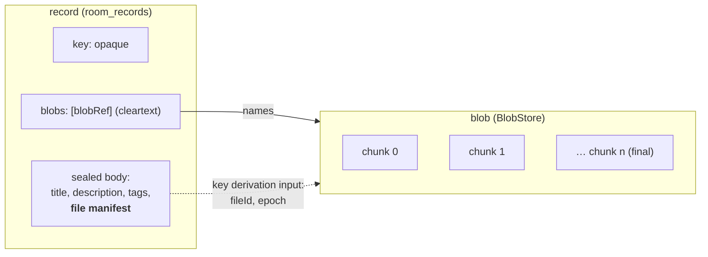

# Data rooms — files, blob stores, and working with a room from a VTC

Status: **proposal.** Nothing here is built. It extends
[`data-rooms.md`](data-rooms.md) (the design) and
[`../02-vta/data-rooms.md`](../02-vta/data-rooms.md) (the operator guide), and
assumes the member portal on `feat/vtc-member-portal`.

Two things are missing before a community can use a room as a real working
space:

1. **Files.** A room holds records: text bodies, sealed as one blob, at most one
   64 KiB Trust Task document on a VTC. A deal room, a board pack or a case file
   is mostly PDFs, spreadsheets and images. Nothing in the `rooms/*` family can
   carry them, and §6.1's "bodies are human-readable text" is the right rule
   for records and the wrong place to put a 40 MB deck.
2. **A way in.** A VTC hosts rooms, and its administrators can see a table of
   them (`plugins/rooms.tsx`). A member cannot use a room from the community's
   site at all, and the room's owner cannot run it from anywhere but Rust. The
   operator guide's §2 ("What works today") is a list of tasks with no surface.

This note settles both. It keeps every invariant the rooms design already holds.
The host never reads content, authorization is the room's chain and never the
VTC's ACL, and a room can move hosts without reissuing anything.

---

## 1. Decisions already taken

Settled with the product owner on 2026-10-10. Not to be re-litigated here.

| | Decision |
|---|---|
| **Where blobs live** | **Pluggable.** Four backends: a **local directory** of plain files, **S3-compatible** object storage, **Google Cloud Storage**, and **[Walrus](https://github.com/MystenLabs/walrus)**. A VTC may run anywhere, not only inside the cloud it stores to. |
| **How storage is organised** | **Named storage configs, as many as the VTC wants.** Each is one backend with its own account and credentials. **Every room is assigned to one config, and one config serves any number of rooms.** Some rooms can sit on one AWS account, others on a second, others on Walrus. |
| **How much a room can hold** | **Limits set by the hosting VTC, at three scopes:** the room, each member in the room, and each object. Each scope measures **file count, file size and total size.** None of it is a protocol constant. **Usage is reported** at every scope. |
| **Storage credentials** | **Usable by the VTC, unrecoverable by its administrators.** An S3 secret key or a Walrus wallet key can be set and replaced through the console, never read back, never exported and never in a backup. A community has several administrators, and none of them can take the keys home. Resolved by keeping **no long-lived credential on the VTC at all**: storage authority is an **external account in the community's VTA** ([`vta-external-accounts.md`](vta-external-accounts.md)), which issues the VTC short-lived credentials scoped to one room. Accounts are managed over Trust Tasks, so from the VTC console, and every change is consented by approvers signing with their own DIDs. |
| **Who holds the room keys when a member uses the portal** | **The member's VTA.** The VTA keeps the MLS group, as it does today. For a file, it releases **that file's key only**, to the member's wallet extension, which encrypts and decrypts in its own context (§4.1). File bytes never pass through the VTA, the group's storage key never reaches the browser, and no key reaches the web page. |

---

## 2. What a file is

**A file is a record plus a blob.** The record is an ordinary `rooms/records`
entry: versioned, curated, listed and sealed exactly as today. The blob is the
file's ciphertext, stored outside the record, and the record points at it.



### 2.1 The file manifest (inside the sealed body)

Everything that describes the file is sealed with the record, so the host learns
nothing it does not already learn from the blob's size.

```jsonc
// inside the sealed record body, alongside title / description / tags
"file": {
  "fileId":     "<32 random bytes, b64url>",    // minted by the uploader
  "name":       "Northwind — term sheet v3.pdf",
  "mediaType":  "application/pdf",
  "size":       4718592,                         // plaintext bytes
  "digest":     "<DigestMultibase of the plaintext>",
  "epoch":      7,                               // epoch the file key derives from
  "segmentSize": 262128,                         // plaintext bytes per segment
  "blobRef":    "<DigestMultibase of the ciphertext manifest>"
}
```

**The manifest is inside the author's signature.** The design already puts an
in-body signature by the writer's DID over the sealed plaintext (design note
§6). Because the manifest, including the plaintext `digest`, is part of that
plaintext, a reader who decrypts a file and checks its digest knows **which
member** put **exactly these bytes** there. A host cannot substitute one file
for another, and no other member can either. Clients verify the digest after
decryption and refuse a mismatch, rather than showing a file "with a warning".

A record may carry one file. A record with several attachments is a later
extension; the `blobs` member below is an array so that extension does not
reshape the wire.

### 2.2 The blob reference (cleartext, on the record)

The host has to know which blobs a record keeps alive. Otherwise it cannot
collect orphans or enforce a quota, and it cannot refuse a record pointing at a
blob that was never uploaded. So the record gains one cleartext member:

```jsonc
"blobs": [ "<blobRef>" ]
```

On a sealed tier that discloses **that** a record carries a file, and the blob
discloses its size. The design already accepts both (§4 of the guide: the
`attributed` tier hides content, not existence or timing). §9 offers padding for
rooms that want sizes blurred.

`blobRef` is the digest of the **ciphertext manifest** (§3.2). It is content
addressing over ciphertext, so it says nothing about the plaintext, and two
uploads of one file get different refs (different `fileId`, different key).
Rooms cannot be correlated by shared files.

---

## 3. Encryption

### 3.1 The file key

```
storage_key(E)  = MLS-Exporter("openvtc/room/storage/v1", "", 32)    // exists today, per epoch E
file_key        = HKDF-SHA256(ikm  = storage_key(E),
                              salt = fileId,
                              info = "openvtc/room/file/v1" || roomId || u64be(E))
```

- **Derived per file, never stored.** The VTA re-derives the key on demand, for
  the current epoch when sealing and through the epoch-link chain for an older
  `E` when opening. That is the same chain `rooms/keys/open` already walks.
- **Bound to the room and the epoch** in `info`. A key released for one room
  cannot open a blob relocated from another.
- **Releasing it costs one file.** An extension that leaks a `file_key` exposes that
  file and nothing else. It cannot derive a sibling, because `storage_key` never
  leaves the VTA.

### 3.2 Chunking: the STREAM construction

The plaintext is cut into `segmentSize` pieces, and each is sealed independently
with ChaCha20-Poly1305, the AEAD records already use:

```
nonce_i = u32be(0) || u64be(i)                       // unique per (file_key, i); file_key is single-use
aad_i   = "openvtc/room/file/v1" || roomId || fileId || u64be(E) || u64be(i) || u8(final)
ct_i    = AEAD(file_key, nonce_i, aad_i, chunk_i)
```

The `final` flag sits in the associated data of the last chunk only. So a host
that **truncates** a blob, **reorders** chunks or **splices** two uploads
produces an authentication failure, never a shorter or rearranged file. This is
the online-AE STREAM construction (Hoang–Reyhanitabar–Rogaway–Vizár), the same
shape age and Tink's streaming AEAD use. Because the nonces are counters, two
blobs must never share a `file_key`; the fresh `fileId` guarantees that.

The **ciphertext manifest** lists each chunk's digest and the whole ciphertext's
digest:

```jsonc
{ "size": 4718896,
  "chunks": { "chunkSize": 262144, "chunkCount": 19, "chunkDigests": ["…", "…"] },
  "digest": "…" }
```

One sealed segment is one transfer chunk, so `chunkSize` is `segmentSize` plus
the 16-byte tag. Transfer chunks top out at 262 144 bytes, so a plaintext segment
tops out at 262 128. The normative shapes are `FileManifest` and `BlobManifest`
in `rooms/_shared/0.1/blobs.schema.json` (trust-tasks-tf).

`blobRef = digest(manifest)`. This is exactly `vti_common::backup_transfer`'s
chunked manifest, committed up front, so upload integrity, resume and idempotent
chunk writes come from code that already exists (§5.1).

### 3.3 Where the code lives

`vti-rooms` gains a `files` module beside `sealed`: the KDF, `FileSealer` /
`FileOpener` as streaming iterators, and the manifest. It is compiled into
`vti-rooms-wasm` so the browser runs the same code as the VTA, the CLI and the
host's conformance tests. That matters for a second reason: browser WebCrypto
has no ChaCha20-Poly1305, and a hand-rolled JS AEAD is not a thing to own.

---

## 4. Custody: the VTA releases a file key

One new Trust Task on the member's VTA:

| Task | Payload | Returns | Gate |
|---|---|---|---|
| `rooms/keys/file-key/0.1` | `{ roomId, fileId, purpose: "seal" \| "open", epoch? }` | `{ key, epoch }` | `RoomOpen` capability, as `seal` / `open` |

- **`purpose: "seal"`** derives under the **current** epoch and returns it. The
  uploader writes that epoch into the manifest.
- **`purpose: "open"`** takes the manifest's `epoch` and derives through the
  chain. If the chain does not reach that far, it is refused with the same two
  messages `rooms/keys/open` uses ("a commit has not been delivered" /
  "the chain reaches back only to N").
- **Audited** with `roomId`, `fileId`, purpose and epoch, never the key. That gives
  a member a record of which files their agents and pages opened.
- **Retry class**: `Idempotent`. The derivation is a pure function, and the census
  in `vta_sdk::retry_safety` must list it.

### 4.1 Through the wallet extension; the key stays out of the page

Today the extension refuses every `rooms/*` task requested by a web page
(`page-task-policy.ts`), which is correct for an arbitrary page. The member
portal is not arbitrary: it is the relying party the member signed in to, and
the room is hosted by that same VTC. The change is:

- **A narrow allow-list for pages.** `rooms/keys/{list,browse,read,seal,open,present}`
  are allowed **only** for the origin of the VTC that hosts the room, read from
  the room's service endpoint as resolved by the VTA, never from the page.
- **Consent per room per origin**, asked once: *"members.northwind.example wants
  to read and add files in **Northwind deal room**."* The grant is remembered, can
  be revoked in the extension's manager, and expires with the member's room
  credentials.
- **`file-key` is not on the list.** The extension requests it from the VTA
  itself and does the file encryption and decryption **in its own context** (its
  offscreen document or service worker, running `vti-rooms-wasm`). It streams
  plaintext to and from the page over a message port. The page gets the bytes
  the member is viewing or uploading, which it must have anyway, and **never a
  key**.

This is stricter than "the browser holds the file key", and deliberately so.

- **A file key never expires.** A key leaked from a page, by an XSS on the
  portal, a malicious dependency or a hostile browser extension reading the
  page's memory, opens that file's ciphertext **forever**.
- **On Walrus that ciphertext is public forever** (§5.4). So one page compromise
  would become a permanent disclosure.
- **With the key held in the extension**, the same compromise discloses what the
  member viewed while it lasted, and nothing after.

---

## 5. The host

### 5.1 Upload and download as Trust Tasks

The **control plane and the data plane are both Trust Tasks.** Then any binding
carries them (HTTPS, TSP, DIDComm), and nothing joins `REST_EXCEPTIONS`. The
precedent is the VTC's own website upload, `vtc/website/upload/*`, which already
moves a site in chunked Trust Tasks over `vti_common::backup_transfer`.

| Task | Needs | Does |
|---|---|---|
| `rooms/blobs/upload/begin/0.1` | `write` chain | Takes the ciphertext manifest. Checks it against every applicable limit (§6.1) and reserves against them. Opens an upload bundle owned by the presenter. Returns `{ uploadId, missing }` |
| `rooms/blobs/upload/chunk/0.1` | the open bundle | `{ uploadId, index, bytes }`. Idempotent; checked against the manifest digest |
| `rooms/blobs/upload/commit/0.1` | the open bundle | Verifies the whole digest, hands the blob to the `BlobStore` and returns `{ blobRef }` |
| `rooms/blobs/upload/abort/0.1` | the open bundle | Discards it |
| `rooms/blobs/get/0.1` | `read` chain | `{ roomId, blobRef }` → the manifest and a short-lived `downloadId` |
| `rooms/blobs/chunk/0.1` | the `downloadId` | `{ downloadId, index }` → `{ bytes }` |

- **Resume** is `begin` with the same manifest. The host answers with the
  `missing` indices, as `backup_transfer` already does.
- **A record that names a blob** (`blobs: [blobRef]` on `rooms/records/put`) is
  refused unless that blob is committed **in this room**. A record can never
  point at nothing, or at another room's file.
- **Chunk documents are large.** A 256 KiB chunk is about 350 KiB once encoded,
  over the 64 KiB default. The chunk specs declare `maxDocumentBytes`, as
  `vtc/website/upload/chunk` does (360 448). That raised limit is granted today
  only to a signer with a live ACL entry (`check_for_known_issuer`), and room
  members have none. So `size.rs` gains a second gate: the claimed issuer **owns
  an open upload or download bundle**. A bundle exists only after a verified chain
  opened it, so the gate admits nobody a verified chain did not, and it charges
  the same `LargeDocumentBudget`.
- **The ceiling** is `backup_transfer`'s: chunks of 16–256 KiB, at most 4096 of
  them, so 1 GiB per blob. A room's limit (§6) may be lower, never higher.

### 5.2 Optional direct-to-store transfer

For S3, a later phase can let `begin` and `get` return **presigned URLs** in
place of chunk tasks, so bulk bytes skip the VTC. The authorization is
unchanged: the signed task is what mints the URL. The manifest digests let the
client verify what it fetched without trusting the bucket. Same for Walrus reads
(§5.4). Not in the first cut. It is an optimisation, and it puts a second origin
in the browser's path.

### 5.3 The `BlobStore` trait

```rust
#[async_trait]
pub trait BlobStore: Send + Sync {
    /// Store a committed, digest-verified blob. Idempotent on `blob_ref`.
    async fn put(&self, blob_ref: &BlobRef, staged: StagedBlob) -> Result<BackendRef>;
    async fn get_chunk(&self, at: &BackendRef, index: u32, manifest: &Manifest) -> Result<Bytes>;
    async fn delete(&self, at: &BackendRef) -> Result<Deletion>;   // Deleted | Lapses { at } | Unsupported
    async fn health(&self) -> Health;
}
```

`vti-common` holds it, node-neutral like `backup_transfer`, so `room-host` and
`vtc-service` share one implementation and one conformance suite. **One instance
per storage config** (§7). A VTC with four configs holds four, keyed by config
id, and every blob operation looks its store up by the blob's own `configId`.

| Backend | Built on | Notes |
|---|---|---|
| **Local directory** | `object_store`'s `LocalFileSystem` | Plain files, `<root>/<aa>/<bb>/<blobRef>`, created owner-only. The default. **Not** in the VTC backup (§5.6) |
| **S3-compatible** | `object_store`'s `AmazonS3` | AWS, R2, MinIO, B2. Server-side encryption on top is harmless and optional; the bytes are already ciphertext. Credentials come from a VTA external account (§7.4) |
| **Google Cloud Storage** | `object_store`'s `GoogleCloudStorage` | Native GCS, not GCS's S3-interoperability mode, which needs static HMAC keys. Credentials come from a VTA external account (§7.4) |
| **Walrus** | HTTP to a **publisher** (write) and an **aggregator** (read) | §5.4 |

Use the [`object_store`](https://crates.io/crates/object_store) crate for the
first three, not `aws-sdk-s3` and `google-cloud-storage`. It is one crate for
local, S3, GCS and Azure, so a later Azure backend costs configuration rather
than code. It takes a custom `CredentialProvider`, which is where §7.4's
VTA-issued credentials plug in. It is also the crate the
Arrow ecosystem maintains. Check it against `cargo-deny` before adopting it.

### 5.4 Walrus

Walrus fits better than it first looks, but three of its properties change what
a room can promise, and those changes have to be written down where an operator
choosing it will read them:

- **Everything on Walrus is public and discoverable.** Anyone holding a
  `blobId` can fetch the ciphertext, now or later. The room's *read chain* stops
  gating fetches: possession of the file key is the whole protection. That is
  sound, since the key derives from a storage key no host or reader outside the
  room holds. But a removed member who kept a file's key can still open that file
  from Walrus, where on the other backends they would also need the host to serve
  them the bytes.
- **Deletion is not erasure.** A blob stored `deletable=true` (always, here) can
  be deleted by the owner of its Sui object. That frees the storage, but the data
  stays recoverable while any other copy exists, and stored ciphertext is assumed
  to be kept by someone. The only real deletion on Walrus is **cryptographic**:
  prune the epoch chain (`prune_epoch_links_before`) so nobody can derive the key.
  Retraction on a Walrus-backed room is therefore "unreadable to members", never
  "gone".
- **Storage is bought in epochs** (two weeks on mainnet) and lapses unless
  extended. The VTC's blob sweeper (§5.6) extends every live blob before its
  `endEpoch`, maps room retention to epochs, and simply stops extending a blob
  that has become an orphan. A lapse is the Walrus form of deletion.

Operationally: **mainnet has no public publisher**, and a self-run publisher
holds a hot Sui wallet in its own config, the long-lived secret §7.4 exists to
avoid. So the VTC does not use a publisher. It writes through a Walrus **upload
relay**, which distributes the encoded slivers to storage nodes. The VTC builds
the Sui transactions that register, certify and extend each blob, and has the
**community's VTA sign them** (the `sui-signer` account model in
[`vta-external-accounts.md`](vta-external-accounts.md)). The VTA signs only
allow-listed Walrus calls, under gas and amount caps. The config names the
relay URL, the aggregator URL, the epochs to buy and the VTA account. Reads go through the aggregator; a CDN in front can briefly cache
a 404 for a just-certified blob, so `get_chunk` retries with backoff. The
backend keeps `(blobId, suiObjectId, endEpoch)` as its `BackendRef`. Walrus's
13.3 GiB per-blob ceiling is far above ours. Walrus is reached over plain HTTPS,
so it is an external store, not a party to the room, and nothing about it
touches the transport preference order (TSP > DIDComm > REST).

### 5.5 What the host stores

A new keyspace, `room_blobs`:

```
room_blobs:<roomId>:<blobRef>  →  { size, manifest, configId, backendRef,
                                     state: committed | orphaned | deleting | gone,
                                     refs, uploadedBy, createdAt, orphanedAt? }
```

- `refs` counts the records that name the blob. It is incremented on put,
  decremented on a rewrite that drops the blob or on a `retracted` curation, and
  when it reaches zero the blob becomes `orphaned`.
- `configId` is the storage config (§7) the blob was written to. It is what lets
  a room move to another config without stranding its existing files.
- `uploadedBy` exists on `attributed` because the host already learns which member
  acted. It does not exist on `private`, where the host cannot learn it.

### 5.6 Lifecycle, GC and backup

- **A blob sweeper** (`vta-sweepers` style, on the VTC's storage thread) moves
  `orphaned` blobs past a grace window (default 7 days, so an undo is possible) to
  `deleting`, calls `BlobStore::delete` and records `gone`. Uploads abandoned
  before commit are `backup_transfer`'s problem and expire with their bundle.
- **Room lifecycle**: a room reaching `Reclaimable` (the lifecycle clock in
  guide §10.1) orphans all its blobs at once.
- **Backup**: `room_blobs` (the index) joins `BACKED_UP`. **The bytes do not.** A
  VTC backup would otherwise grow with every upload. Storage configs (§7) are
  backed up; their credentials are not (§7.4). Each backend gets an explicit
  answer in `docs/03-vtc/backup-restore.md`:
  - **local directory**: back the directory up beside the VTC backup;
  - **S3**: the bucket's own versioning or replication;
  - **Walrus**: replicated by design.

  A restore whose index names blobs the store does not have reports them as
  `missing`, never silently.

---

## 6. Limits and usage

The host decides how much it is willing to store. That is a hosting decision
like any other, and nothing a room's credentials can widen.

### 6.1 Three scopes, three measures

| Scope | `maxFiles` | `maxFileBytes` | `maxBytes` |
|---|---|---|---|
| **Object**: one file | — | the largest single file | — |
| **Member**: one member, in one room | files they have added | largest file *they* may add (≤ the room's) | total they have added |
| **Room** | files in the room | largest file in the room | total in the room |
| **Storage config** (§7): capacity, not policy | — | — | total across every room on it |

Plus `filesEnabled: false`, which refuses `rooms/blobs/*` for a room outright.

- **An upload must fit every scope at once.** `begin` checks the object
  against `min(member.maxFileBytes, room.maxFileBytes, host ceiling)`. It checks
  the member's and the room's counts and totals *with this file added*, and the
  storage config's capacity. The refusal names **which** limit and its numbers
  (`memberBytes: 1.9 of 2 GiB`), so a member knows whether to delete their own
  files or ask the room's owner.
- **"Member" means the person, not the key that signed.** Usage is charged to
  the **subject at the root of the presented chain**. An agent writing on an
  attenuated chain spends its member's quota, and a member cannot multiply their
  allowance by minting agents. The VMC subject is the member, the same DID the
  `attributed` tier already discloses to the host.
- **On `private` rooms there are no per-member limits.** The host cannot tell
  members apart, by design. Object and room limits still hold. The console says
  so rather than showing an empty column.
- **Reservations, not after-the-fact checks.** `begin` reserves the bytes and
  the file against every scope. `commit` converts the reservation into usage, and
  `abort` or bundle expiry releases it. Two concurrent uploads cannot both squeeze
  under a limit that only one of them fits.
- **Sizes are ciphertext bytes**: what is actually stored, padding included
  (§9). The portal shows the plaintext size of a file beside it, from the sealed
  manifest. Quotas are about storage and are stated in storage.
- **Deleting frees quota at once.** Retracting a file's record releases it from
  the member's and the room's usage when the blob is **orphaned**, not after GC's
  grace window. Members expect a delete to make room. The storage config's
  capacity keeps counting it until the backend deletion actually happens.

### 6.2 Where the numbers come from

1. **The `rooms` policy returns them at creation.** `data.vtc.rooms.decision`
   gains `limits` (room and member) and `storage` (which config, §7.2). So a
   community writes, as policy, next to who may create a room at all:
   - "members' rooms get 2 GiB, 200 MiB per member, 100 MiB per file";
   - "rooms owned by the board get 20 GiB on the EU bucket";
   - "`open` rooms get no files".

   The shipped default:
   ```jsonc
   { "filesEnabled": true,
     "room":   { "maxFiles": 10000, "maxFileBytes": "100 MiB", "maxBytes": "5 GiB" },
     "member": { "maxFiles": 2000,  "maxFileBytes": "100 MiB", "maxBytes": "1 GiB" } }
   ```
2. **An administrator can override one room**, including its per-member
   defaults and **one named member's** allowance in that room, with
   `vtc/rooms/limits/set/0.1`. It is audited with a reason. Lowering a limit below
   current use refuses new uploads and deletes nothing.
3. **A host-wide ceiling** in config (`[rooms.blobs] max_file_bytes`), capped by
   §5.1's 1 GiB, bounds everything above.

All of the room-hosting administration in §6 and §7 sits on a **new capability,
`vtc.rooms.admin`**. Today the only rooms task on the console, `vtc/rooms/list`,
is gated on plain `Admin`, and a capability is what lets a community hand room
hosting to someone who is not a full administrator
(`docs/05-design-notes/vtc-admin-roles.md`). `vtc/rooms/list` moves to it.

### 6.3 Usage reporting

The host already knows everything usage needs: it is the counters §6.1 enforces.
Reporting adds no new disclosure, only a place to read it.

**Live counters**, updated in the same write as the blob index (§5.5):

```
room_usage:<roomId>                    →  { files, bytes, reservedBytes, uploads30d, downloads30d, egressBytes30d }
room_usage:<roomId>:member:<memberDid> →  { files, bytes, reservedBytes, lastUploadAt }
storage_usage:<configId>               →  { rooms, files, bytes, pendingDeleteBytes }
```

**History**: one row per room per day in `room_usage_daily` (files, bytes,
uploads, downloads, egress bytes), kept 400 days, so a community can see growth
and cost over a year. **Egress is counted**, because on S3 reads are what cost
money, and a room whose files are downloaded a thousand times a day is a
different conversation from one that is merely large.

**Who sees what:**

| Reader | Sees | Through |
|---|---|---|
| **Room-hosting administrator** (`vtc.rooms.admin`) | every room and storage config. Per member on `attributed`: member DIDs with their counts, never file names | `vtc/rooms/usage/0.1`: filter by room, member, storage config or date range, sort, top-N; CSV export from the console |
| **Room owner** (an `admin` chain on the room) | their room, per member | `rooms/usage/0.1` |
| **Member** | the room's totals and limits, and **their own** usage and limits | `rooms/info/0.1` |

**Alerts**: crossing 80 %, 95 % and 100 % of any limit, or of a storage
config's capacity, raises a hint on the console's live channel (topic `rooms`,
hints only, never the data; see the `vtc/admin/events/*` invariant) and a banner
in the portal for the member or owner concerned.

Per-member usage on an `attributed` room tells administrators who adds how much.
That is the tier's actual privacy property, and the console states it beside
the column, as §8.1 does for activity.

---

## 7. Storage configs

### 7.1 A config is a named backend; rooms are assigned to configs

```
storage_configs:<configId>  →  { id: "eu-s3-primary", label: "EU — S3 (main account)",
                                  kind: local | s3 | walrus,
                                  settings: { … },              // per kind, below; never a secret
                                  credential: <credentialId>?,   // §7.4
                                  capacityBytes?,                // §6.1's fourth row
                                  state: active | draining | retired,
                                  createdBy, createdAt }
```

- **As many configs as the community wants.** Two AWS accounts, an R2 bucket and
  a Walrus publisher are four configs, and a GCS bucket makes five. Each has its own `BlobStore` instance (§5.3),
  built when the config is activated and rebuilt when its settings or credential
  change.
- **Settings per kind**, none of them secret:
  - **local**: the `root` directory.
  - **s3**:
    - `endpoint`, `region`, `bucket`, an optional `prefix`;
    - `pathStyle` for MinIO;
    - `auth`: `vta-account` (naming the account) or `ambient`; `sealed` only
      as §7.4's fallback.
  - **gcs**:
    - `bucket`, an optional `prefix`;
    - `auth`: `vta-account` (naming the account) or `ambient`; `sealed` only
      as §7.4's fallback.
  - **walrus**:
    - `relayUrl` and `aggregatorUrl`;
    - `epochs` to buy and `extendBeforeEpochs`;
    - the VTA `sui-signer` account that pays.
- **Every room is assigned to exactly one config**, which receives its new
  uploads. **A config serves any number of rooms.** The assignment is
  `Room.storageConfig`, held by the VTC beside the room and never in the room's
  credentials. Moving hosts means the new host picks its own.
- **Every blob remembers its own config** (`room_blobs.configId`, §5.5), so
  reassigning a room never strands its existing files (§7.3).
- **A config is never deleted while a blob names it.** `retired` refuses new
  rooms and new uploads but keeps serving reads. A config with live blobs is
  `draining` until a migration empties it.

### 7.2 Choosing the config at creation

1. **The `rooms` policy decides** (`decision.storage.config`). It can also
   return `decision.storage.allowed`, a list a room's creator may choose from. A
   community then writes "board rooms go to `eu-s3-primary`; anyone may choose
   `walrus-main` for public-interest rooms".
2. **The creator may ask** for one of the allowed configs. That is one field on
   the VTC's room-creation path, a VTC extension (`ext["org.openvtc"].storageConfig`)
   so `rooms/create` stays host-neutral. A config outside the allowed list is
   refused with the list.
3. **With neither**, the VTC's default config.

The member portal shows the creator the allowed configs by **label and kind**,
with what each kind means for the room in one line each:

- **Local or S3**: "files are removed when deleted".
- **Walrus**: "public ciphertext, removal is cryptographic" (§5.4).

### 7.3 Reassigning and migrating

- **`vtc/rooms/storage/assign/0.1`** (`vtc.rooms.admin`) points a room at another
  config. **New uploads go there from that moment.** Existing files stay where
  they are and keep working, because each blob names its own config.
- **`vtc/rooms/storage/migrate/0.1`** moves a room's existing blobs to its
  current config:
  1. copy;
  2. verify against the manifest digest (the ciphertext is identical, so no
     key is involved);
  3. switch `room_blobs.configId`;
  4. delete from the old config through GC.

  It is resumable, rate-limited, reported as progress on the console and
  audited. On Walrus, the "delete" is a lapse (§5.4).
- **Draining a config** is migrating every room assigned to it, then `retired`.

### 7.4 Credentials: the VTC holds none

The requirement is that the VTC can use storage, while **no administrator,
however many there are, can recover a credential.** The strongest answer is that
the VTC never has a long-lived credential to recover. Storage authority belongs
to the community's **VTA**, the workspace's key authority, as an **external
account**. The VTC is bound to use that account and gets back only short-lived,
downscoped credentials. The VTA side, including the auth models, key pinning,
consent and sealing, is its own note:
[`vta-external-accounts.md`](vta-external-accounts.md). What the VTC does with it:

| Backend | Account model (recommended first) | What the VTC receives |
|---|---|---|
| S3 (AWS) | `aws-roles-anywhere` | AWS session credentials, ≤ 15 min, **downscoped to one room's prefix** |
| GCS | `gcp-wif-pinned` | a GCS access token, ≤ 15 min, with a Credential Access Boundary on **one room's prefix** |
| S3-compatible without federation (R2, B2, MinIO) | `s3-static-presign` | **per-object presigned URLs**. The access key never leaves the VTA |
| Walrus | `sui-signer` | signatures over Walrus storage transactions the VTA has validated |
| Local directory | — | nothing; the files are the VTC's own disk |

**Per-room prefixes make downscoping real.** Blobs live under
`rooms/<first 32 hex of SHA-256(roomId)>/<blobRef>`. The store learns which
blobs belong together, which the host knows anyway, but never a room's
identifier. Every credential the VTC asks for names one room's prefix. A
credential lifted from the VTC's memory while it serves room A cannot read,
write or delete room B's files, cannot list the bucket, and is dead within 15
minutes. The VTC caches one credential per (config, room) and renews it before
expiry. On AWS the binding can also pin `aws:SourceIp` to the VTC's egress, so a
stolen credential is useless off that network.

**Consent sits where the authority does.**
- Creating or changing an external account, its secret or its bindings is
  consented **at the VTA**, by approvers signing with their own DIDs. The VTC
  console is the front end for that and cannot approve on anyone's behalf
  (`vta-external-accounts.md` §7).
- What stays on the VTC is the VTC's own decision of **which rooms use which
  config**, and it parks in the VTC administrator action list:
  - creating a config;
  - changing its settings;
  - assigning or migrating a room;
  - retiring a config.

  Single-administrator mode (VTI-APV-022) waives that consent on its usual
  terms.
- The console shows both queues in one list.

**Ambient identity** (`auth: ambient`) is allowed where the VTC runs on the
target cloud, with the VTC applying the same per-room downscoping itself
(`AssumeRole` with a session policy; a Credential Access Boundary). It is weaker
in one respect worth stating: issuance is not audited or rate-limited by the
VTA, and anything on the host that can reach the instance metadata endpoint can
use the role.

**Fallback, discouraged: `sealed`.** For a VTC with no runtime link to a VTA
(`vta-external-accounts.md` needs one), an access key can be stored on the VTC:
- **Set**: sealed in the administrator's browser with `sealed_transfer` to the
  VTC, sent as `vtc/storage/credentials/set/0.1`.
- **Store**: re-encrypted at rest under a key derived from the VTC's own secret.
- **Never returned**: shown only as a fingerprint.
- **Excluded from backup**: a VTC backup carries the VTC's key bundle.
- **Re-entered after a restore.**

It protects against every administrator, through every surface the VTC offers.
It does **not** protect against whoever operates the machine, who can
reconstruct the key, because the process must be able to use it, and the VTC
has no TEE. The console marks a `sealed` config with that sentence. A deployment
where administrators and operators are the same people should treat this mode
as unavailable.

**Least privilege at the backend**, which `external/accounts/setup` generates
and the probe checks:
- the role or service account allows `Put`, `Get` and `Delete` object on
  `rooms/*` under the config's bucket, and nothing else: no list beyond a
  prefix, no ACL or policy actions, no other bucket;
- the Walrus signer's address holds a few epochs' worth of WAL and SUI, with a
  per-day cap at the VTA.

### 7.6 Per-config facts the console shows

For every config: kind, label, health (the last `BlobStore::health` probe and
the last successful put, get and delete), rooms assigned, files, bytes,
capacity, pending deletions, and credential state:
- `vta-account eu-s3-primary · active · 14 rooms holding credentials`;
- `ambient`;
- `sealed · fingerprint ab12…`, with the operator warning;
- `credential required`.

For a VTA account it links to the account's page, with its model, probe
history, bindings and generated cloud-side setup. On Walrus it also shows the
signer address, its balance and the next extension due.

---

## 8. The experience

Two surfaces, kept apart the way the console and the portal already are:
**the console administers hosting, and the portal is where people use rooms.**
An administrator who is also a room member uses the portal for content, like
everyone else. The VTC's console never holds a room key and never shows a record
body.

### 8.1 Admin console: the Data rooms plugin

Extends `plugins/rooms.tsx`. Everything here is about **hosting**. None of it
needs, or could use, room credentials.

- **Rooms table** (exists): add **storage config** and **usage** columns
  ("eu-s3-primary · 1.2 / 5 GB · 312 files"), and filters for config and for
  rooms near a limit.
- **Room detail** (new, `/rooms/:roomId`):
  - **Identity**: room DID, owner DID, tier, created.
  - **Lifecycle**: epoch and expiry, lifecycle state, retention.
  - **Storage**: the assigned config, and how many of the room's blobs still sit
    on earlier configs. Bytes and files against the room's limits. The largest
    blobs by size (sizes only), and orphans awaiting GC.
  - **Members' usage** (`attributed` only): one row per member who has added
    files (DID, files, bytes, against their limit), each with an **override**
    action. It is not a membership roster: a member who has added nothing does not
    appear, because the host has never seen them.
  - **Activity**: counts per day of puts, reads, uploads, downloads and egress. On
    `attributed`, *which member* acted is visible here, because the host knows it.
    The page says so in words, since that is the tier's actual privacy property.
  - **Actions**: edit limits (`vtc/rooms/limits/set`), reassign storage, migrate.
    Each takes a reason, is audited, and the storage actions park for a second
    administrator (§7.4).
- **Storage** (new top-level page):
  - **Configs**: a list with §7.6's facts. **New config** is a form per kind.
    It picks a VTA external account, or creates one through the
    External accounts pages (`vta-external-accounts.md` §7), recommended model
    first, with ambient second and `sealed` last, behind its warning. A credential is entered once, sealed in the browser, and shown
    afterwards only as its fingerprint.
  - **Config detail**: the rooms assigned, capacity against use, health
    history, credential state, and **Replace credential**, **Drain**, **Retire**.
  - **After a restore**: every config whose account needs provider setup
    again, or whose `sealed` credential must be re-entered, listed first.
- **External accounts** (new): the community VTA's accounts, driven over Trust
  Tasks. Create one per model with the generated cloud-side setup, probe it,
  bind consumers to it, rotate it, and suspend it. Consent requests from the VTA
  appear in the same queue as the VTC's own actions, and an approver answers
  them with their wallet.
- **Usage** (new top-level page): the §6.3 reports.
  - **Views**: totals by config, by room and by member. Top rooms by bytes and by
    egress. 30, 90 and 365-day growth charts from `room_usage_daily`.
  - **Export**: CSV.
  - **Thresholds**: rooms and configs past 80 %, 95 % or 100 % of a limit.
- **Settings ▸ Rooms**:
  - **Default limits** at all three scopes, the default storage config, and the
    host-wide ceiling.
  - **Who may create rooms**: the "who may create" card that exists, now showing
    the limits and storage config the policy would return per tier.
- **Never**: record titles, file names, file contents, a download button, or a
  credential's value. The host does not have the first four, and nobody gets the
  fifth (§7.4). The console must not imply otherwise.

### 8.2 Member portal: Rooms

Builds on `/members` (`feat/vtc-member-portal`). Every room act goes through the
member's wallet extension (§4.1) to their VTA. The portal holds no room
credentials and no group key.

**My rooms.** Every room hosted by *this* VTC that the member holds credentials
for, found from the VTA (`rooms/keys/list`), never from a server-side roster,
which the host does not have. Each card shows tier, member since, last activity,
unread count, and storage: the room's use against its limit, and **the member's
own** use against theirs.

**A room.** One page, three panes:

- **Browse.** Records and files together, newest first.
  - **Filters**: All, Files, Notes, Pinned, Mine, Retracted.
  - **Search**: client-side over titles, descriptions, tags and file names. The
    VTA's `rooms/keys/browse` opens them, and the portal keeps the index in memory
    only.
  - **Integrity**: listing is verified (`rooms/keys/browse` runs the count check
    and the commitment), and a host caught omitting records shows as a banner,
    not a silently shorter list, in the words R1.5 of
    `tasks/data-rooms-todo.md` calls for.
- **Open.**
  - **Notes** render as markdown.
  - **Files** show name, type, size, who added them and when, with **Download**.
    Download decrypts in the browser, streaming to disk where the File System
    Access API exists and falling back to an in-memory `Blob`.
  - **Previews**: images and PDFs render in a sandboxed frame from the decrypted
    bytes. Nothing is ever sent anywhere for a preview.
  - **History**: versions, curation state and the epoch.
- **Add.**
  - **Drop a file, or write a note.** A file shows its size against the room's
    limits before anything happens: the file against the per-file limit, and the
    member's and the room's remaining space and file count. A file that would not
    fit is refused here, naming the limit and who can raise it: the room's owner
    for a member allowance, the community for the room.
  - **Upload**: encrypt with progress, resumable after a closed tab (§5.1's
    `begin` + `missing`), then the record put.
  - **Notes**: written in markdown, sealed with `rooms/keys/seal`.

**Curate**, for members whose chain grants `curate`: pin, deprecate, retract.
The portal says what retracting a file means **on this room's backend** (§5.4):
"removed for everyone" on local and S3, "unreadable to members, the encrypted
copy may persist" on Walrus.

**Run a room**, for the room's owner. Only the room's owner sees this, which is a
different thing from being an administrator of the VTC.

- **Create a room.** One guided flow:
  - mint the room's DID in the member's VTA (`room` template);
  - register it on this VTC, which policy decides;
  - form the group;
  - issue the owner's own credentials.
- **Invite.** The invitation, then the key package, then the welcome, then the
  epoch and the credentials. That is guide §6, driven end to end.
- **Remove a member.** The commit, then the new epoch, then delivery to everyone
  else.
- **Renew, transfer ownership, nominate a successor.**

### 8.3 The extension's own manager

The plugin's manager panes (`manager/panes/rooms*.tsx`) get the same file
browse, download and upload. A member then has a way to use a room that never
puts a file key in a web page. It costs little once §3.3's wasm is shared.

---

## 9. What each party learns

| Party | Learns | Never learns |
|---|---|---|
| **Host (VTC)** | that a record has a file; blob sizes, counts and upload times; on `attributed`, which member uploaded or downloaded | file names, types, contents, plaintext digests |
| **VTC administrators** (`vtc.rooms.admin`) | everything the host learns, as reports (§6.3): usage per room, per config and, on `attributed`, per member | everything the host never learns, and **any storage credential or key**. Alone, they cannot change one either (§7.4) |
| **Whoever operates the VTC's machine** | with VTA accounts: the room-scoped, ≤ 15-minute credentials in memory at that moment, and the ability to ask for more **while** they control it, every request audited at the VTA. With `ambient`: the role, unaudited. With `sealed`: the stored key. In every case they still cannot open a file | file contents, which need room keys the VTC never holds |
| **Blob store** (local / S3) | ciphertext sizes and access times | anything room-shaped; it never sees a room ID, only `blobRef` paths |
| **Walrus** | the same, **publicly and permanently** | the same |
| **Member's VTA** | which files the member's extension and agents opened (it audits `file-key`) | file contents; bytes never pass through it |
| **The portal page** | the plaintext of what the member views or uploads | any key: file keys stay in the extension (§4.1) |
| **A removed member** | nothing new after removal, because later epochs derive keys they cannot. Files they could already open they may have kept, as with records | — |

Two mitigations are optional per room and off by default:

- **Size padding**: pad each blob to the next [Padmé](https://lbarman.ch/blog/padme/)
  bucket (≤ 12 % overhead) so exact sizes do not fingerprint known documents.
- **Upload-time jitter** does not belong here. Timing is visible to the host for
  records too, and the `private` tier is where that gets addressed.

**What cannot exist:** server-side virus scanning, content search, thumbnails and
deduplication. The host cannot read a file, by design. Scanning, if a community
wants it, belongs in the member's client after decryption.

---

## 10. Specifications to land first

Everything below is a Trust Task specification change and lands in
`dtgwg-trust-tasks-tf` first, reaching this workspace through a `trust-tasks-rs`
bump, per the workspace rule.

| Spec | Change |
|---|---|
| `rooms/records/put/0.1` → **0.2** | `blobs: [blobRef]`. A new version, not an edit: a 0.1 host would accept a record pointing at a blob it never checked |
| `rooms/_shared/room.schema.json` | `limits`, `usage` |
| `rooms/info/0.1` | new: the room, with limits and usage, for a `read` chain |
| `rooms/blobs/upload/{begin,chunk,commit,abort}/0.1` | new; `chunk` declares `maxDocumentBytes.request` |
| `rooms/blobs/{get,chunk}/0.1` | new; `chunk` declares `maxDocumentBytes.response` |
| `rooms/keys/file-key/0.1` | new |
| `rooms/usage/0.1` | new: per-member usage for a room's `admin` chain |
| `vtc/rooms/get/0.1`, `vtc/rooms/limits/set/0.1`, `vtc/rooms/usage/0.1` | new, VTC-only: room detail, limit overrides at all three scopes, usage reports |
| `vtc/storage/configs/{list,get,create,update,retire}/0.1` | new, VTC-only: storage configs (§7.1) |
| `vtc/storage/credentials/set/0.1` | new, VTC-only, for the discouraged `sealed` fallback. The payload is a `sealed_transfer` armor block; the response is the fingerprint. **No get or list task returns a value** |
| `vtc/rooms/storage/{assign,migrate}/0.1` | new, VTC-only (§7.3) |
| `vtc/storage/configs/probe/0.1` | new, VTC-only: put, get and delete a canary under a test prefix with the config's credentials |
| the `external/*` family on the VTA | see [`vta-external-accounts.md`](vta-external-accounts.md) §11 |
| the sealed body's `file` member | documented in the rooms spec's sealed-body section; it is client-to-client, so the host's schemas never see it |

`vti-rooms`'s hand-written wire types follow with conformance tests, as the
existing ones do.

---

## 11. Prerequisites

Two gaps from guide §2 block the owner half of §8.2 and are worth closing first
on their own merit:

- **The owner's MLS half as VTA tasks.** `RoomGroup::{create, add_member,
  remove_member}` are library-only, so admitting someone to a sealed room is Rust.
  New tasks `rooms/owner/group/{create,add,remove}/0.1` on the owner's VTA make
  it a task like every member step.
- **`pnm rooms owner …`** over those tasks plus `rooms/owner/{invite,issue-*}`,
  and `pnm rooms put` sealing through `rooms/keys/seal`. An owner then has a
  CLI, the portal has tasks to drive, and the two exercise the same path.

---

## 12. Phases

| # | Phase | Size | Depends on |
|---|---|---|---|
| P0 | Owner MLS tasks + `pnm rooms owner …` + sealed `put` (§11) | L | — |
| P1 | Specs (§10) | M | — |
| P2 | `vti-rooms::files`: KDF, STREAM, manifest; wasm build; test vectors | M | P1 |
| P3 | `BlobStore` trait in `vti-common`; local, S3 and GCS via `object_store`; conformance suite | M | — |
| P4 | Storage configs (§7): config store, per-room prefixes, ambient auth with self-downscoping, the `sealed` fallback, action-list consent for storage changes, `vtc.rooms.admin` | L | P3 |
| P4b | `vta-account` auth: a `CredentialProvider` over `external/credentials/issue`, per-room credential cache, presigned-URL path for `s3-static-presign`, and the console's External accounts pages. Needs E0–E3 of the external-accounts note | M | P4, E0–E3 |
| P5 | Host: `room_blobs`, upload/download tasks, `size.rs` bundle gate, limits at three scopes with reservations, usage counters, GC sweeper. In **both** `vtc-service` and `room-host` (one config, set from its command line) | L | P1, P3, P4 |
| P6 | VTA `rooms/keys/file-key`; `pnm rooms file {put,get}` | M | P2 |
| P7 | Extension: page allow-list + per-room consent, file crypto in the extension's own context with plaintext streamed over a port (§4.1); manager-pane files (§8.3) | M | P6 |
| P8 | Member portal Rooms (§8.2), members first, owners after P0 | XL | P5, P7, member portal merged |
| P9 | Console: room detail, Storage, Usage, Settings (§8.1); `room_usage_daily` history and CSV | L | P4, P5 |
| P10 | Room storage reassignment and migration (§7.3) | M | P5 |
| P11 | Walrus backend: upload relay, transactions signed by the VTA's `sui-signer` (E4), epoch extension in the sweeper | L | P3, P4, P5, E4 |
| P12 | Direct-to-store presigned transfer (§5.2), if measurements ask for it | M | P5 |

P0, P2 and P3 run in parallel; P4 follows P3, and P4b follows P4. A member can upload and
download a file from the CLI after P6, and from the portal after P8.

---

## 13. Open

1. **Walrus payment.** How the signer address is funded, by whom, and what the
   console does as the balance runs low. Custody is settled (§7.4: the VTA's key,
   else a sealed credential); funding is an operator decision. It blocks P11 and
   nothing earlier.
2. **The VTC's runtime link to its VTA.** `vta-account` auth needs the VTC to
   call its community VTA at runtime, as an integration with a narrow ACL
   entry. **Proposed:** a VTC that hosts rooms with files must keep that link,
   and `sealed` stays only for evaluation setups. Confirm it, and decide whether
   the VTC refuses `sealed` outright in production builds.
3. **Rooms bringing their own storage.** A room owner who wants their files in
   *their* bucket. §7.4's sealed credential already keeps it from the VTC's
   administrators. What is open is whether the `rooms` policy should allow an
   owner-supplied config and how its capacity is counted. Not proposed for the
   first cut; nothing in §7 would need reshaping to add it.
4. **Several files per record.** The wire allows it (`blobs` is an array). The
   sealed `file` member would become `files`. Decide from use.
5. **Large-file streaming in the browser.** File System Access is Chromium-only.
   Firefox and Safari fall back to an in-memory `Blob`, which bounds a download by
   memory. A Service-Worker stream is the usual answer; worth it only if rooms
   routinely hold files over a few hundred MB.
6. **`private` tier.** Nothing here is `private`-specific. Its upload attribution
   question is the same unsettled ZK binding as everything else on that tier.
7. **Re-encrypting on removal.** Not proposed. Files sealed before a removal stay
   readable to whoever held their key then, exactly as records do. A room that
   needs more re-uploads under the new epoch, which is a client feature
   ("re-seal everything") rather than a protocol one.
